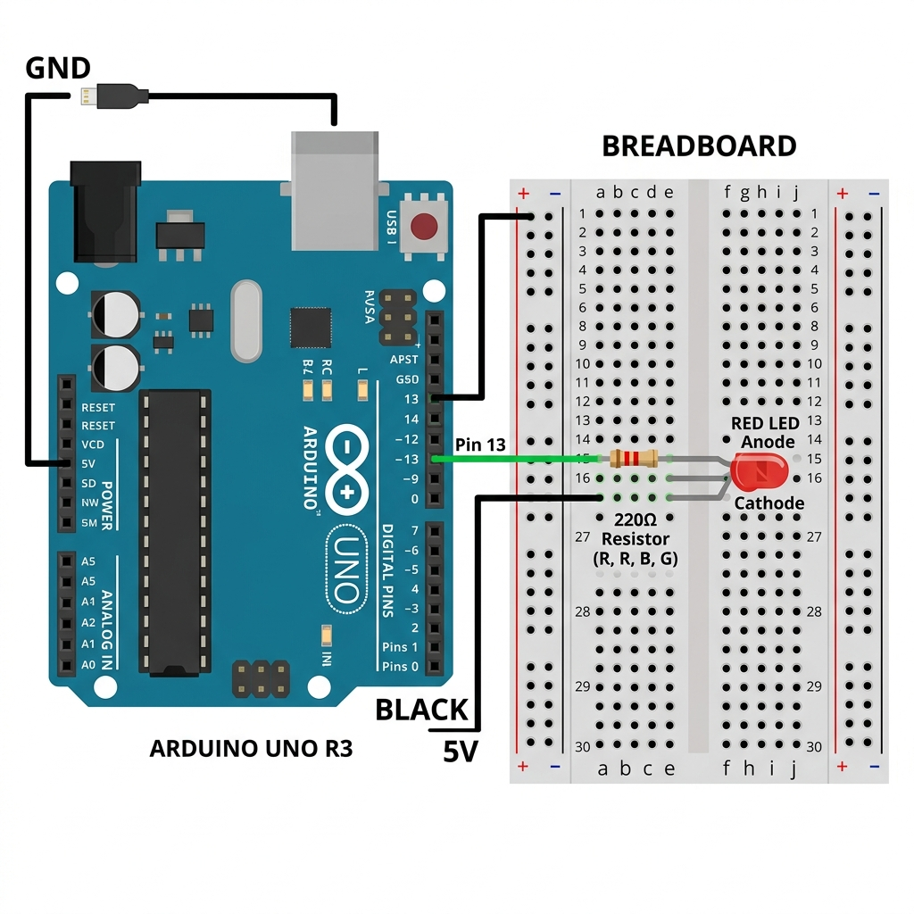
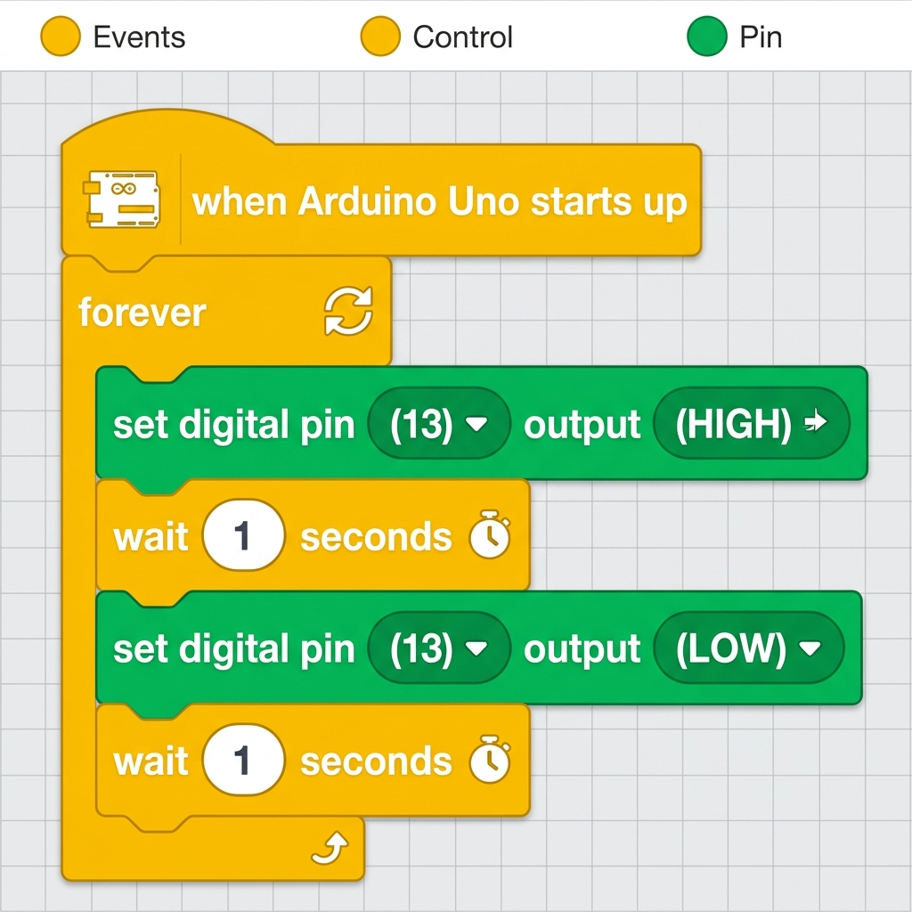

# Ders 01: Blink (Göz Kırpan LED) 💡

Bu ilk dersimizde, Arduino'nun "Hello World"ü kabul edilen **Blink** projesini gerçekleştireceğiz. Amacımız, Arduino üzerindeki dahili LED'i veya harici bir LED'i 1 saniye arayla yakıp söndürmektir.

---

## ⚙️ Gerekli Elemanlar

1. **Arduino Uno** (veya uyumlu bir kart)
2. **Breadboard** (Ekmek tahtası)
3. **1x LED** (Herhangi bir renk)
4. **1x 220Ω Direnç** (LED'in zarar görmesini engellemek için)
5. **Jumper Kablolar**

---

## 🔌 Devre Şeması

LED'lerin uzun bacağı **Anot (+)**, kısa bacağı **Katot (-)** kutbudur. 
*   **GND** pinini breadboard'un eksi (-) hattına bağlayın.
*   LED'in katot (-) bacağını 220Ω direnç üzerinden GND'ye bağlayın.
*   LED'in anot (+) bacağını ise Arduino'nun **13 numaralı dijital pinine** bağlayın.



---

## 🧩 mBlock Blok Kodları

mBlock 5 kullanarak projeyi bloklarla kodlamak isterseniz, aşağıdaki yapıyı kurabilirsiniz:

*   **Tetikleyici:** `Arduino Uno başladığında` (when Arduino Uno starts up)
*   **Döngü:** `sürekli tekrarla` (forever)
*   **İşlem:** Dijital pin 13'ü YÜKSEK (HIGH) yap -> 1 saniye bekle -> Dijital pin 13'ü DÜŞÜK (LOW) yap -> 1 saniye bekle.



---

## 💻 Arduino C/C++ Kodları

Projenin Arduino IDE ile yüklenebilecek C/C++ kodları aşağıdaki gibidir:

```cpp
/*
  Ders 01: Blink (Göz Kırpan LED)
*/

const int ledPin = 13; // LED'in bağlı olduğu pin

void setup() {
  pinMode(ledPin, OUTPUT); // Pini çıkış olarak ayarlıyoruz
}

void loop() {
  digitalWrite(ledPin, HIGH); // LED'i yak
  delay(1000);                // 1 saniye bekle
  digitalWrite(ledPin, LOW);  // LED'i söndür
  delay(1000);                // 1 saniye bekle
}
```

---

## 🌐 Tinkercad Simülasyonu

Projeyi bilgisayarınızda kurmadan çevrimiçi simüle etmek isterseniz:
👉 **[Tinkercad Devresini İncele](https://www.tinkercad.com/)** *(Buraya kendi Tinkercad linkinizi ekleyebilirsiniz)*
