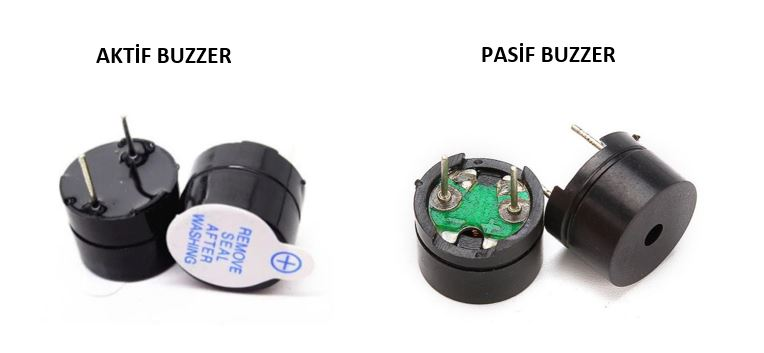
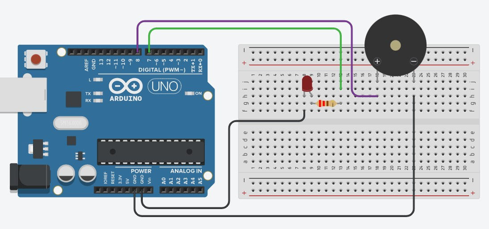
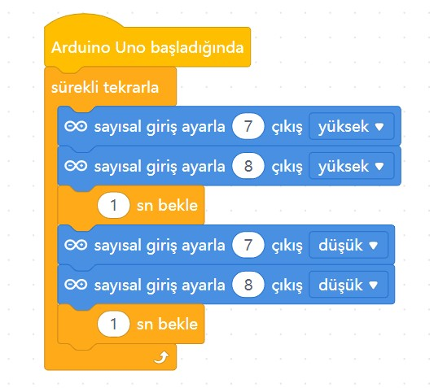

# Ders 03: Flaşör Buzzer (Sesli ve Işıklı Devre) 🔊💡

Çocukların ses ve ışık algılarını kodlama dünyasıyla birleştiren, hem görsel hem de işitsel geri bildirim alarak algoritmaları daha kolay kavramalarını sağlayan harika bir proje! Robotist’in Flaşör Buzzer uygulaması, LED'in yanıp sönmesine bir de ses tonu ekleyerek gerçek hayattaki uyarı sistemlerinin (örneğin alarm veya ikaz sistemleri) nasıl çalıştığını eğlenceli bir şekilde keşfetmelerini sağlar.

Bu projeyle çocuklar; ses dalgalarını kontrol etmeyi öğrenir, aktif ve pasif buzzer arasındaki farkları keşfeder ve birden fazla çıkış elemanını eşzamanlı çalıştırmayı kavrar. Ürettikleri her ses, onların problem çözme ve özgün proje geliştirme yeteneğine yepyeni bir ritim katar!

**Robotist ile keşfet, öğren, eğlen!**

---

## 🔊 Aktif ve Pasif Buzzer Nedir?

Buzzer, elektrik enerjisini ses enerjisine dönüştüren küçük bir hoparlördür. Projelerimizde iki farklı buzzer türüyle karşılaşırız:
*   **Aktif Buzzer:** İçerisinde kendi ses üretme devresi bulunur. Sadece 5V enerji verildiğinde doğrudan sabit bir bip sesi çıkartır (Bu projede aktif buzzer kullanacağız).
*   **Pasif Buzzer:** İçerisinde hazır bir ses devresi yoktur. Ses üretebilmek için Arduino'dan farklı frekanslarda sinyal gönderilmesi gerekir (Melodi çalmak için kullanılır).



---

## ⚙️ Gerekli Elemanlar

1. **Arduino Uno** (Zekamızı temsil eden kontrol kartı)
2. **Breadboard** (Devremizi kuracağımız delikli tahta)
3. **1x LED** (Görsel uyarı için)
4. **1x Aktif Buzzer** (İşitsel uyarı için)
5. **1x 220Ω Direnç** (LED'imizi korumak için)
6. **Jumper Kablolar** (Bağlantı yollarımız)

---

## 🔌 Devre Şeması

Bu projede LED ve Buzzer'ı bağımsız pinlerden kontrol ederek aynı anda çalıştırıyoruz:
*   **LED:** Anot (+) bacağını Arduino **Pin 7**'ye, katot (-) bacağını 220Ω direnç üzerinden **GND** hattına bağlayın.
*   **Buzzer:** Uzun (+) bacağını Arduino **Pin 8**'e, kısa (-) bacağını doğrudan **GND** hattına bağlayın.



---

## 🧩 mBlock Blok Kodları

mBlock 5 ile LED ve Buzzer'ı eşzamanlı olarak kontrol ediyoruz:
*   **Açma (HIGH):** Dijital pin 7 (LED) ve dijital pin 8 (Buzzer) YÜKSEK konumuna getirilir -> 1 saniye beklenir.
*   **Kapatma (LOW):** Dijital pin 7 (LED) ve dijital pin 8 (Buzzer) DÜŞÜK konumuna getirilir -> 1 saniye beklenir.



---

## 💻 Arduino C/C++ Kodları

Projenin Arduino IDE ile yüklenebilecek metin tabanlı C/C++ kodları:

```cpp
/*
  Ders 03: Flaşör (Blink) Buzzer ve LED Uygulaması
*/

const int ledPin = 7;
const int buzzerPin = 8;

void setup() {
  pinMode(ledPin, OUTPUT);
  pinMode(buzzerPin, OUTPUT);
}

void loop() {
  // LED ve Buzzer aynı anda açılır (1 saniye)
  digitalWrite(ledPin, HIGH);
  digitalWrite(buzzerPin, HIGH);
  delay(1000);
  
  // LED ve Buzzer aynı anda kapatılır (1 saniye)
  digitalWrite(ledPin, LOW);
  digitalWrite(buzzerPin, LOW);
  delay(1000);
}
```

---

## 🌐 Tinkercad Simülasyonu

Projeyi bilgisayarınızda kurmadan çevrimiçi simüle etmek isterseniz:
👉 **[Tinkercad Devresini İncele](https://www.tinkercad.com/)** *(Buraya kendi Tinkercad linkinizi ekleyebilirsiniz)*
