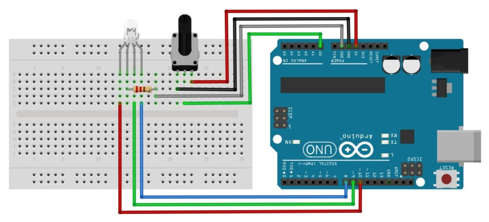
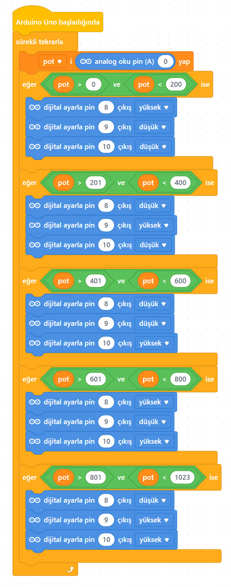

# Ders 19: Potansiyometre ile RGB LED Kontrolü 🤖🔆🎨

Evlerimizde veya eğlence mekanlarında kullanılan akıllı aydınlatma sistemlerinin, bir düğmeyi çevirdikçe nasıl farklı renklere büründüğünü hiç merak ettiniz mi? Robotist’in Potansiyometre ile RGB LED uygulaması, çocukların analog giriş elemanı olan potansiyometreyi kullanarak üç ana rengi (Kırmızı, Yeşil, Mavi) barındıran RGB LED'in renklerini nasıl kontrol edebileceklerini öğretir.

Bu projeyle çocuklar; analog veri aralıklarını bölmeyi, RGB renk sentezini (renk karıştırmayı) ve potansiyometreyi bir renk seçici (color picker) olarak nasıl kullanacaklarını kavrar.

**Robotist ile keşfet, öğren, eğlen!**

---

## 🎨 RGB LED ve Potansiyometre Nedir?

*   **RGB LED:** Kırmızı (Red), Yeşil (Green) ve Mavi (Blue) renkli üç farklı LED'in tek bir kılıfta birleşmiş halidir. Bu üç rengin farklı oranlarda birleşmesiyle milyonlarca ara renk elde edilebilir. Projemizde **Ortak Katot** (uzun bacağı eksi - GND pini) RGB LED kullanılmaktadır.
*   **Potansiyometre:** Ayarlanabilir dirençtir. Üzerindeki mil çevrildikçe Arduino'nun analog pininden **0 ile 1023** arasında bir değer okunmasını sağlar.

### 📐 Renk Eşleştirme Mantığı
Potansiyometreden gelen 0-1023 arasındaki veriyi 5 farklı bölgeye ayırıyoruz:
1.  **0 - 200 aralığı:** 🔵 Mavi (Blue)
2.  **201 - 400 aralığı:** 🟢 Yeşil (Green)
3.  **401 - 600 aralığı:** 🔴 Kırmızı (Red)
4.  **601 - 800 aralığı:** 🟣 Fuşya (Magenta - Kırmızı + Mavi)
5.  **801 - 1023 aralığı:** 🟡 Sarı / Zeytin Yeşili (Yellow - Kırmızı + Yeşil)

---

## ⚙️ Gerekli Elemanlar

1. **Arduino Uno** (Zekamız)
2. **Breadboard** (Bağlantı tahtamız)
3. **1x Ortak Katot RGB LED** (Renkli ışık kaynağımız)
4. **1x Potansiyometre** (Renk kontrol düğmemiz)
5. **1x 220Ω Direnç** (LED koruması)
6. **Jumper Kablolar**

---

## 🔌 Devre Bağlantısı

Aşağıdaki bağlantı şemasını takip ederek devrenizi kurabilirsiniz:

```text
POTANSİYOMETRE BAĞLANTISI:
[ Kenar Pin 1 ]  -------> Arduino 5V
[ Orta Pin ]     -------> Arduino A0 (Analog Giriş)
[ Kenar Pin 2 ]  -------> Arduino GND

RGB LED BAĞLANTISI (Ortak Katot):
[ R (Kırmızı) ]  -------> Arduino Pin 9 (PWM)
[ G (Katot / -) ] -------> 220Ω Direnç -------> Arduino GND
[ G (Yeşil) ]    -------> Arduino Pin 10 (PWM)
[ B (Mavi) ]     -------> Arduino Pin 11 (PWM)
```



---

## 🧩 mBlock Blok Kodları

mBlock 5'te bu projeyi hem **Yükleme Modu** (kart bağımsız) hem de **Canlı Mod** (sahnede Panda ile etkileşimli) olarak yazabiliriz.

### A) Yükleme Modu (Cihaz Üzerinde Çalışma)
mBlock programında **Aygıtlar** sekmesinden bir `pot` değişkeni tanımlanır. Potansiyometre değeri bu değişkene atanır ve `eğer ise` blokları yardımıyla belirlenen aralıklarda ilgili PWM pinleri (9, 10, 11) açılır / kapatılır.

### B) Canlı Mod (Sahnede Gösterim)
Canlı modda, aygıttan okunan potansiyometre değeri **Yükleme Modu İletisi** aracılığıyla kuklaya gönderilir. Sahnede bulunan Panda, potansiyometreyi çevirdikçe anlık değeri baloncuk içinde söyler.



---

## 💻 Arduino C/C++ Kodları

```cpp
/*
  Ders 19: Potansiyometre ile RGB LED Kontrolü
*/

const int potPin = A0;      // Potansiyometre orta ucu A0 pinine bağlı
const int redPin = 9;       // RGB Led Kırmızı pini (PWM)
const int greenPin = 10;    // RGB Led Yeşil pini (PWM)
const int bluePin = 11;     // RGB Led Mavi pini (PWM)

void setup() {
  pinMode(redPin, OUTPUT);
  pinMode(greenPin, OUTPUT);
  pinMode(bluePin, OUTPUT);
  Serial.begin(9600);
}

void loop() {
  int potDeger = analogRead(potPin);
  Serial.print("Pot Degeri: ");
  Serial.println(potDeger);
  
  if (potDeger >= 0 && potDeger <= 200) {
    setColor(0, 0, 255);      // Mavi
  } 
  else if (potDeger >= 201 && potDeger <= 400) {
    setColor(0, 255, 0);      // Yesil
  } 
  else if (potDeger >= 401 && potDeger <= 600) {
    setColor(255, 0, 0);      // Kirmizi
  } 
  else if (potDeger >= 601 && potDeger <= 800) {
    setColor(255, 0, 255);    // Fusya
  } 
  else {
    setColor(255, 255, 0);    // Sari
  }
  
  delay(50);
}

// Renk ayarı fonksiyonu (Ortak katot LED için HIGH=Açık, LOW=Kapalı)
void setColor(int red, int green, int blue) {
  analogWrite(redPin, red);
  analogWrite(greenPin, green);
  analogWrite(bluePin, blue);
}
```

---

## 🌐 Tinkercad Simülasyonu

Projeyi bilgisayarınızda kurmadan çevrimiçi simüle etmek isterseniz:
👉 **[Tinkercad Devresini İncele](https://www.tinkercad.com/)**
