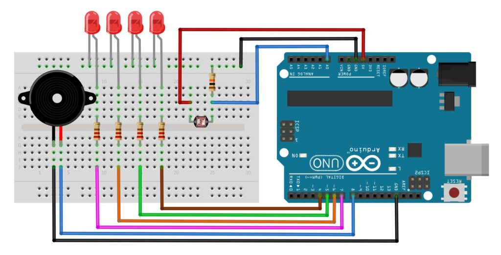
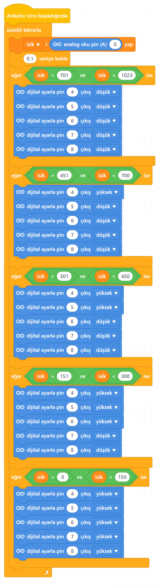

# Ders 20: LDR ile Işık Seviye Kontrol Devresi 🤖🔆📈

Güneş panellerinin güneşi nasıl takip ettiğini, sokak lambalarının havanın karardığını nasıl anladığını veya bazı gece lambalarının ışık şiddetine göre nasıl tepki verdiğini hiç merak ettiniz mi? Robotist’in LDR ile Işık Seviye Kontrol Devresi uygulaması, çocukların ortamdaki ışık miktarını ölçerek buna göre sıralı LED'ler (VU-metre tarzı) ve bir buzzer yardımıyla sesli/ışıklı gösterge sistemi yapmalarını sağlar.

Bu projeyle çocuklar; foto-direnç (LDR) çalışma mantığını, voltaj bölücü (pull-down) devre tasarımını, çoklu LED ve buzzer kontrolünü ve analog verileri koşullandırarak kademeli tepki oluşturmayı öğrenirler.

**Robotist ile keşfet, öğren, eğlen!**

---

## 📈 LDR (Işığa Bağımlı Direnç) Nedir?

*   **Çalışma Prensibi:** LDR (Light Dependent Resistor), üzerine düşen ışık miktarı arttıkça iç direnci **düşen**, karanlıkta ise direnci milyon ohm seviyelerine kadar **yükselen** yarı iletken bir elemandır.
*   **Voltaj Bölücü Devre:** LDR'den hassas analog okuma yapabilmek için 10kΩ'luk bir sabit direnç ile seri bağlanarak bir voltaj bölücü (pull-down) devresi oluşturulur.
*   **Eşik Seviyeleri:**
    1.  **Değer > 200:** 🟢 1. LED yanar.
    2.  **Değer > 400:** 🟢 2. LED yanar.
    3.  **Değer > 600:** 🟢 3. LED yanar.
    4.  **Değer > 800:** 🔴 4. LED yanar ve Buzzer öter (Maksimum Işık Alarmı).

---

## ⚙️ Gerekli Elemanlar

1. **Arduino Uno** (Zekamız)
2. **Breadboard** (Bağlantı tahtamız)
3. **1x LDR (Foto-direnç)** (Işık gözümüz)
4. **4x LED** (Kademe göstergelerimiz)
5. **1x Buzzer** (Sesli uyarı elemanı)
6. **4x 220Ω Direnç** (LED korumaları)
7. **1x 10kΩ Direnç** (LDR pull-down direnci)
8. **Jumper Kablolar**

---

## 🔌 Devre Bağlantısı

Aşağıdaki bağlantı şemasını takip ederek devrenizi kurabilirsiniz:

```text
LDR (IŞIK SENSÖRÜ) BAĞLANTISI:
[ LDR Pin 1 ] --------> Arduino 5V
[ LDR Pin 2 ] --------> Arduino A0 ve 10kΩ Direnç
[ 10kΩ Direnç diğer ucu ] --> Arduino GND

LED BAĞLANTI PINLERİ:
- LED 1 (Anot) -------> 220Ω Direnç -------> Arduino Pin 4
- LED 2 (Anot) -------> 220Ω Direnç -------> Arduino Pin 5
- LED 3 (Anot) -------> 220Ω Direnç -------> Arduino Pin 6
- LED 4 (Anot) -------> 220Ω Direnç -------> Arduino Pin 7
* LED Katotları (-) ---> Ortak Hat --------> Arduino GND

BUZZER BAĞLANTISI:
[ + (Uzun uç) ] ------> Arduino Pin 8
[ - (Kısa uç) ] ------> Arduino GND
```



---

## 🧩 mBlock Blok Kodları

mBlock 5 ile projeyi iki modda kodlayabilirsiniz:

### A) Yükleme Modu (Cihaz Üzerinde Çalışma)
mBlock uygulamasında `isik` isimli bir değişken tanımlayarak analog `A0` okuma değerini bu değişkene aktarırız. Ardından `eğer ise` blokları ile 200, 400, 600 ve 800 değerlerini karşılaştırıp sıralı LED'lerin dijital pinlerini (4, 5, 6, 7) `yüksek` ya da `düşük` konuma getiririz. Değer 800'ü geçtiğinde pin 8'e bağlı buzzer'ı ses üretmesi için aktif hale getiririz.

### B) Canlı Mod (Live Mode)
Aygıtlar sekmesinde okunan sensör değeri **Yükleme Modu İletisi** ile kuklalara gönderilir. Canlı modda Panda sahnedeki ışık düzeyini anlık ve sayısal olarak çocuklara göstererek kodun mantığını kavramalarını kolaylaştırır.



---

## 💻 Arduino C/C++ Kodları

```cpp
/*
  Ders 20: LDR ile Işık Seviye Kontrol Devresi
*/

const int ldrPin = A0;
const int ledPins[] = {4, 5, 6, 7};
const int buzzerPin = 8;
const int numLeds = 4;

void setup() {
  for (int i = 0; i < numLeds; i++) {
    pinMode(ledPins[i], OUTPUT);
  }
  pinMode(buzzerPin, OUTPUT);
  Serial.begin(9600);
}

void loop() {
  int isikDegeri = analogRead(ldrPin);
  Serial.print("Isik Degeri: ");
  Serial.println(isikDegeri);
  
  // Tüm çıkışları sıfırlayalım
  for (int i = 0; i < numLeds; i++) {
    digitalWrite(ledPins[i], LOW);
  }
  digitalWrite(buzzerPin, LOW);
  
  // Kademeli kontrol
  if (isikDegeri > 200) {
    digitalWrite(ledPins[0], HIGH);
  }
  if (isikDegeri > 400) {
    digitalWrite(ledPins[1], HIGH);
  }
  if (isikDegeri > 600) {
    digitalWrite(ledPins[2], HIGH);
  }
  if (isikDegeri > 800) {
    digitalWrite(ledPins[3], HIGH);
    digitalWrite(buzzerPin, HIGH);
  }
  
  delay(100);
}
```

---

## 🌐 Tinkercad Simülasyonu

Projeyi bilgisayarınızda kurmadan çevrimiçi simüle etmek isterseniz:
👉 **[Tinkercad Devresini İncele](https://www.tinkercad.com/)**
