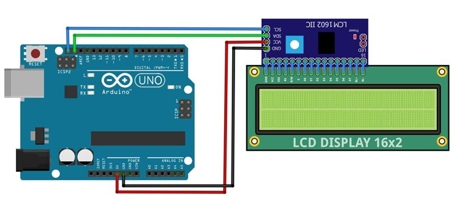
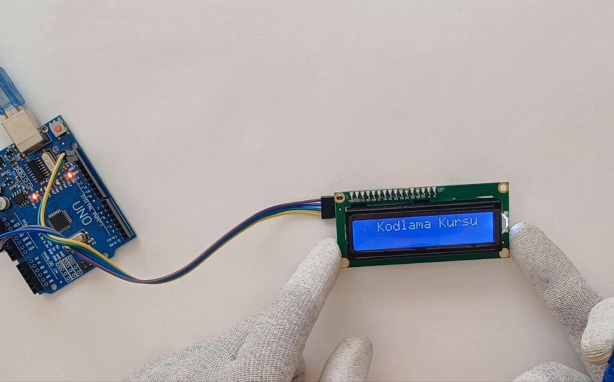

# Ders 21: mBlock I2C LCD Ekran Uygulamaları 🤖🔆📟

Projelerimizde sensörlerden okuduğumuz sıcaklık, mesafe veya nem gibi değerleri bilgisayar ekranına ihtiyaç duymadan, doğrudan projemizin üzerinde nasıl görebiliriz? Robotist’in I2C LCD Ekran uygulaması, çocukların sadece 4 kablo kullanarak Arduino projelerine profesyonel bir bilgi ekranı eklemelerini ve farklı ekran efektleri tasarlamalarını sağlar.

Bu projeyle çocuklar; I2C (Inter-Integrated Circuit) seri haberleşme protokolünü, 16x2 LCD ekranların çalışma prensibini ve ekran üzerinde metin kaydırma, yanıp sönme gibi görsel efektler oluşturmayı öğrenirler.

**Robotist ile keşfet, öğren, eğlen!**

---

## 📟 I2C LCD Ekran Nedir?

*   **16x2 LCD Ekran:** Yan yana 16 karakter ve alt alta 2 satırdan oluşan, toplam 32 karakter kapasiteli sıvı kristal ekrandır.
*   **I2C Modülü (Kolaylık):** Normalde Arduino'ya bağlanması için en az 6-12 pin gerektiren LCD ekranları, arkasına entegre edilen bir çip sayesinde sadece **4 kablo** (VCC, GND, SDA, SCL) ile bağlamamızı sağlar.
*   **Haberleşme Pinleri (I2C):**
    *   **SDA (Serial Data Line):** Veri hattıdır.
    *   **SCL (Serial Clock Line):** Saat sinyali hattıdır.
    *   *Not:* Arduino Uno'da SDA pini **A4**, SCL pini ise **A5** analog girişlerine de paralel bağlıdır.

---

## ⚙️ Gerekli Elemanlar

1. **Arduino Uno** (Zekamız)
2. **Breadboard** (Bağlantı tahtamız)
3. **1x 16x2 I2C LCD Ekran** (Bilgi panelimiz)
4. **Jumper Kablolar** (Dişi-Erkek ve Erkek-Erkek)

---

## 🔌 Devre Bağlantısı

Aşağıdaki bağlantı şemasını takip ederek devrenizi kurabilirsiniz:

```text
LCD EKRAN (I2C) BAĞLANTISI:
[ VCC ]  ----------> Arduino 5V
[ GND ]  ----------> Arduino GND
[ SDA ]  ----------> Arduino Pin A4 (veya SDA pini)
[ SCL ]  ----------> Arduino Pin A5 (veya SCL pini)
```



---

## 🧩 mBlock Blok Kodları

mBlock 5'te I2C LCD ekran kullanabilmek için:
1.  **Uzantılar** penceresini açın.
2.  Arama kısmına **"LCD"** veya **"I2C LCD"** yazarak **"LCD I2C Eklentisi TR"** uzantısını ekleyin.
3.  Uzantı ile birlikte gelen özel blokları (LCD başlat, Ekranı temizle, Koordinata yazı yaz, Ekranı kaydır vb.) kullanarak metin animasyonlarınızı oluşturabilirsiniz.



---

## 💻 Arduino C/C++ Kodları

```cpp
/*
  Ders 21: I2C LCD Ekran Uygulamaları
*/

#include <Wire.h>
#include <LiquidCrystal_I2C.h>

// 16 sütun 2 satır LCD nesnesi oluşturuluyor (Adres genellikle 0x27)
LiquidCrystal_I2C lcd(0x27, 16, 2);

void setup() {
  lcd.init();        // LCD baslatiliyor
  lcd.backlight();   // Arka isik aciliyor
  
  lcd.setCursor(0, 0); 
  lcd.print("ROBOTIST KULUBY");
  lcd.setCursor(0, 1);
  lcd.print("Hos Geldiniz!");
  delay(3000);
}

void loop() {
  // Temizle ve yeni metin yaz
  lcd.clear();
  lcd.setCursor(0, 0);
  lcd.print("mBlock & Arduino");
  lcd.setCursor(0, 1);
  lcd.print("Egitim Portali");
  delay(2000);
  
  // Sola kaydirma efekti
  for (int i = 0; i < 16; i++) {
    lcd.scrollDisplayLeft();
    delay(200);
  }
  
  // Yanip sonen arka isik (alarm efekti)
  lcd.clear();
  lcd.setCursor(2, 0);
  lcd.print("UYARI: TEHLIKE");
  
  for (int i = 0; i < 5; i++) {
    lcd.noBacklight();
    delay(300);
    lcd.backlight();
    delay(300);
  }
  delay(1000);
}
```

---

## 🌐 Tinkercad Simülasyonu

Projeyi bilgisayarınızda kurmadan çevrimiçi simüle etmek isterseniz:
👉 **[Tinkercad Devresini İncele](https://www.tinkercad.com/)**
