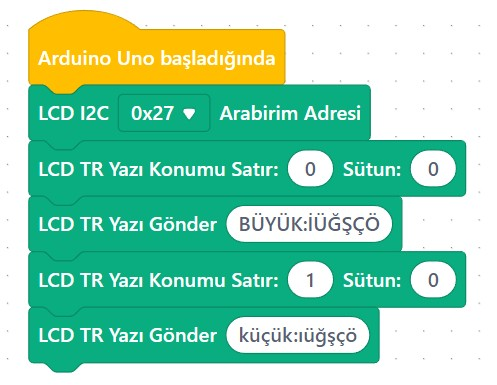

# Ders 22: mBlock LCD Ekran I2C Türkçe Karakterli Yazı 🤖🔆📟🇹🇷

Arduino projelerinizde LCD ekrana "HOS GELDINIZ", "SICAKLIK" veya "YAGMUR" gibi kelimeler yazdırırken Türkçe karakterlerin (ş, ı, ğ, ç, ö, ü) yerine garip sembollerin çıktığını fark etmişsinizdir. Bunun sebebi, standart LCD ekranların İngilizce ağırlıklı karakter setlerine sahip olmasıdır. Robotist’in LCD Türkçe Karakter uygulaması, çocukların LCD ekranın özel hafıza alanına (CGRAM) kendi tasarladıkları pikselleri yükleyerek ekranlarında kusursuz Türkçe metinler yazdırmalarını sağlar!

Bu projeyle çocuklar; piksel tabanlı grafik tasarım mantığını (5x8 piksel matrisi), mikrodenetleyicilerin özel hafıza bölgelerini yönetmeyi ve `lcd.write()` fonksiyonu ile kendi karakterlerini ekrana basmayı öğrenirler.

**Robotist ile keşfet, öğren, eğlen!**

---

## 🇹🇷 Türkçe Karakter Tasarım Mantığı (CGRAM)

Her bir karakter LCD ekranda yan yana 5 piksel, alt alta 8 pikselden oluşan bir matris kutucuğudur. Bu kutucuklardaki piksellerin hangilerinin yanacağını (`1` / `B1`) hangilerinin söneceğini (`0` / `B0`) belirleyerek kendi karakterlerimizi oluştururuz. LCD sürücüsü hafızasında bu şekilde **en fazla 8 adet** özel karakteri aynı anda tutabilir.

Örnek olarak yumuşak g (`ğ`) karakterinin 5x8 piksel tasarımı:
```text
B01111   ->   ■ ■ ■ ■
B00000   ->  
B01110   ->   ■ ■ ■  
B10000   ->  ■       
B10111   ->  ■   ■ ■ ■
B10001   ->  ■       ■
B01110   ->   ■ ■ ■  
B00000   ->  
```

---

## ⚙️ Gerekli Elemanlar

1. **Arduino Uno** (Zekamız)
2. **Breadboard** (Bağlantı tahtamız)
3. **1x 16x2 I2C LCD Ekran** (Türkçe karakter destekli bilgi panelimiz)
4. **Jumper Kablolar**

---

## 🔌 Devre Bağlantısı

Bağlantılar bir önceki dersimiz (Ders 21) ile tamamen aynıdır:

```text
LCD EKRAN (I2C) BAĞLANTISI:
[ VCC ]  ----------> Arduino 5V
[ GND ]  ----------> Arduino GND
[ SDA ]  ----------> Arduino Pin A4 (veya SDA pini)
[ SCL ]  ----------> Arduino Pin A5 (veya SCL pini)
```


---

## 🧩 mBlock Blok Kodları

mBlock 5'te bu işlemi gerçekleştirmek için:
1.  **Uzantılar** sekmesine girip arama çubuğuna **"I2C LCD Ekran Türkçe"** yazarak yazarının Ahmet Candemir olduğu özel eklentiyi mBlock uygulamanıza yükleyin.
2.  Bu eklenti, doğrudan Türkçe karakterli cümleleri (`TÜRKÇE karakter`, `ışık`, `yağmur` vb.) tanıyan ve arka planda custom karakter tanımlamalarını otomatik gerçekleştiren bloklar sunar.
3.  `LCD I2C Türkçe ekranı başlat` bloğundan sonra `LCD ekrana Türkçe yaz` bloklarını kullanarak Türkçe yazdırabilirsiniz.



---

## 💻 Arduino C/C++ Kodları

```cpp
/*
  Ders 22: LCD Ekran I2C Türkçe Karakter Yazdırma
*/

#include <Wire.h>
#include <LiquidCrystal_I2C.h>

LiquidCrystal_I2C lcd(0x27, 16, 2);

// Türkçe Karakterlerin 5x8 Piksel Kodları
byte turkce_c[8] = { B00000, B01110, B10000, B10000, B10001, B01110, B00100, B00000 }; // ç
byte turkce_g[8] = { B01111, B00000, B01110, B10000, B10111, B10001, B01110, B00000 }; // ğ
byte turkce_noktasiz_i[8] = { B00000, B00000, B01100, B00100, B00100, B00100, B01110, B00000 }; // ı
byte turkce_o[8] = { B01010, B00000, B01110, B10001, B10001, B10001, B01110, B00000 }; // ö
byte turkce_s[8] = { B00000, B01111, B10000, B01110, B00001, B11110, B00100, B00000 }; // ş
byte turkce_u[8] = { B01010, B00000, B10001, B10001, B10001, B10001, B01110, B00000 }; // ü
byte turkce_buyuk_i[8] = { B00100, B00000, B01110, B00100, B00100, B00100, B01110, B00000 }; // İ

void setup() {
  lcd.init();
  lcd.backlight();
  
  // Karakterler LCD'nin CGRAM hafıza indekslerine (0-7) kaydediliyor
  lcd.createChar(0, turkce_c);
  lcd.createChar(1, turkce_g);
  lcd.createChar(2, turkce_noktasiz_i);
  lcd.createChar(3, turkce_o);
  lcd.createChar(4, turkce_s);
  lcd.createChar(5, turkce_u);
  lcd.createChar(6, turkce_buyuk_i);
  
  lcd.clear();
  
  // 1. Satır: TÜRKÇE yazısı (Ü=5, Ç=0)
  lcd.setCursor(0, 0);
  lcd.print("T");
  lcd.write(5); // Ü
  lcd.print("RK");
  lcd.write(0); // Ç
  lcd.print("E KODLAMA");
  
  // 2. Satır: sağlık, ışık (ğ=1, ı=2, ş=4)
  lcd.setCursor(0, 1);
  lcd.print("sa");
  lcd.write(1); // ğ
  lcd.print("l");
  lcd.write(2); // ı
  lcd.print("k, ");
  lcd.write(2); // ı
  lcd.write(4); // ş
  lcd.write(2); // ı
  lcd.print("k");
}

void loop() {
  // Karakter tanımlamaları bir kez setup() içinde yapıldığında yeterlidir.
}
```

---

## 🌐 Tinkercad Simülasyonu

Projeyi bilgisayarınızda kurmadan çevrimiçi simüle etmek isterseniz:
👉 **[Tinkercad Devresini İncele](https://www.tinkercad.com/)**
