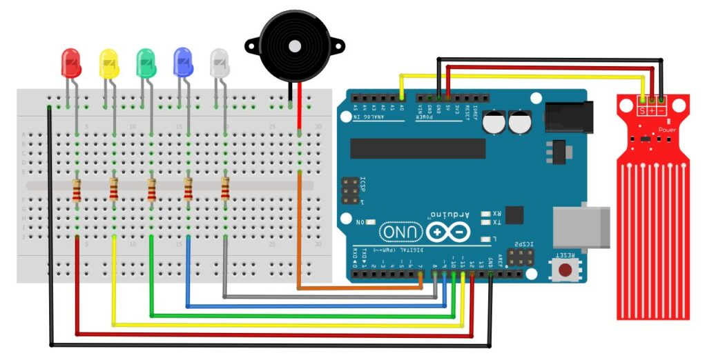
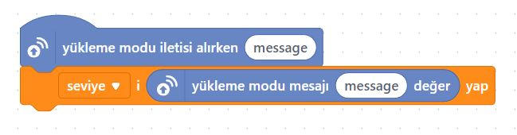

# Ders 23: Su Seviye Kontrol Devresi - Yağmur Alarmı 🤖🔆🌧️🌊

Barajlardaki su doluluk oranlarının nasıl ölçüldüğünü, akıllı tarım sistemlerinde yağmur yağdığında pencerelerin nasıl otomatik kapandığını veya çamaşır makinelerinin su taşmasını nasıl engellediğini hiç düşündünüz mü? Robotist’in Su Seviye Kontrol Devresi uygulaması, çocukların suya duyarlı özel bir analog sensör kullanarak su yüksekliğini ölçmesini ve VU-metre tarzında ışıklı/sesli bir erken uyarı alarm sistemi yapmalarını sağlar!

Bu projeyle çocuklar; suyun iletkenlik özelliğini, direnç değişimine dayalı analog sensörlerin çalışmasını ve kademeli karşılaştırma algoritmaları yazmayı öğrenirler.

**Robotist ile keşfet, öğren, eğlen!**

---

## 🌊 Su Seviye Sensörü Nedir?

*   **Çalışma Prensibi:** Sensör kartı üzerinde birbirine paralel uzanan bakır iletken hatlar bulunur. Sensör suya daldırıldığında su hatlar arasında bir köprü oluşturur. Suyun yüksekliğine bağlı olarak iletkenlik artar, direnç düşer ve Arduino'ya giden voltaj yükselir.
*   **Analog Çıkış (DATA / S):** Sensör kuru durumdayken `0` değerini verir. Suyla temas ettiğinde seviyeye göre `100` ile `750` arasında analog değerler üretir.
*   **Kademe Eşikleri:**
    1.  **Değer > 100:** 🟢 Yeşil LED (Düşük Su)
    2.  **Değer > 250:** 🔵 Mavi LED (Orta-Düşük Su)
    3.  **Değer > 400:** 🟡 Sarı LED (Orta Su)
    4.  **Değer > 550:** ⚪ Beyaz LED (Yüksek Su)
    5.  **Değer > 680:** 🔴 Kırmızı LED ve Buzzer Alarm (Taşma / Kritik Seviye)

---

## ⚙️ Gerekli Elemanlar

1. **Arduino Uno** (Zekamız)
2. **Breadboard** (Bağlantı tahtamız)
3. **1x Su Seviye / Yağmur Sensörü** (Islaklık dedektörümüz)
4. **5x LED** (Yeşil, Mavi, Sarı, Beyaz, Kırmızı)
5. **1x Buzzer** (Siren sesi)
6. **5x 220Ω Direnç** (LED koruması)
7. **Jumper Kablolar** (Dişi-Erkek ve Erkek-Erkek)

---

## 🔌 Devre Bağlantısı

Aşağıdaki bağlantı şemasını takip ederek devrenizi kurabilirsiniz:

```text
SU SEVİYE SENSÖRÜ BAĞLANTISI:
[ + (VCC) ] --------> Arduino 5V
[ - (GND) ] --------> Arduino GND
[ S (DATA) ] -------> Arduino A0 (Analog Giriş)

LED PIN BAĞLANTILARI:
- LED 1 (Yeşil)  -------> 220Ω Direnç -------> Arduino Pin 8
- LED 2 (Mavi)   -------> 220Ω Direnç -------> Arduino Pin 9
- LED 3 (Sarı)   -------> 220Ω Direnç -------> Arduino Pin 10
- LED 4 (Beyaz)  -------> 220Ω Direnç -------> Arduino Pin 11
- LED 5 (Kırmızı) -------> 220Ω Direnç -------> Arduino Pin 12
* LED Katotları (-) ----> Ortak Hat ----------> Arduino GND

BUZZER BAĞLANTISI:
[ + (Uzun uç) ] --------> Arduino Pin 7
[ - (Kısa uç) ] --------> Arduino GND
```



---

## 🧩 mBlock Blok Kodları

mBlock 5 ile bu devreyi iki modda çalıştırabilirsiniz:

### A) Yükleme Modu (Cihaz Üzerinde Çalışma)
mBlock uygulamasında `seviye` isimli bir değişken oluşturulur. Analog `A0` pini okunarak bu değişkene aktarılır. `eğer ise` blokları kullanılarak değişken değeri eşik sınırlarıyla (100, 250, 400, 550, 680) kıyaslanır ve sırasıyla dijital pinler (8, 9, 10, 11, 12) `yüksek` veya `düşük` konuma getirilir. 680 sınırı geçildiğinde pin 7'ye bağlı olan buzzer ses üretmesi için aktif edilir.

### B) Canlı Mod (Live Mode)
Aygıtlar sekmesinde okunan su yüksekliği **Yükleme Modu İletisi** ile kuklalara gönderilir. Sahnede bulunan Panda, su yüksekliği arttıkça değişen sayısal değerleri çocuklara canlı olarak gösterir.



---

## 💻 Arduino C/C++ Kodları

```cpp
/*
  Ders 23: Su Seviye Kontrol Devresi - Yağmur Alarmı
*/

const int suPin = A0;
const int ledPins[] = {8, 9, 10, 11, 12};
const int buzzerPin = 7;
const int numLeds = 5;

// Esik Degerleri
const int esikler[] = {100, 250, 400, 550, 680};

void setup() {
  for (int i = 0; i < numLeds; i++) {
    pinMode(ledPins[i], OUTPUT);
  }
  pinMode(buzzerPin, OUTPUT);
  Serial.begin(9600);
}

void loop() {
  int suDegeri = analogRead(suPin);
  Serial.print("Su Degeri: ");
  Serial.println(suDegeri);
  
  // LED ve Buzzer temizliği
  for (int i = 0; i < numLeds; i++) {
    digitalWrite(ledPins[i], LOW);
  }
  digitalWrite(buzzerPin, LOW);
  
  // Kademeli kontrol
  if (suDegeri >= esikler[0]) {
    digitalWrite(ledPins[0], HIGH);
  }
  if (suDegeri >= esikler[1]) {
    digitalWrite(ledPins[1], HIGH);
  }
  if (suDegeri >= esikler[2]) {
    digitalWrite(ledPins[2], HIGH);
  }
  if (suDegeri >= esikler[3]) {
    digitalWrite(ledPins[3], HIGH);
  }
  if (suDegeri >= esikler[4]) {
    digitalWrite(ledPins[4], HIGH);
    digitalWrite(buzzerPin, HIGH);
  }
  
  delay(100);
}
```

---

## 🌐 Tinkercad Simülasyonu

Projeyi bilgisayarınızda kurmadan çevrimiçi simüle etmek isterseniz:
👉 **[Tinkercad Devresini İncele](https://www.tinkercad.com/)**
