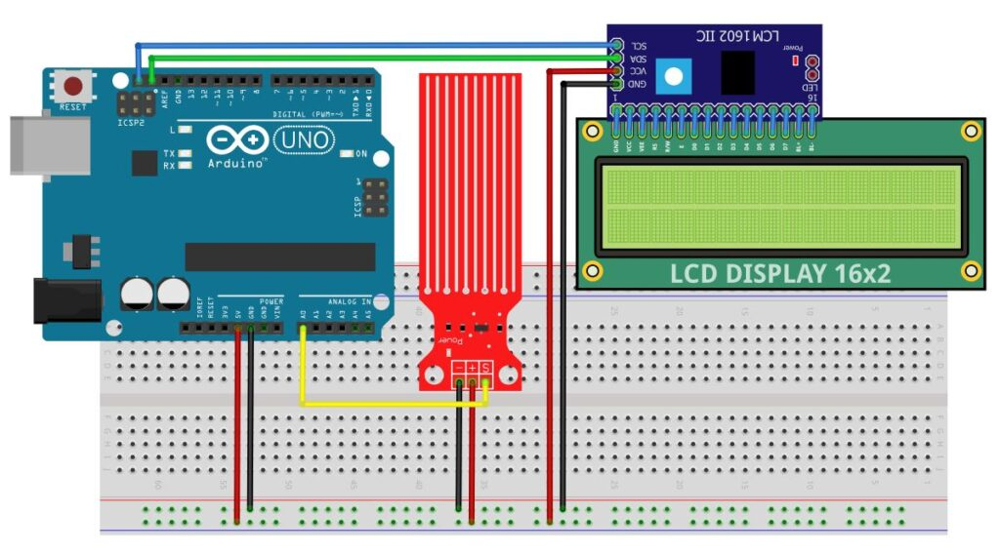
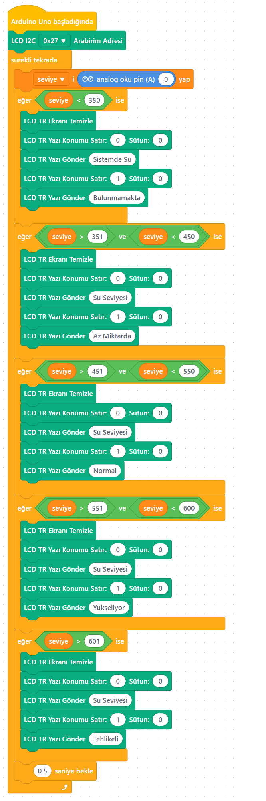

# Ders 24: mBlock Yağmur Alarmı - Su Seviye Kontrolü LCD Ekranlı 🤖🔆📟🌧️🌊

Bir önceki projemizde suyun seviyesini sadece LED'ler yardımıyla görmüştük. Ancak gerçek endüstriyel barajlarda, akıllı seralarda veya su depolarında su miktarı sayısal veriler ve durum mesajlarıyla anlık takip edilir. Robotist’in LCD Ekranlı Su Seviye Kontrolü uygulaması, çocukların su yüksekliğini milimetrik olarak ekranda (I2C LCD) sayısal değerlerle görmesini ve Türkçe uyarı mesajlarıyla ("Düşük", "Orta", "Yüksek", "Kritik/Taşma") takip etmesini sağlar!

Bu projeyle çocuklar; iki farklı donanımı (sensör ve ekran) I2C üzerinden senkronize etmeyi, verileri LCD ekran formatına uygun hizalamayı ve durum bazlı ekrana yazı yazdırma mantığını öğrenirler.

**Robotist ile keşfet, öğren, eğlen!**

---

## ⚙️ Gerekli Elemanlar

1. **Arduino Uno** (Zekamız)
2. **Breadboard** (Bağlantı tahtamız)
3. **1x Su Seviye / Yağmur Sensörü** (Islaklık dedektörümüz)
4. **1x 16x2 I2C LCD Ekran** (Türkçe karakterli bilgi ekranımız)
5. **Jumper Kablolar** (Dişi-Erkek ve Erkek-Erkek)

---

## 🔌 Devre Bağlantısı

Aşağıdaki bağlantı şemasını takip ederek devrenizi kurabilirsiniz:

```text
SU SEVİYE SENSÖRÜ BAĞLANTISI:
[ + (VCC) ] --------> Arduino 5V (Breadboard Artı Kanalına)
[ - (GND) ] --------> Arduino GND (Breadboard Eksi Kanalına)
[ S (DATA) ] -------> Arduino A0

LCD EKRAN (I2C) BAĞLANTISI:
[ VCC ]  ----------> Arduino 5V (Breadboard Artı Kanalına)
[ GND ]  ----------> Arduino GND (Breadboard Eksi Kanalına)
[ SDA ]  ----------> Arduino Pin A4 (veya SDA pini)
[ SCL ]  ----------> Arduino Pin A5 (veya SCL pini)
```



---

## 🧩 mBlock Blok Kodları

mBlock 5'te bu projeyi kodlamak için:
1.  **Uzantılar** sekmesinden hem **"I2C LCD Ekran Türkçe"** uzantısını ekleyin.
2.  `seviye` değişkeni oluşturularak `A0` pini sürekli okunur.
3.  Ekranda üst satıra sabit olarak `"Deger: "` yazıldıktan sonra yanına `seviye` değişkeni eklenir.
4.  `eğer ise` blokları ile su seviyesi aralıkları (100, 300, 500, 650) kontrol edilir.
5.  Her aralıkta LCD ekranın alt satırı temizlenir ve `"Kuru"`, `"Düşük"`, `"Orta"`, `"Yüksek"`, `"Kritik / Taşma"` durum bilgileri yazdırılır.



---

## 💻 Arduino C/C++ Kodları

```cpp
/*
  Ders 24: LCD Ekranlı Su Seviye Kontrol Devresi
*/

#include <Wire.h>
#include <LiquidCrystal_I2C.h>

LiquidCrystal_I2C lcd(0x27, 16, 2);

// Özel Türkçe Karakterler (ü ve ş)
byte turkce_u[8] = { B01010, B00000, B10001, B10001, B10001, B10001, B01110, B00000 }; // ü
byte turkce_s[8] = { B00000, B01111, B10000, B01110, B00001, B11110, B00100, B00000 }; // ş

const int suPin = A0;

void setup() {
  lcd.init();
  lcd.backlight();
  
  lcd.createChar(0, turkce_u);
  lcd.createChar(1, turkce_s);
  
  lcd.clear();
  lcd.setCursor(0, 0);
  lcd.print("Su Seviye Olcum");
  lcd.setCursor(0, 1);
  lcd.print("Sistemi Acildi");
  delay(2000);
}

void loop() {
  int suDegeri = analogRead(suPin);
  lcd.clear();
  
  // 1. Satır: Sayısal Değer
  lcd.setCursor(0, 0);
  lcd.print("Deger: ");
  lcd.print(suDegeri);
  
  // 2. Satır: Sözel Durum
  lcd.setCursor(0, 1);
  lcd.print("Durum: ");
  
  if (suDegeri < 100) {
    lcd.print("Kuru");
  } 
  else if (suDegeri >= 100 && suDegeri < 300) {
    lcd.print("D");
    lcd.write(0); // ü
    lcd.write(1); // ş
    lcd.write(0); // ü
    lcd.print("k"); // Düşük
  } 
  else if (suDegeri >= 300 && suDegeri < 500) {
    lcd.print("Orta");
  } 
  else if (suDegeri >= 500 && suDegeri < 650) {
    lcd.print("Y");
    lcd.write(0); // ü
    lcd.print("ksek"); // Yüksek
  } 
  else {
    lcd.print("Kritik/Ta");
    lcd.write(1); // ş
    lcd.print("ma"); // Kritik/Taşma
  }
  
  delay(500); // 0.5 saniyede bir ekran güncellenir
}
```

---

## 🌐 Tinkercad Simülasyonu

Projeyi bilgisayarınızda kurmadan çevrimiçi simüle etmek isterseniz:
👉 **[Tinkercad Devresini İncele](https://www.tinkercad.com/)**
