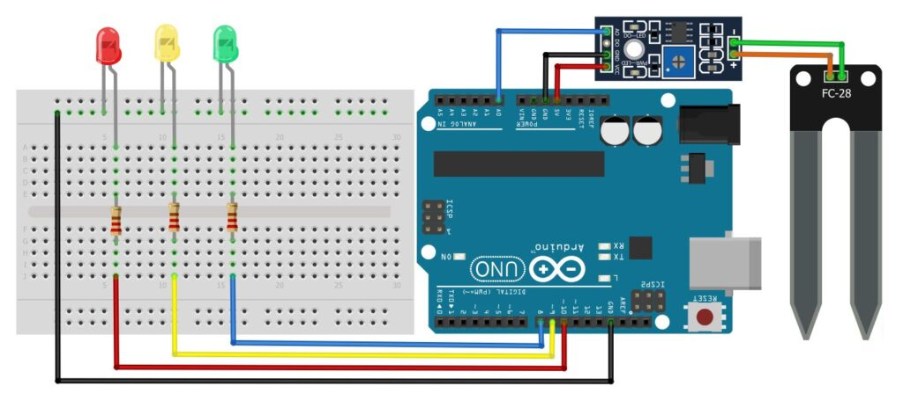
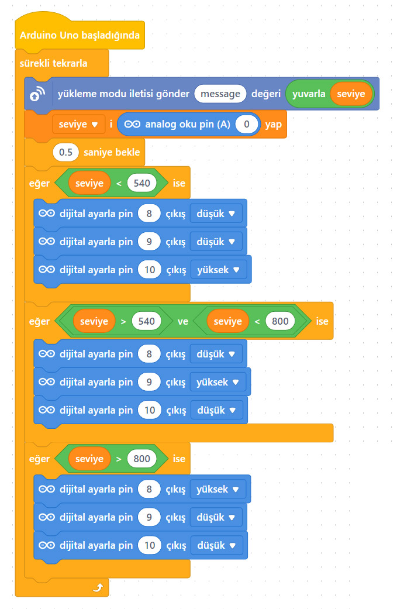

# Ders 25: mBlock Toprak Nem Seviye LED Kontrol Devresi 🤖🌱🔴🟡🟢

Çiçeklerimizin toprağının ne kadar nemli olduğunu ve ne zaman sulanması gerektiğini uzaktan anlamak ister misiniz? Robotist’in Toprak Nem Seviye LED Kontrol uygulaması, çocukların toprak nem sensörü (FC-28) kullanarak toprağın nem oranını ölçmelerini ve seviyeyi 3 farklı renkteki LED'lerle (Kırmızı, Sarı, Yeşil) görsel olarak takip etmelerini sağlar!

Bu projeyle çocuklar; toprak direncinin nem oranıyla nasıl değiştiğini, analog verilerin dijital çıktılara (LED) nasıl dönüştürüldüğünü ve eşik değerlerine göre mantıksal karar kontrol yapılarını kurmayı öğrenirler.

**Robotist ile keşfet, öğren, eğlen!**

---

## 🌱 Toprak Nem Sensörü (FC-28) Çalışma Mantığı

*   **Direnç İlkesi:** Toprak nem sensörü, toprağa batırılan iki prob arasındaki direnci ölçer. Toprak ıslakken iletkenlik yüksek (direnç düşük), toprak kuruyken iletkenlik düşük (direnç yüksek) olur.
*   **Analog Değer Okuma:** Sensör A0 analog pini üzerinden 0-1023 arasında bir değer üretir:
    *   **Tamamen Kuru Toprak / Hava:** Sensör değeri ~1023 civarındadır.
    *   **Islak Toprak / Su:** Sensör değeri ~270-300 seviyelerine kadar düşer.
*   **LED Seviyeleri:**
    *   **Değer > 700:** Toprak Kuru ➡️ **Yeşil LED** yanar.
    *   **Değer 450 - 700:** Toprak Nemli ➡️ **Sarı LED** yanar.
    *   **Değer < 450:** Toprak Çok Nemli / Islak ➡️ **Kırmızı LED** yanar.


---

## ⚙️ Gerekli Elemanlar

1. **Arduino Uno** (Zekamız)
2. **Breadboard** (Bağlantı tahtamız)
3. **1x FC-28 Toprak Nem Sensörü ve Amplifikatör Kartı** (Nem dedektörümüz)
4. **3x LED** (Kırmızı, Sarı, Yeşil)
5. **3x 220 Ω Direnç** (LED koruyucular)
6. **Jumper Kablolar**

---

## 🔌 Devre Bağlantısı

Aşağıdaki bağlantı şemasını takip ederek devrenizi kurabilirsiniz:

```text
TOPRAK NEM SENSÖRÜ (FC-28) BAĞLANTISI:
- Prob Uçları ---------------------> Amplifikatör Kartı İki Vidalı Klemens (Yönü Yok)
- Amplifikatör [ VCC ] ------------> Arduino 5V (Breadboard Artı Kanalı)
- Amplifikatör [ GND ] ------------> Arduino GND (Breadboard Eksi Kanalı)
- Amplifikatör [ AO (Analog) ] ----> Arduino A0

LED BAĞLANTILARI:
- Kırmızı LED (Artı/Uzun Bacak) ---> 220 Ω Direnç ---> Arduino Pin 8
- Sarı LED (Artı/Uzun Bacak) -------> 220 Ω Direnç ---> Arduino Pin 9
- Yeşil LED (Artı/Uzun Bacak) ------> 220 Ω Direnç ---> Arduino Pin 10
- Tüm LED'lerin Eksi/Kısa Bacakları ------------------> Arduino GND (Breadboard Eksi Kanalı)
```



---

## 🧩 mBlock Blok Kodları

mBlock 5 ile bu devreyi kurarken:
1.  **Aygıtlar** sekmesinden Arduino Uno'yu ekleyin.
2.  `seviye` adında bir değişken oluşturun ve analog `A0` pini okuyarak bu değişkene aktarın.
3.  `eğer ise` kontrol bloklarını kullanarak:
    *   Eğer `seviye > 700` ise Pin 10'u (Yeşil LED) YÜKSEK, Pin 9 ve Pin 8'i DÜŞÜK yapın.
    *   Eğer `seviye <= 700 ve seviye > 450` ise Pin 9'u (Sarı LED) YÜKSEK, Pin 10 ve Pin 8'i DÜŞÜK yapın.
    *   Eğer `seviye <= 450` ise Pin 8'i (Kırmızı LED) YÜKSEK, Pin 10 ve Pin 9'u DÜŞÜK yapın.
4.  Değerlerin değişimini bilgisayarınızdan canlı olarak izlemek için **Seri Port** bağlantısını aktif hale getirebilirsiniz.



---

## 💻 Arduino C/C++ Kodları

```cpp
/*
  Ders 25: Toprak Nem Seviye LED Kontrol Devresi
*/

// Pin tanımlamaları
const int nemPin = A0;      // Toprak nem sensörü analog pini
const int kirmiziLed = 8;   // Çok ıslak seviye LED'i
const int sariLed = 9;      // Nemli seviye LED'i
const int yesilLed = 10;    // Kuru seviye LED'i

void setup() {
  // LED pinlerini çıkış olarak ayarlıyoruz
  pinMode(kirmiziLed, OUTPUT);
  pinMode(sariLed, OUTPUT);
  pinMode(yesilLed, OUTPUT);
  
  // Seri haberleşmeyi başlatıyoruz
  Serial.begin(9600);
}

void loop() {
  // Sensörden analog değeri okuyoruz
  int nemDegeri = analogRead(nemPin);
  
  // Seri port ekranına yazdırıyoruz
  Serial.print("Toprak Nem Degeri: ");
  Serial.println(nemDegeri);
  
  // Nem seviyesine göre LED'leri kontrol ediyoruz
  if (nemDegeri > 700) {
    // Toprak Kuru -> Yeşil LED Aktif
    digitalWrite(yesilLed, HIGH);
    digitalWrite(sariLed, LOW);
    digitalWrite(kirmiziLed, LOW);
  }
  else if (nemDegeri <= 700 && nemDegeri > 450) {
    // Toprak Nemli -> Sarı LED Aktif
    digitalWrite(yesilLed, LOW);
    digitalWrite(sariLed, HIGH);
    digitalWrite(kirmiziLed, LOW);
  }
  else {
    // Toprak Çok Nemli / Islak -> Kırmızı LED Aktif
    digitalWrite(yesilLed, LOW);
    digitalWrite(sariLed, LOW);
    digitalWrite(kirmiziLed, HIGH);
  }
  
  delay(500); // 500 ms bekletiyoruz
}
```

---

## 🌐 Tinkercad Simülasyonu

Projenizi test etmek için çevrimiçi simülasyonu inceleyebilirsiniz:
👉 **[Tinkercad Devresini İncele](https://www.tinkercad.com/)**
