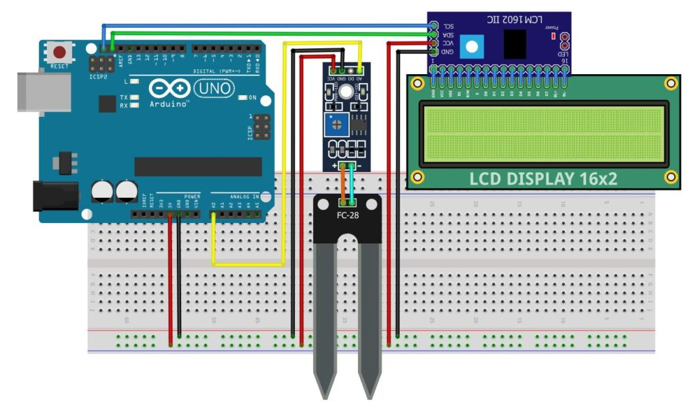

# Ders 26: mBlock LCD Ekranlı Toprak Nem Seviye Ölçme Devresi 🤖🔆📟🌱💧

Evde yokken çiçeklerimizin susuz kalıp kurumaması için nasıl akıllı sulama sistemleri yapabiliriz? Robotist’in LCD Ekranlı Toprak Nem Seviye Ölçme uygulaması, çocukların toprağın nem oranını ölçen özel bir prob (FC-28) kullanarak saksının susuz kalıp kalmadığını anlık olarak I2C LCD ekran üzerinden takip etmelerini sağlar!

Bu projeyle çocuklar; toprak direncinin nemle olan ilişkisini, analog voltaj okumayı ve ölçülen nem oranına göre ekran üzerinde bilgilendirici yönlendirmeler ("Kuru. Lütfen Sula", "Nem: Normal", "Nem: Yüksek") tasarlamayı öğrenirler.

**Robotist ile keşfet, öğren, eğlen!**

---

## 🌱 Toprak Nem Sensörü (FC-28) Çalışma Mantığı

*   **Direnç İlkesi:** Toprağa batırılan iki metal bacak (prob) arasında elektrik akımı geçirilir. Toprak ıslakken elektrik kolayca iletilir (direnç düşüktür). Toprak kurudukça iletkenlik azalır (direnç yükselir).
*   **Analog Çıkış (A0):** Sensörün ürettiği voltaj değeri Arduino tarafından okunur:
    *   **Değer > 750:** Toprak Kuru ➡️ LCD: *"Kuru. Lütfen Sula"*
    *   **Değer 450 - 750:** Toprak Nemli ➡️ LCD: *"Nem: Normal"*
    *   **Değer < 450:** Toprak Çok Islak ➡️ LCD: *"Nem: Yüksek"*


---

## ⚙️ Gerekli Elemanlar

1. **Arduino Uno** (Zekamız)
2. **Breadboard** (Bağlantı tahtamız)
3. **1x FC-28 Toprak Nem Sensörü ve Amplifikatör Kartı** (Nem dedektörümüz)
4. **1x 16x2 I2C LCD Ekran** (Türkçe karakterli bilgi ekranımız)
5. **Jumper Kablolar**

---

## 🔌 Devre Bağlantısı

Aşağıdaki bağlantı şemasını takip ederek devrenizi kurabilirsiniz:

```text
TOPRAK NEM SENSÖRÜ (FC-28) BAĞLANTISI:
- Prob Uçları ---------------------> Amplifikatör Kartı İki Vidalı Klemens (Yönü Yok)
- Amplifikatör [ VCC ] ------------> Arduino 5V (Breadboard Artı Kanalı)
- Amplifikatör [ GND ] ------------> Arduino GND (Breadboard Eksi Kanalı)
- Amplifikatör [ AO (Analog) ] ----> Arduino A0

LCD EKRAN (I2C) BAĞLANTISI:
- [ VCC ]  ------------------------> Arduino 5V (Breadboard Artı Kanalı)
- [ GND ]  ------------------------> Arduino GND (Breadboard Eksi Kanalı)
- [ SDA ]  ------------------------> Arduino Pin A4 (veya SDA pini)
- [ SCL ]  ------------------------> Arduino Pin A5 (veya SCL pini)
```



---

## 🧩 mBlock Blok Kodları

mBlock 5 ile bu devreyi kurarken:
1.  **Uzantılar** sekmesinden **"I2C LCD Ekran Türkçe"** eklentisini ekleyin.
2.  `nem` adında bir değişken oluşturun ve analog `A0` pini okuyarak bu değişkene eşitleyin.
3.  `eğer ise` blokları yardımıyla `nem` değeri 750'den büyükse alt satıra `"Kuru. Lütfen Sula"`, 450 ile 750 arasındaysa `"Nem: Normal"`, 450'den küçükse `"Nem: Yüksek"` yazdırın.
4.  Çocukların sensör kalibrasyonu yapabilmesi için üst satıra her zaman `nem` değişkeninin sayısal değerini yazdırın.


---

## 💻 Arduino C/C++ Kodları

```cpp
/*
  Ders 26: LCD Ekranlı Toprak Nem Seviye Ölçme Devresi
*/

#include <Wire.h>
#include <LiquidCrystal_I2C.h>

LiquidCrystal_I2C lcd(0x27, 16, 2);

// Özel Türkçe Karakterler
byte turkce_u[8] = { B01010, B00000, B10001, B10001, B10001, B10001, B01110, B00000 }; // ü

const int nemPin = A0;

void setup() {
  lcd.init();
  lcd.backlight();
  lcd.createChar(0, turkce_u);
  
  lcd.clear();
  lcd.setCursor(0, 0);
  lcd.print("Akilli Cicek");
  lcd.setCursor(0, 1);
  lcd.print("Sistemi Acildi");
  delay(2000);
}

void loop() {
  int nemDegeri = analogRead(nemPin);
  lcd.clear();
  
  // 1. Satır: Nem Değeri
  lcd.setCursor(0, 0);
  lcd.print("Nem Degeri: ");
  lcd.print(nemDegeri);
  
  // 2. Satır: Bitki Durum Mesajı
  lcd.setCursor(0, 1);
  if (nemDegeri > 750) {
    lcd.print("Kuru. L");
    lcd.write(0); // ü
    lcd.print("tfen Sula"); 
  } 
  else if (nemDegeri <= 750 && nemDegeri > 450) {
    lcd.print("Nem: Normal");
  } 
  else {
    lcd.print("Nem: Y");
    lcd.write(0); // ü
    lcd.print("ksek");
  }
  
  delay(1000); // Her saniye güncelle
}
```

---

## 🌐 Tinkercad Simülasyonu

Projeyi bilgisayarınızda kurmadan çevrimiçi simüle etmek isterseniz:
👉 **[Tinkercad Devresini İncele](https://www.tinkercad.com/)**
