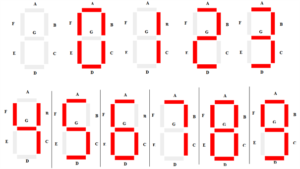
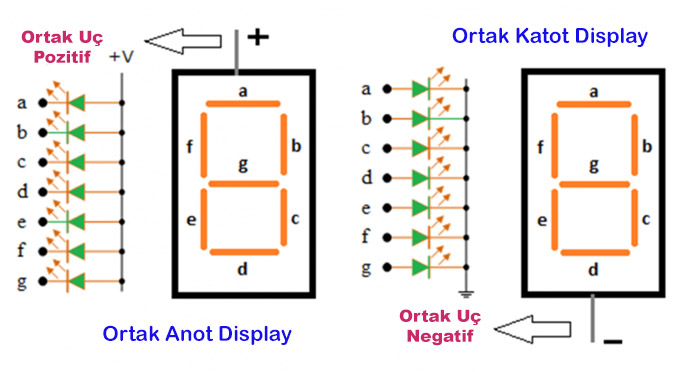
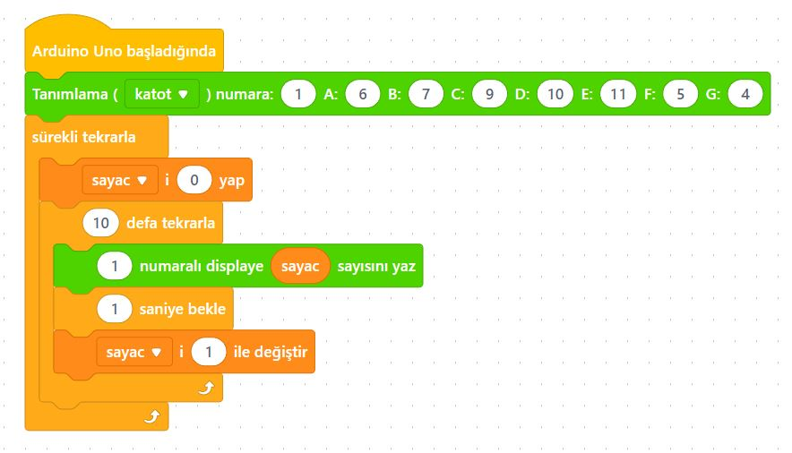

# Ders 27: mBlock 7 Segment Display 0-9 Sayıcı 🤖🔢

Sayısal göstergeler (asansörlerdeki kat numaraları, dijital saatler veya skor tabelaları) nasıl çalışır? Robotist’in 7 Segment Display uygulaması, çocukların 7 parçalı özel bir LED ekranı (7 Segment Display) kullanarak 0'dan 9'a kadar yukarı ve aşağı doğru sayan eğlenceli bir sayaç devresi kurmalarını sağlar!

Bu projeyle çocuklar; 7 segment ekranın iç yapısını, ortak anot ve ortak katot kavramlarını, birden fazla LED'i tek bir veri tablosu (dizi) kullanarak kontrol etmeyi ve zamanlama mantığını öğrenirler.

**Robotist ile keşfet, öğren, eğlen!**

---

## 🔢 7 Segment Display Nedir?

7 segment display, üzerinde 7 adet çizgisel LED ve 1 adet nokta LED bulunan bir gösterge elemanıdır. Her bir LED segmenti harflerle adlandırılır:

```text
      --- A ---
     |         |
     F         B
     |         |
      --- G ---
     |         |
     E         C
     |         |
      --- D ---   (DP) [Nokta]
```



### Ortak Katot (Common Cathode) ve Ortak Anot (Common Anode)
*   **Ortak Katot:** Tüm LED'lerin eksi (-) uçları (katot) içten birleştirilmiştir ve toprağa (GND) bağlanır. Segmentleri yakmak için ilgili pinlere **HIGH** (5V) verilir.
*   **Ortak Anot:** Tüm LED'lerin artı (+) uçları (anot) içten birleştirilmiştir ve 5V'a bağlanır. Segmentleri yakmak için ilgili pinlere **LOW** (0V) verilir.

---

## ⚙️ Gerekli Elemanlar

1. **Arduino Uno** (Zekamız)
2. **Breadboard** (Bağlantı tahtamız)
3. **1x 7 Segment Display** (Ortak Katot veya Ortak Anot)
4. **2x 220 Ω Direnç** (Ortak pin koruyucuları)
5. **Jumper Kablolar**

---

## 🔌 Devre Bağlantısı

Aşağıdaki bağlantı şemasını takip ederek devrenizi kurabilirsiniz:

```text
7 SEGMENT DISPLAY (ORTAK KATOT) BAĞLANTISI:
- Display Pin 3 ve Pin 8 (Ortadaki Pinler) ➡️ 220 Ω Direnç üzerinden Arduino GND
- Display Pin A (Pin 7)   ➡️ Arduino Pin 4
- Display Pin B (Pin 6)   ➡️ Arduino Pin 5
- Display Pin C (Pin 4)   ➡️ Arduino Pin 6
- Display Pin D (Pin 2)   ➡️ Arduino Pin 7
- Display Pin E (Pin 1)   ➡️ Arduino Pin 8
- Display Pin F (Pin 9)   ➡️ Arduino Pin 9
- Display Pin G (Pin 10)  ➡️ Arduino Pin 10
- Display Pin DP (Pin 5)  ➡️ Arduino Pin 11
```

*Not: Display pin numaraları ekranın alt sol köşesinden (1 numara) başlayıp saat yönünün tersine 10 numaraya kadar devam eder.*



---

## 🧩 mBlock Blok Kodları

mBlock 5 ile bu devreyi kurarken:
1.  **Arama** kısmına "Seven Segment" veya "segment" yazarak ilgili uzantıyı (örneğin *sendekodlasegment* uzantısını) ekleyin.
2.  `sayac` adında bir değişken oluşturun.
3.  Display tanımlama bloğundan **Ortak Katot** veya **Ortak Anot** seçiminizi yapın ve pinlerinizi eşleştirin (A: 4, B: 5, C: 6, D: 7, E: 8, F: 9, G: 10, DP: 11).
4.  Bir döngü kurarak `sayac` değerini 0'dan 9'a kadar birer saniye aralıklarla artırın ve ekranda gösterin.
5.  Ardından 9'dan 0'a kadar geri sayma döngüsü kurun.



---

## 💻 Arduino C/C++ Kodları

```cpp
/*
  Ders 27: 7 Segment Display 0-9 Sayıcı
*/

// Segment pinlerinin dizisi (A, B, C, D, E, F, G, DP)
const int segmentPins[] = {4, 5, 6, 7, 8, 9, 10, 11};

// Ortak Katot için 0-9 rakamlarının segment tablosu (1 = AÇIK, 0 = KAPALI)
const byte rakamlar[10][8] = {
  {1, 1, 1, 1, 1, 1, 0, 0}, // 0
  {0, 1, 1, 0, 0, 0, 0, 0}, // 1
  {1, 1, 0, 1, 1, 0, 1, 0}, // 2
  {1, 1, 1, 1, 0, 0, 1, 0}, // 3
  {0, 1, 1, 0, 0, 1, 1, 0}, // 4
  {1, 0, 1, 1, 0, 1, 1, 0}, // 5
  {1, 0, 1, 1, 1, 1, 1, 0}, // 6
  {1, 1, 1, 0, 0, 0, 0, 0}, // 7
  {1, 1, 1, 1, 1, 1, 1, 0}, // 8
  {1, 1, 1, 1, 0, 1, 1, 0}  // 9
};

void setup() {
  // Tüm segment pinlerini çıkış (OUTPUT) yapıyoruz
  for (int i = 0; i < 8; i++) {
    pinMode(segmentPins[i], OUTPUT);
  }
}

// Belirli bir rakamı display üzerinde gösteren fonksiyon
void rakamGoster(int sayi) {
  for (int segment = 0; segment < 8; segment++) {
    digitalWrite(segmentPins[segment], rakamlar[sayi][segment]);
  }
}

void loop() {
  // 0'dan 9'a kadar ileri doğru sayalım
  for (int i = 0; i < 10; i++) {
    rakamGoster(i);
    delay(1000);
  }
  
  delay(1000);
  
  // 9'dan 0'a kadar geri doğru sayalım
  for (int i = 9; i >= 0; i--) {
    rakamGoster(i);
    delay(1000);
  }
  
  delay(1000);
}
```

---

## 🌐 Tinkercad Simülasyonu

Projenizi tarayıcı üzerinden simüle etmek isterseniz:
👉 **[Tinkercad Devresini İncele](https://www.tinkercad.com/)**
