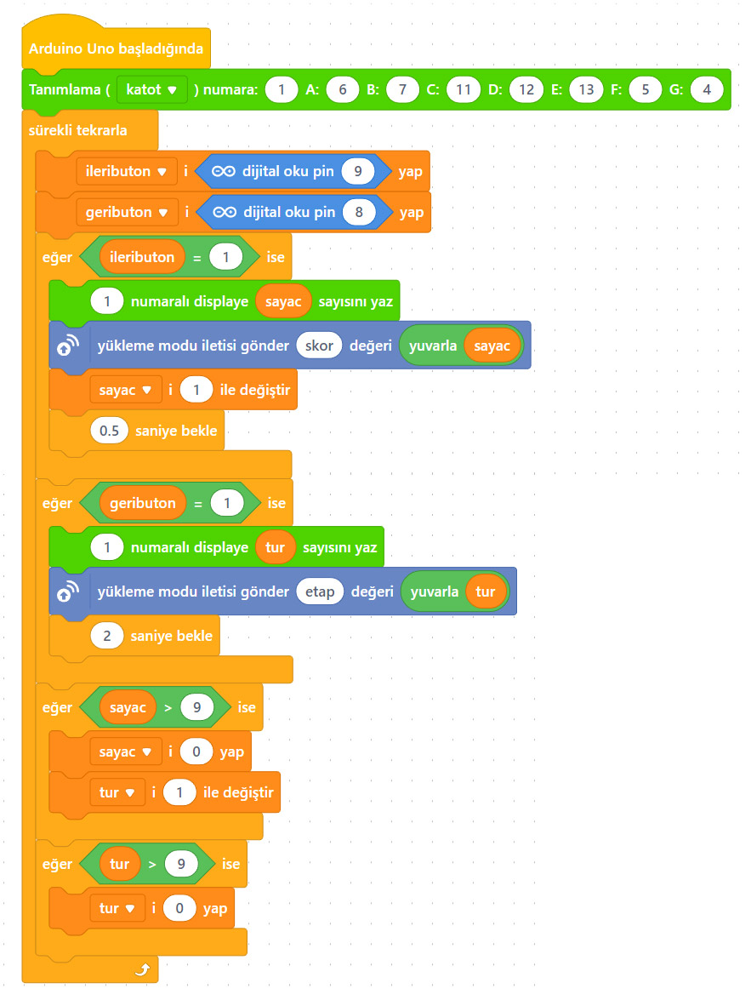

# Ders 28: mBlock 7 Segment Display Scoreboard Butonlu 🤖🔢🔘

Kendi futbol maçınız veya masa oyunlarınız için bir skor tabelası yapmaya ne dersiniz? Robotist’in Butonlu 7 Segment Display Scoreboard uygulaması, çocukların iki adet push buton kullanarak display üzerindeki sayıları artırıp azaltabilmesini sağlayan interaktif bir skor tabelası devresi kurmalarını sağlar!

Bu projeyle çocuklar; buton durum değişimi (kenar tetikleme) mantığını, buton arkı (bounce) önleme yöntemlerini ve giriş elemanları (butonlar) ile çıkış elemanlarını (gösterge) uyum içinde kontrol etmeyi öğrenirler.

**Robotist ile keşfet, öğren, eğlen!**

---

## ⚙️ Gerekli Elemanlar

1. **Arduino Uno** (Zekamız)
2. **Breadboard** (Bağlantı tahtamız)
3. **1x 7 Segment Display** (Ortak Katot veya Ortak Anot)
4. **2x Push Buton** (İleri ve Geri butonları)
5. **2x 220 Ω Direnç** (Ortak pin koruyucuları)
6. **2x 10 kΩ Direnç** (Buton pull-down dirençleri)
7. **Jumper Kablolar**

---

## 🔌 Devre Bağlantısı

Aşağıdaki bağlantı şemasını takip ederek devrenizi kurabilirsiniz:

```text
7 SEGMENT DISPLAY (ORTAK KATOT) BAĞLANTISI:
- Display Pin 3 ve Pin 8 (Ortadaki Pinler) ➡️ 220 Ω Direnç üzerinden Arduino GND
- Display Pin A (Pin 7)   ➡️ Arduino Pin 4
- Display Pin B (Pin 6)   ➡️ Arduino Pin 5
- Display Pin C (Pin 4)   ➡️ Arduino Pin 6
- Display Pin D (Pin 2)   ➡️ Arduino Pin 7
- Display Pin E (Pin 1)   ➡️ Arduino Pin 10
- Display Pin F (Pin 9)   ➡️ Arduino Pin 11
- Display Pin G (Pin 10)  ➡️ Arduino Pin 12
- Display Pin DP (Pin 5)  ➡️ Arduino Pin 13

BUTON BAĞLANTILARI (Active-High / Pull-Down):
- İleri Butonu:
  - Buton Sol Bacağı ➡️ Arduino 5V
  - Buton Sağ Bacağı ➡️ 10 kΩ Direnç üzerinden GND
  - Buton Sağ Bacağı ➡️ Arduino Pin 8
- Geri Butonu:
  - Buton Sol Bacağı ➡️ Arduino 5V
  - Buton Sağ Bacağı ➡️ 10 kΩ Direnç üzerinden GND
  - Buton Sağ Bacağı ➡️ Arduino Pin 9
```


---

## 🧩 mBlock Blok Kodları

mBlock 5 ile bu devreyi kurarken:
1.  **Seven Segment** uzantısını ekleyin.
2.  `sayac`, `ileributon`, `geributon` adında değişkenler oluşturun.
3.  Tanımlama bloğunda katot seçimi yapın ve pinlerinizi eşleştirin (A: 4, B: 5, C: 6, D: 7, E: 10, F: 11, G: 12, DP: 13).
4.  Döngü içerisinde `ileributon` değerini Pin 8'den okuyun, `geributon` değerini Pin 9'dan okuyun.
5.  `eğer ise` blokları yardımıyla:
    *   Eğer İleri Butonuna basıldıysa (değer 1 ise), sayacı 1 artırın. Eğer sayaç 9'dan büyük olduysa sayacı 0 yapın.
    *   Eğer Geri Butonuna basıldıysa (değer 1 ise), sayacı 1 azaltın. Eğer sayaç 0'dan küçük olduysa sayacı 9 yapın.
6.  Butona basıldığında tek bir sayım yapılması için her basımdan sonra `0.15 saniye bekle` bloğu ekleyin.



---

## 💻 Arduino C/C++ Kodları

```cpp
/*
  Ders 28: 7 Segment Display Scoreboard (Butonlu Sayaç)
*/

// Segment pinleri (A, B, C, D, E, F, G, DP)
const int segmentPins[] = {4, 5, 6, 7, 10, 11, 12, 13};

// Buton pinleri
const int ileriButonPin = 8;
const int geriButonPin = 9;

// Ortak Katot için segment tablosu (1 = AÇIK, 0 = KAPALI)
const byte rakamlar[10][8] = {
  {1, 1, 1, 1, 1, 1, 0, 0}, // 0
  {0, 1, 1, 0, 0, 0, 0, 0}, // 1
  {1, 1, 0, 1, 1, 0, 1, 0}, // 2
  {1, 1, 1, 1, 0, 0, 1, 0}, // 3
  {0, 1, 1, 0, 0, 1, 1, 0}, // 4
  {1, 0, 1, 1, 0, 1, 1, 0}, // 5
  {1, 0, 1, 1, 1, 1, 1, 0}, // 6
  {1, 1, 1, 0, 0, 0, 0, 0}, // 7
  {1, 1, 1, 1, 1, 1, 1, 0}, // 8
  {1, 1, 1, 1, 0, 1, 1, 0}  // 9
};

int sayac = 0; // Skor değeri

// Buton durum takibi için değişkenler
int sonIleriDurum = LOW;
int sonGeriDurum = LOW;

void setup() {
  // Segment pinlerini çıkış yapıyoruz
  for (int i = 0; i < 8; i++) {
    pinMode(segmentPins[i], OUTPUT);
  }
  
  // Buton pinlerini giriş yapıyoruz
  pinMode(ileriButonPin, INPUT);
  pinMode(geriButonPin, INPUT);
  
  // Başlangıç skorunu gösteriyoruz
  rakamGoster(sayac);
}

void rakamGoster(int sayi) {
  for (int segment = 0; segment < 8; segment++) {
    digitalWrite(segmentPins[segment], rakamlar[sayi][segment]);
  }
}

void loop() {
  // Butonların anlık durumlarını okuyoruz
  int ileriDurum = digitalRead(ileriButonPin);
  int geriDurum = digitalRead(geriButonPin);
  
  // İLERİ BUTONU KONTROLÜ (Durum Değişimi: LOW'dan HIGH'a geçiş)
  if (ileriDurum == HIGH && sonIleriDurum == LOW) {
    sayac++;
    if (sayac > 9) {
      sayac = 0; // 9'u geçince tekrar 0'a döner
    }
    rakamGoster(sayac);
    delay(150); // Debounce gecikmesi
  }
  
  // GERİ BUTONU KONTROLÜ (Durum Değişimi: LOW'dan HIGH'a geçiş)
  if (geriDurum == HIGH && sonGeriDurum == LOW) {
    sayac--;
    if (sayac < 0) {
      sayac = 9; // 0'ın altına inince 9'a döner
    }
    rakamGoster(sayac);
    delay(150); // Debounce gecikmesi
  }
  
  // Buton durumlarını güncelliyoruz
  sonIleriDurum = ileriDurum;
  sonGeriDurum = geriDurum;
}
```

---

## 🌐 Tinkercad Simülasyonu

Projenizi çevrimiçi olarak test edebilirsiniz:
👉 **[Tinkercad Devresini İncele](https://www.tinkercad.com/)**
