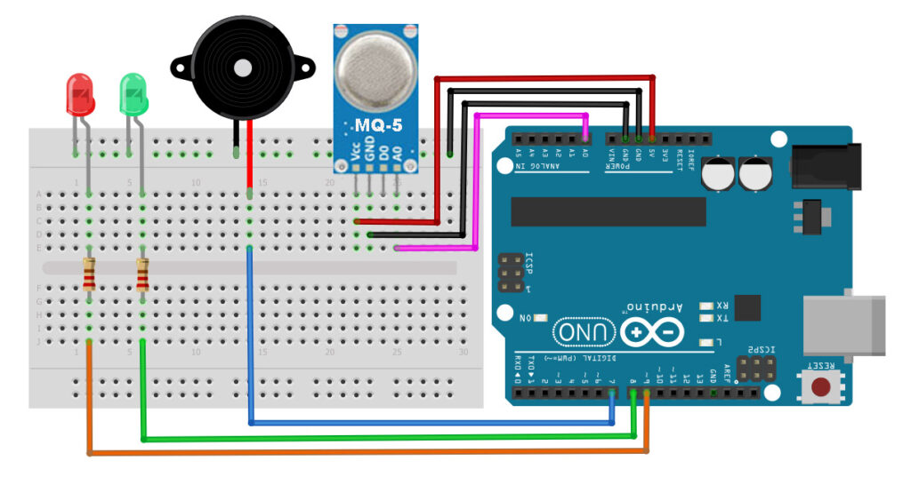
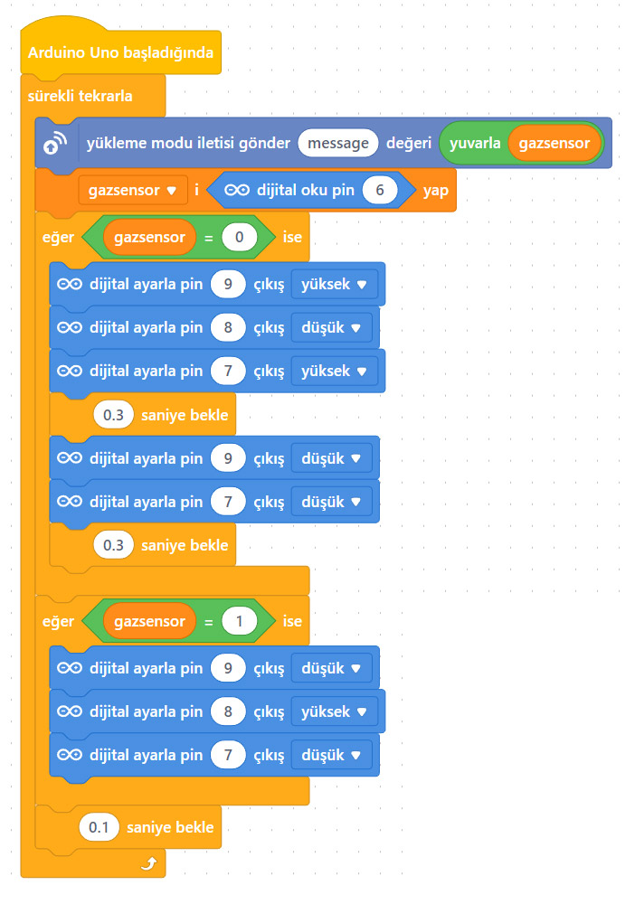

# Ders 29: mBlock MQ-5 Gaz Sensörü ile Doğal Gaz Kaçağı Alarmı 🤖💨🚨

Evlerimizde güvenliği artırmak ve doğal gaz kaçaklarına karşı önlem almak için nasıl bir sistem yapabiliriz? Robotist’in MQ-5 Gaz Sensörü ile Doğal Gaz Kaçağı Alarmı uygulaması, çocukların ortamdaki yanıcı gazları (LPG, doğal gaz, bütan) algılayan özel bir sensör (MQ-5) kullanarak tehlike anında sesli (Buzzer) ve görsel (Kırmızı LED) uyarı veren bir güvenlik devresi tasarlamalarını sağlar!

Bu projeyle çocuklar; gaz sensörlerinin çalışma mantığını, havadaki gaz yoğunluğunun analog sinyallere dönüşümünü ve kritik sınır eşikleriyle acil durum senaryoları kodlamayı öğrenirler.

**Robotist ile keşfet, öğren, eğlen!**

---

## 💨 MQ-5 Gaz Sensörü Nasıl Çalışır?

*   **Isıtıcı Eleman ve Metal Oksit Tabaka:** Sensörün içinde küçük bir ısıtıcı ve gaza duyarlı kalay dioksit ($SnO_2$) tabakası bulunur. Sensör ısındığında ortamdaki gaz molekülleri bu yüzeyle etkileşime girer.
*   **Direnç Değişimi:** Ortamda doğal gaz veya LPG yoğunluğu arttıkça sensörün iç direnci azalır ve çıkış voltajı artar.
*   **MQ Serisi Sensör Ailesi:**
    *   **MQ-2:** Duman, LPG, Bütan, Metan
    *   **MQ-5:** Doğal Gaz ve LPG (Bizim projemiz)
    *   **MQ-7:** Karbonmonoksit (Soba zehirlenmeleri için)
    *   **MQ-135:** Hava kalitesi ve zararlı gazlar



---

## ⚙️ Gerekli Elemanlar

1. **Arduino Uno** (Zekamız)
2. **Breadboard** (Bağlantı tahtamız)
3. **1x MQ-5 Gaz Sensörü Kartı** (Gaz dedektörümüz)
4. **1x Buzzer** (Sesli alarmımız)
5. **2x LED** (Kırmızı ve Yeşil)
6. **2x 220 Ω Direnç** (LED koruyucular)
7. **Jumper Kablolar**

---

## 🔌 Devre Bağlantısı

Aşağıdaki bağlantı şemasını takip ederek devrenizi kurabilirsiniz:

```text
MQ-5 GAZ SENSÖRÜ BAĞLANTISI:
- [ VCC ] -------------------------> Arduino 5V
- [ GND ] -------------------------> Arduino GND
- [ AO ] (Analog Çıkış) -----------> Arduino Pin A0

LED VE BUZZER BAĞLANTILARI:
- Kırmızı LED (Artı Uç) -----------> 220 Ω Direnç ➡️ Arduino Pin 8
- Yeşil LED (Artı Uç) -------------> 220 Ω Direnç ➡️ Arduino Pin 9
- LED'lerin Eksi Uçları -----------> Arduino GND
- Buzzer (Artı/+ Uç) --------------> Arduino Pin 7
- Buzzer (Eksi/- Uç) --------------> Arduino GND
```



---

## 🧩 mBlock Blok Kodları

mBlock 5 ile bu devreyi kurarken:
1.  `gazsensor` adında bir değişken tanımlayın.
2.  Sürekli tekrarla bloğu içerisinde analog `A0` pinini okuyup bu değeri `gazsensor` değişkenine eşitleyin.
3.  `eğer ise değilse` kontrol yapısını kurun:
    *   Eğer `gazsensor > 400` ise Pin 9'u (Yeşil LED) DÜŞÜK yapın, Pin 8'i (Kırmızı LED) ve Pin 7'yi (Buzzer) YÜKSEK yapıp 0.2 saniye bekletin, ardından her ikisini DÜŞÜK yapıp tekrar 0.2 saniye bekletin (kesikli alarm).
    *   Değilse (güvenli durum), Pin 9'u YÜKSEK (Yeşil LED Açık), Pin 8 ve Pin 7'yi DÜŞÜK (Alarm Kapalı) konumda tutun.

---

## 💻 Arduino C/C++ Kodları

```cpp
/*
  Ders 29: MQ-5 Gaz Sensörü ile Doğal Gaz Kaçağı Alarmı
*/

// Pin tanımlamaları
const int gazPin = A0;      // MQ-5 sensör analog pini
const int kirmiziLed = 8;   // Tehlike LED'i
const int yesilLed = 9;     // Güvenli LED'i
const int buzzer = 7;       // Alarm hoparlörü

// Eşik gaz değeri
const int esikDegeri = 400;

void setup() {
  pinMode(kirmiziLed, OUTPUT);
  pinMode(yesilLed, OUTPUT);
  pinMode(buzzer, OUTPUT);
  
  Serial.begin(9600); // Seri port ekranını başlat
}

void loop() {
  int gazDegeri = analogRead(gazPin);
  
  Serial.print("Gaz Seviyesi: ");
  Serial.println(gazDegeri);
  
  if (gazDegeri > esikDegeri) {
    digitalWrite(yesilLed, LOW); // Yeşil LED söner
    
    // Alarm durumunda kesikli ses ve ışık
    digitalWrite(kirmiziLed, HIGH);
    digitalWrite(buzzer, HIGH);
    delay(200);
    digitalWrite(kirmiziLed, LOW);
    digitalWrite(buzzer, LOW);
    delay(200);
  }
  else {
    digitalWrite(yesilLed, HIGH);  // Yeşil LED yanar
    digitalWrite(kirmiziLed, LOW); // Kırmızı LED söner
    digitalWrite(buzzer, LOW);     // Buzzer susar
    delay(100);
  }
}
```

---

## 🌐 Tinkercad Simülasyonu

Projenizi çevrimiçi simülatörde deneyimleyin:
👉 **[Tinkercad Devresini İncele](https://www.tinkercad.com/)**
