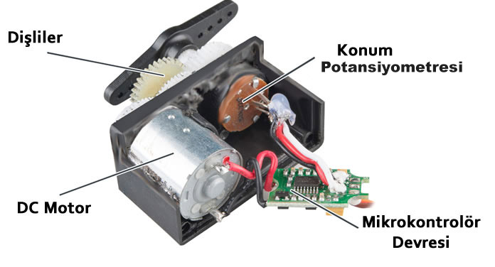
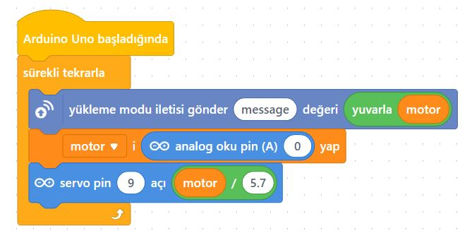
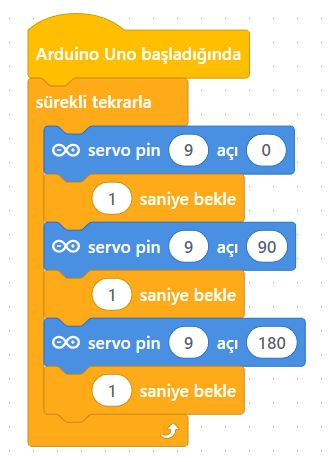

# Ders 30: mBlock ile Servo Motor Uygulamaları 🤖⚙️

Robot kollardan akıllı bariyerlere, uzaktan kumandalı araçlardan radar sistemlerine kadar hareket kontrolü gerektiren projelerde ne kullanırız? Robotist’in Servo Motor uygulaması, çocukların SG90 servo motoru kullanarak 0 ile 180 derece arasında hassas açısal dönüşler yapabilen mekanizmalar tasarlamasını sağlar!

Bu projeyle çocuklar; servo motorların çalışma mantığını, PWM (Pals Genişliği Modülasyonu) sinyallerini ve potansiyometre gibi analog girişlerle servo motor açıları arasında matematiksel ölçekleme (map) yapmayı öğrenirler.

**Robotist ile keşfet, öğren, eğlen!**

---

## ⚙️ Servo Motor Nedir ve Nasıl Çalışır?

*   **Açısal Kontrol:** DC motorların aksine servo motorlar, milinin kaç derece döneceğini kontrol edebildiğimiz motorlardır. SG90 servo motorlar genellikle 0° ile 180° arasında hareket eder.
*   **PWM Sinyalleri:** Servo motorlar, konumlarını belirlemek için PWM sinyalleri kullanır. Sinyalin 5V seviyesinde kalma süresi (pals genişliği), motor milinin hangi dereceye konumlanacağını belirler (Örn: 1.5 ms pals genişliği motoru 90 dereceye getirir).
*   **Kablo Bağlantıları:**
    *   **Kırmızı (VCC):** 5V Besleme
    *   **Kahverengi / Siyah (GND):** Toprak / Eksi
    *   **Turuncu / Sarı (Sinyal):** PWM Kontrol Pini (Arduino Pin 9)



---

## ⚙️ Gerekli Elemanlar

1. **Arduino Uno** (Zekamız)
2. **Breadboard** (Bağlantı tahtamız)
3. **1x SG90 Servo Motor**
4. **1x 10 kΩ Potansiyometre** (Açı kontrolü için)
5. **Jumper Kablolar**

---

## 🔌 Devre Bağlantısı

Aşağıdaki bağlantı şemasını takip ederek devrenizi kurabilirsiniz:

```text
SERVO MOTOR BAĞLANTISI:
- [ Kırmızı Kablo (VCC) ] -----------> Arduino 5V
- [ Kahverengi Kablo (GND) ] --------> Arduino GND
- [ Turuncu Kablo (Sinyal) ] --------> Arduino Pin 9 (PWM)

POTANSİYOMETRE BAĞLANTISI:
- Sol Bacak -------------------------> Arduino 5V
- Orta Bacak ------------------------> Arduino Pin A0
- Sağ Bacak -------------------------> Arduino GND
```



---

## 🧩 mBlock Blok Kodları

mBlock 5 ile servo motor uygulamalarında:
1.  **Aygıtlar** sekmesinden servo motor bloğunu (`pin 9 açısını 90 yap` bloğu) kullanın.
2.  **Uygulama 1 (Sabit Derece):** Yeşil bayrak tıklandığında servo açısını 90 derece yapın.
3.  **Uygulama 2 (Adımlı Dönüş):** Sürekli tekrarla içerisinde açıyı 0 yapıp 1 saniye bekle, 90 yapıp 1 saniye bekle, 180 yapıp 1 saniye bekle bloklarını kurun.
4.  **Uygulama 3 (Yumuşak Tarama):** Bir `motor` değişkeni tanımlayın. Döngüyle `motor` değerini 0'dan 180'e kadar 1'er artırıp servoya gönderin, ardından 180'den 0'a geri azaltın.
5.  **Uygulama 4 (Potansiyometre Kontrolü):** Analog `A0` okumasını 5.7 değerine bölerek açıyı elde edin ve servo açısına eşitleyin.



---

## 💻 Arduino C/C++ Kodları

Servo motor uygulamalarında en sık kullanılan **4 farklı kod yapısını** aşağıda inceleyebilirsiniz:

### 1. Sabit Açıda Konumlandırma (90 Derece)
```cpp
#include <Servo.h>
Servo servoMotor;

void setup() {
  servoMotor.attach(9); // Servoyu pin 9'a bağla
  servoMotor.write(90);  // 90 dereceye konumlandır
}

void loop() {}
```

### 2. Sıralı Dönüş (0 - 90 - 180 Derece)
```cpp
#include <Servo.h>
Servo servoMotor;

void setup() {
  servoMotor.attach(9);
}

void loop() {
  servoMotor.write(0);
  delay(1000);
  servoMotor.write(90);
  delay(1000);
  servoMotor.write(180);
  delay(1000);
}
```

### 3. Otomatik Süpürme (Sweep - Yumuşak Tarama)
```cpp
#include <Servo.h>
Servo servoMotor;

void setup() {
  servoMotor.attach(9);
}

void loop() {
  // 0'dan 180 dereceye 1'er derece artış
  for (int aci = 0; aci <= 180; aci++) {
    servoMotor.write(aci);
    delay(15);
  }
  // 180'den 0 dereceye 1'er derece azalış
  for (int aci = 180; aci >= 0; aci--) {
    servoMotor.write(aci);
    delay(15);
  }
}
```

### 4. Potansiyometre ile Hassas Açı Kontrolü
```cpp
#include <Servo.h>
Servo servoMotor;

const int potPin = A0;
const int servoPin = 9;

void setup() {
  servoMotor.attach(servoPin);
}

void loop() {
  int potDegeri = analogRead(potPin);
  int aci = map(potDegeri, 0, 1023, 0, 180);
  servoMotor.write(aci);
  delay(15);
}
```

---

## 🌐 Tinkercad Simülasyonu

Projenizi çevrimiçi simülatörde deneyimleyin:
👉 **[Tinkercad Devresini İncele](https://www.tinkercad.com/)**
