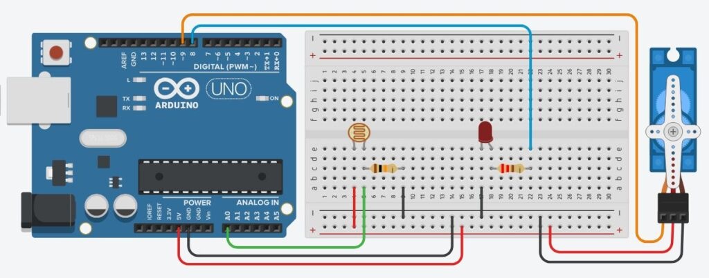
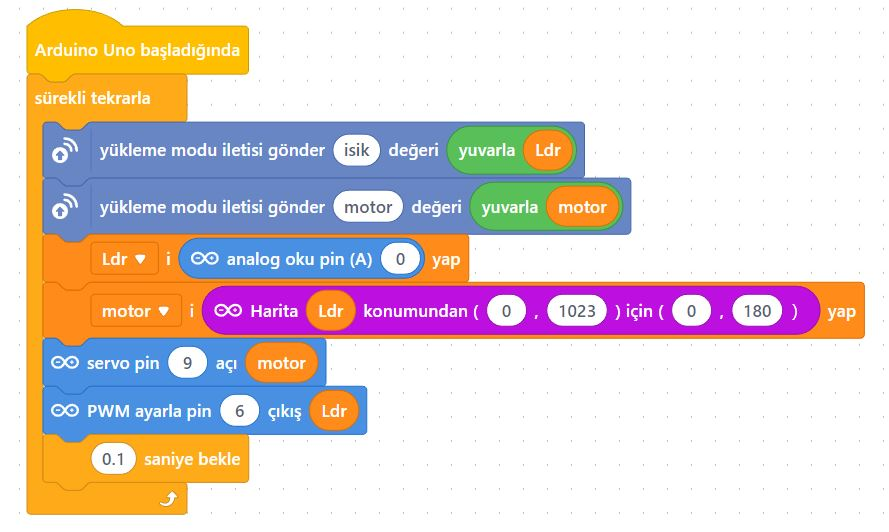

# Ders 31: mBlock LDR ile Işığa Göre Hareket Eden Servo Motor 🤖☀️⚙️

Hava karardığında pencerelerin perdelerini veya dükkan kepenklerini otomatik kapatan, gün aydınlandığında ise tekrar açan akıllı bir ev sistemi tasarlamak ister misiniz? Robotist’in LDR ile Işığa Göre Hareket Eden Servo Motor uygulaması, çocukların ışık sensörü (LDR) yardımıyla güneş ışığını veya el feneri ışığını algılayarak servo motoru belirli açılarda döndüren akıllı sistem tasarımları yapmasını sağlar!

Bu projeyle çocuklar; LDR değerlerine göre karar mekanizmaları kurmayı, orantılı eşleme (map) mantığını ve PWM sinyali kullanan eyleyicileri (servo) kontrol etmeyi öğrenirler.

**Robotist ile keşfet, öğren, eğlen!**

---

## ⚙️ Gerekli Elemanlar

1. **Arduino Uno** (Zekamız)
2. **Breadboard** (Bağlantı tahtamız)
3. **1x SG90 Servo Motor**
4. **1x LDR (Işık Sensörü)**
5. **1x LED** (Yeşil veya Kırmızı)
6. **1x 10 kΩ Direnç** (LDR pull-down direnci)
7. **1x 220 Ω Direnç** (LED koruyucu direnci)
8. **Jumper Kablolar**

---

## 🔌 Devre Bağlantısı

Aşağıdaki bağlantı şemasını takip ederek devrenizi kurabilirsiniz:

```text
LDR (IŞIK SENSÖRÜ) BAĞLANTISI (Active-High):
- LDR Sol Bacağı --------------------> Arduino 5V
- LDR Sağ Bacağı --------------------> 10 kΩ Direnç ➡️ Arduino GND
- LDR Sağ Bacağı --------------------> Arduino Analog Pin A0

SERVO MOTOR BAĞLANTISI:
- Kırmızı Kablo (VCC) ---------------> Arduino 5V
- Kahverengi Kablo (GND) ------------> Arduino GND
- Turuncu Kablo (Sinyal) ------------> Arduino Pin 9 (PWM)

LED BAĞLANTISI:
- LED Artı (+) Ucu ------------------> 220 Ω Direnç ➡️ Arduino Pin 6 (PWM)
- LED Eksi (-) Ucu ------------------> Arduino GND
```



---

## 🧩 mBlock Blok Kodları

mBlock 5 ile bu devreyi kurarken:
1.  `Ldr` ve `motor` adında iki adet değişken oluşturun.
2.  **Uygulama 1 (Eşik Değeri Kontrolü):**
    *   Sürekli tekrarla içerisinde `Ldr` değişkenine analog `A0` okumasını aktarın.
    *   Eğer `Ldr < 700` ise Pin 9 açısını 180 yapın (perde kapansın) ve Pin 8 dijital çıkışını YÜKSEK yapın (LED yansın).
    *   Değilse Pin 9 açısını 0 yapın (perde açılsın) ve Pin 8 dijital çıkışını DÜŞÜK yapın (LED sönsün).
3.  **Uygulama 2 (Orantılı Kontrol - Işık Şiddetine Göre):**
    *   Analog `A0` okumasını matematiksel oranlarla (0-180 aralığına) ölçekleyip `motor` değişkenine atayın ve servo motor açısını `motor` değişkeni yapın. LED parlaklığını juga PWM çıkışı (Pin 6) ile orantılı kontrol edin.



---

## 💻 Arduino C/C++ Kodları

### 1. Basit Eşik Değeri Kontrollü (Akşam Kapanan Perde)
```cpp
#include <Servo.h>
Servo servoMotor;

const int ldrPin = A0;
const int ledPin = 8;

void setup() {
  servoMotor.attach(9);
  pinMode(ledPin, OUTPUT);
}

void loop() {
  int ldrDegeri = analogRead(ldrPin);
  
  if (ldrDegeri < 700) {
    servoMotor.write(180);
    digitalWrite(ledPin, HIGH);
  } else {
    servoMotor.write(0);
    digitalWrite(ledPin, LOW);
  }
  delay(100);
}
```

### 2. Kademeli ve Orantılı Kontrol (Işık Şiddetine Göre Otomatik Perde)
```cpp
#include <Servo.h>
Servo servoMotor;

const int ldrPin = A0;
const int ledPin = 6; // PWM pini

void setup() {
  servoMotor.attach(9);
  pinMode(ledPin, OUTPUT);
}

void loop() {
  int ldrDegeri = analogRead(ldrPin);
  
  // Karanlıkta motor 180 dereceye (kapalı), aydınlıkta 0 dereceye (açık) gitsin
  int motorAcisi = map(ldrDegeri, 200, 900, 0, 180);
  motorAcisi = constrain(motorAcisi, 0, 180);
  
  // Karanlıkta LED daha parlak yansın
  int ledParlaklik = map(ldrDegeri, 200, 900, 255, 0);
  ledParlaklik = constrain(ledParlaklik, 0, 255);
  
  servoMotor.write(motorAcisi);
  analogWrite(ledPin, ledParlaklik);
  
  delay(20);
}
```

---

## 🌐 Tinkercad Simülasyonu

Projenizi çevrimiçi simülatörde deneyimleyin:
👉 **[Tinkercad Devresini İncele](https://www.tinkercad.com/)**
