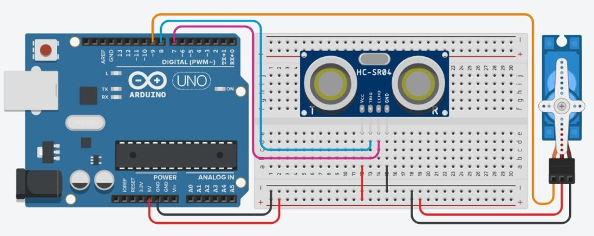
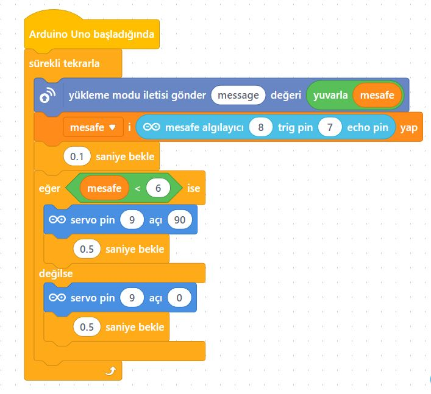

# Ders 32: mBlock Servo Motor ve HC-SR04 Ultrasonik Sensör ile Akıllı Engel Bariyeri 🤖📏⚙️

Alışveriş merkezlerinin veya sitelerin otopark girişlerindeki otomatik açılan bariyerleri veya elinizi yaklaştırdığınızda kendiliğinden açılan akıllı çöp kutularını görmüşsünüzdür. Robotist’in bu uygulamasında çocuklar, HC-SR04 Ultrasonik Mesafe Sensörü ve SG90 Servo Motor kullanarak nesneleri algılayan ve otomatik olarak açılıp kapanan bir akıllı bariyer/kapı sistemi tasarlarlar!

Bu projeyle çocuklar; ses dalgalarıyla mesafe ölçüm mantığını, zaman-mesafe dönüşümünü ve sensörden gelen verilere göre motor hareketini tetikleyen algoritmalar tasarlamayı öğrenirler.

**Robotist ile keşfet, öğren, eğlen!**

---

## 📏 HC-SR04 Ultrasonik Sensör Nasıl Çalışır?

*   **Ses Dalgaları ile Algılama:** HC-SR04 sensörü, insanın duyamayacağı yükseklikte bir ses dalgası (ultrasonik) yayar. Bu dalga bir engele çarpıp geri döner.
*   **Trig Pini:** Tetikleme sinyalidir. Bu pinden 10 mikrosaniyelik mikro-darbe gönderilerek ölçüm başlatılır.
*   **Echo Pini:** Yansıyan sinyalin algılanma bacağıdır. Ses dalgasının çıkış ve dönüş süresi boyunca bu pin yüksek (HIGH) kalır.
*   **Matematiksel Hesaplama:** Ses havada saniyede yaklaşık 340 metre yol alır. Gidiş-dönüş süresini santimetreye dönüştürmek için şu formül kullanılır:
    $$\text{Mesafe (cm)} = \frac{\text{Süre (mikrosaniye)}}{58.2}$$

---

## ⚙️ Gerekli Elemanlar

1. **Arduino Uno** (Zekamız)
2. **Breadboard** (Bağlantı tahtamız)
3. **1x HC-SR04 Ultrasonik Sensör** (Mesafe gözümüz)
4. **1x SG90 Servo Motor** (Bariyer kolumuz)
5. **Jumper Kablolar**

---

## 🔌 Devre Bağlantısı

Aşağıdaki bağlantı şemasını takip ederek devrenizi kurabilirsiniz:

```text
HC-SR04 MESAFE SENSÖRÜ BAĞLANTISI:
- [ VCC ] -------------------------> Arduino 5V
- [ GND ] -------------------------> Arduino GND
- [ Trig ] ------------------------> Arduino Pin 8
- [ Echo ] ------------------------> Arduino Pin 7

SERVO MOTOR BAĞLANTISI:
- Kırmızı Kablo (VCC) -------------> Arduino 5V
- Kahverengi Kablo (GND) -----------> Arduino GND
- Turuncu Kablo (Sinyal) -----------> Arduino Pin 9 (PWM)
```



---

## 🧩 mBlock Blok Kodları

mBlock 5 ile bu devreyi kurarken:
1.  `mesafe` adında bir değişken tanımlayın.
2.  Sürekli tekrarla bloğu içerisinde `mesafe` değişkenini `tetikleme pini 8 olan yankı pini 7 olan ultrasonik mesafe sensörü oku` değerine eşitleyin.
3.  `eğer ise değilse` kontrol yapısını ekleyin:
    *   Eğer `mesafe < 6` ise Pin 9'daki servo motorun açısını 90 yapın (Bariyer Açık).
    *   Değilse Pin 9'daki servo motorun açısını 0 yapın (Bariyer Kapalı).
4.  Döngünün sonuna kararlı okuma sağlamak amacıyla `0.1 saniye bekle` bloğu koyun.



---

## 💻 Arduino C/C++ Kodları

```cpp
/*
  Ders 32: HC-SR04 Ultrasonik Sensör ile Servo Motor Kontrolü
*/

#include <Servo.h>

Servo bariyerServo;

const int trigPin = 8;
const int echoPin = 7;
const int servoPin = 9;

// Algılama eşiği (6 cm)
const int esikMesafe = 6;

void setup() {
  bariyerServo.attach(servoPin);
  
  pinMode(trigPin, OUTPUT);
  pinMode(echoPin, INPUT);
  
  bariyerServo.write(0); // Bariyeri başlangıçta kapat
  Serial.begin(9600);
}

void loop() {
  // Ultrasonik sinyal gönderiliyor
  digitalWrite(trigPin, LOW);
  delayMicroseconds(2);
  digitalWrite(trigPin, HIGH);
  delayMicroseconds(10);
  digitalWrite(trigPin, LOW);
  
  // Yankı süresini oku
  long sure = pulseIn(echoPin, HIGH);
  
  // Mesafeyi santimetreye dönüştür
  int mesafe = sure / 58.2;
  
  Serial.print("Mesafe: ");
  Serial.print(mesafe);
  Serial.println(" cm");
  
  if (mesafe > 0 && mesafe < esikMesafe) {
    bariyerServo.write(90); // Bariyeri aç
    Serial.println("-> Engel algılandı! Kapı Açık.");
  } 
  else {
    bariyerServo.write(0);  // Bariyeri kapat
  }
  
  delay(100);
}
```

---

## 🌐 Tinkercad Simülasyonu

Projenizi çevrimiçi simülatörde deneyimleyin:
👉 **[Tinkercad Devresini İncele](https://www.tinkercad.com/)**
