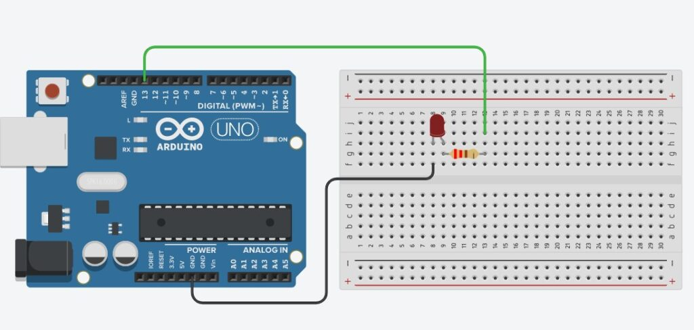
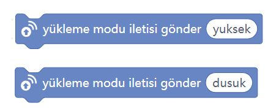

# Ders 33: mBlock Canlı Çalıştırma Modu ve Kukla Etkileşimi 🤖📡

Arduino projelerimizde kod yazdıktan sonra yüklenmesini beklemek yerine, yaptığımız değişiklikleri anında gözlemlemek ister misiniz? Robotist’in **mBlock Canlı Çalıştırma Modu** uygulaması, çocukların kod bloklarını anlık olarak çalıştırmasını ve Arduino üzerindeki donanımlar ile bilgisayar ekranındaki kuklaları (Sprite) etkileşimli bir şekilde konuşturmasını sağlar.

Bu dersle birlikte çocuklar; canlı (live) modunun çalışma mantığını, **Yükleme Modu Yayını (Upload Mode Broadcast)** eklentisini, seri port üzerinden veri iletimini ve donanım-yazılım arası çift yönlü haberleşmeyi kavrar!

**Robotist ile keşfet, öğren, eğlen!**

---

## 📡 Canlı Mod ve Yükleme Modu Yayını Nedir?

*   **Canlı (Live) Modu:** Bu modda yazdığımız kodlar doğrudan Arduino kartına yüklenmez. Bunun yerine mBlock, bilgisayar üzerinden Arduino ile anlık seri haberleşme kurar. Bloklara tıkladığınız anda ilgili komut anında karta gönderilir ve çalıştırılır. Prototip yaparken ve kodları test ederken inanılmaz hız kazandırır!
*   **Yükleme Modu Yayını (Upload Mode Broadcast):** Arduino'ya yüklediğimiz kodların, bilgisayar ekranındaki mBlock kuklalarıyla iletişim kurmasını sağlayan özel bir protokoldür. Örneğin; Arduino'ya bağlı bir sensör tetiklendiğinde kuklanın konuşmasını veya sahne arka planının değişmesini sağlayabiliriz.

---

## ⚙️ Gerekli Elemanlar

1.  **Arduino Uno** (Zekamız)
2.  **Breadboard** (Bağlantı tahtamız)
3.  **1x LED** (Durum göstergemiz)
4.  **1x 220Ω Direnç** (LED koruması için)
5.  **Jumper Kablolar**

---

## 🔌 Devre Şeması

Bu projede temel bir LED kontrolü yapıyoruz:
*   LED'in anot (+) bacağını 220Ω direnç üzerinden Arduino **Pin 13**'e bağlayın.
*   LED'in katot (-) bacağını Arduino **GND** pinine bağlayın.



---

## 🧩 mBlock Blok Kodları

Canlı modu ve kukla etkileşimini kullanabilmek için hem **Aygıtlar** hem de **Kuklalar** sekmesinde **Yükleme Modu Yayını** eklentisini yüklememiz gerekir:

1.  Dizinler sütununun en altındaki **+ Uzantı** butonuna tıklayın.
2.  Açılan pencereden **Yükleme Modu Yayını** (Upload Mode Broadcast) eklentisini ekleyin.

### 1. Aygıt (Arduino) Blokları:
Arduino Uno kartımız başladığında sürekli olarak LED'i yakıp söndürür ve anlık durumu kuklaya bildirmek üzere "yuksek" ve "dusuk" mesajlarını yayınlar.



### 2. Kukla (Panda) Blokları:
Kuklamız ise Arduino'dan gelen "yuksek" ve "dusuk" mesajlarını dinler. Mesaj geldiğinde ekranda "Lamba Yandı" veya "Lamba Söndü" şeklinde konuşur.


---

## 💻 Arduino C/C++ Kodları

Yükleme Modu Yayını eklentisi arka planda seri haberleşmeyi (Serial Communication) kullanır. Aşağıdaki kod, Arduino'nun mBlock arayüzündeki kuklayla haberleşmesi için arka planda çalışan saf C++ kodunu temsil eder:

```cpp
/*
  Ders 33: mBlock Canlı Çalıştırma Modu & İletişim Kodları
*/

const int ledPin = 13;

void setup() {
  pinMode(ledPin, OUTPUT);
  Serial.begin(115200); // mBlock ile hızlı seri haberleşme
}

void loop() {
  // LED'i yak ve mBlock kuklasına 'yuksek' mesajı gönder
  digitalWrite(ledPin, HIGH);
  Serial.println("yuksek"); 
  delay(1000);
  
  // LED'i söndür ve mBlock kuklasına 'dusuk' mesajı gönder
  digitalWrite(ledPin, LOW);
  Serial.println("dusuk"); 
  delay(1000);
}
```

---

## 💡 Önemli İpuçları ve Canlı Mod Kurulumu

1.  **Bellenim (Firmware) Güncellemesi:** Canlı mod butonuna bastığınızda kartınız tepki vermiyorsa veya hata alıyorsanız, Aygıtlar sekmesindeki **Güncelle** veya **Bellenim Güncelle** (Firmware Update) seçeneğini kullanarak kartınıza mBlock'un canlı bağlantı yazılımını yükleyin.
2.  **Türkçe Karakter Uyarısı:** Yükleme modu yayınlarında iletilen mesaj isimlerinde (`yuksek`, `dusuk`) kesinlikle Türkçe karakter kullanmamaya dikkat edin. Ancak kuklanın ekranda söyleyeceği mesajlarda (`Lamba Yandı`, `Lamba Söndü`) Türkçe karakter kullanabilirsiniz.

---

## 🌐 Tinkercad Simülasyonu

Projenin temel LED bağlantısını Tinkercad üzerinde simüle etmek isterseniz:
👉 **[Tinkercad Devresini İncele](https://www.tinkercad.com/)**

---

**Hazırlayan:** [sultanamed](https://github.com/sultanamed) 💻  
www.robotist.fun  
Hayal gücünü kodla, geleceği robotla!
