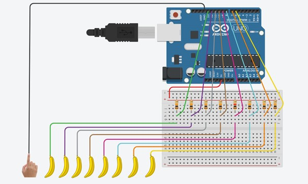
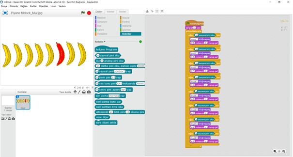

# Ders 34: mBlock ile Muz Piyano (Banana Piano) Yapımı 🍌🎹

Sıradan meyveleri dokunmatik bir piyano tuşuna dönüştürmek ister misiniz? Robotist’in **Muz Piyano** uygulaması, çocukların insan vücudunun iletkenliğini kullanarak meyvelere dokunduklarında nasıl elektrik akımını tamamladıklarını ve bu sayede bilgisayardan veya bir buzzerdan nota sesleri çıkartabileceklerini öğrenmelerini sağlar.

Bu dersle birlikte çocuklar; insan vücudunun ve meyvelerin iletkenliğini, pull-up direnç bağlantı mantığını, mBlock ile bilgisayar hoparlöründen ses üretmeyi ve Arduino ile `tone()` fonksiyonu kullanarak melodi çalmayı öğrenirler!

**Robotist ile keşfet, öğren, eğlen!**

---

## 🍌 İletkenlik ve Dokunmatik Piyano Mantığı

*   **İnsan Vücudu ve Meyvelerin İletkenliği:** Su oranı yüksek olan muz, elma, portakal gibi meyveler elektrik akımını iletir. İnsan vücudu da zayıf bir iletkendir.
*   **Devrenin Tamamlanması:** Arduino'nun toprak (GND) ucuna bağlı bir kabloyu bir elimizle tutarken, diğer elimizle bir muza dokunduğumuzda akım üzerimizden toprağa akar. Arduino, pindeki bu voltaj düşüşünü (HIGH'dan LOW'a geçişi) algılayarak dokunulduğunu anlar ve ilgili notayı çalar.
*   **Pull-Up Direnç Kullanımı:** Boşta duran giriş pinlerinin kararsız sinyaller (gürültü) almasını engellemek için pinleri 10kΩ dirençlerle 5V hattına bağlarız. Böylece muzlara dokunmadığımızda pinler hep HIGH (1) değerini okur. Muza dokunduğumuz anda ise pin LOW (0) değerine çekilir.

---

## ⚙️ Gerekli Elemanlar

1.  **Arduino Uno** (Zekamız)
2.  **Breadboard** (Bağlantı tahtamız)
3.  **8x Muz** veya farklı meyve/iletken nesne (Portakal, elma, alüminyum folyo vb.)
4.  **8x 10kΩ Direnç** (Pull-up dirençleri için)
5.  **1x Pasif Buzzer** (Arduino bağımsız modu için opsiyonel)
6.  **Jumper Kablolar**

---

## 🔌 Devre Şeması

*   8 adet 10kΩ direncin birer uçlarını breadboard üzerinde birleştirip Arduino **5V** pinine bağlayın.
*   Dirençlerin diğer uçlarını sırasıyla Arduino **D6, D7, D8, D9, D10, D11, D12 ve D13** pinlerine bağlayın.
*   Aynı pinlerden birer jumper kablo daha çıkartarak uçlarını meyvelere saplayın.
*   Arduino'nun **GND** pininden uzun bir jumper kablo çıkartın. Bu kablonun metal ucunu piyano çalarken bir elinizle sürekli tutmanız gerekecektir.
*   *(Opsiyonel)* Bağımsız mod için buzzerın artı (+) ucunu **D5** pinine, eksi (-) ucunu ise **GND**'ye bağlayın.



---

## 🧩 mBlock Blok Kodları

mBlock 5 üzerinde muz piyanosunu çalıştırmak için Canlı Mod eklentisini kullanabiliriz. Dokunmatik mantığı gereği, dirençler pull-up yapıldığı için **pine bağlı değer LOW (0) olduğunda** (yani dokunulduğunda) nota çalınacaktır.

*   Sürekli tekrarla döngüsü içerisinde her bir pini (`D6` ile `D13` arası) kontrol edin.
*   Pindeki değer `0` (LOW) olduğunda ilgili kukla kılığına geçilmesini ve bilgisayar hoparlöründen ilgili notanın çalınmasını sağlayın.



---

## 💻 Arduino C/C++ Kodları (Bağımsız Çevrimdışı Mod)

Bilgisayardan bağımsız olarak, Arduino Uno kartına bir buzzer bağlayarak projeyi çalıştırmak isterseniz aşağıdaki saf C++ kodunu kullanabilirsiniz. Bu kodda Arduino'nun dahili pull-up dirençlerini (`INPUT_PULLUP`) aktif ederek devre kurulumunu daha da basitleştirebilirsiniz!

```cpp
/*
  Ders 34: Arduino Muz Piyano (Bağımsız Buzzer Modu)
*/

// Buzzer pini
const int buzzerPin = 5;

// Piyano tuş pinleri (8 adet)
const int tusPinleri[8] = {13, 12, 11, 10, 9, 8, 7, 6};

// Notaların frekans değerleri (C4, D4, E4, F4, G4, A4, B4, C5)
const int notalar[8] = {262, 294, 330, 349, 392, 440, 494, 523};

void setup() {
  pinMode(buzzerPin, OUTPUT);
  
  // Tüm giriş pinlerini dahili PULL-UP modunda tanımlıyoruz.
  // Bu sayede dışarıdan 10k direnç bağlamanıza gerek kalmaz!
  for (int i = 0; i < 8; i++) {
    pinMode(tusPinleri[i], INPUT_PULLUP);
  }
}

void loop() {
  bool herhangiBirTusBasildi = false;

  for (int i = 0; i < 8; i++) {
    // İletkenlikle parmak basıldığında pin LOW (0) seviyesine çekilir
    if (digitalRead(tusPinleri[i]) == LOW) {
      tone(buzzerPin, notalar[i]); // İlgili notayı çal
      herhangiBirTusBasildi = true;
      break; // Aynı anda sadece tek nota çalınmasını sağlar
    }
  }

  // Hiçbir tuşa basılmıyorsa sesi kes
  if (!herhangiBirTusBasildi) {
    noTone(buzzerPin);
  }
  
  delay(50); // Kararlı okuma için kısa gecikme
}
```

---

## 🌐 Tinkercad Simülasyonu

Projenin bağlantısını ve mantığını Tinkercad üzerinde simüle edip test etmek isterseniz:
👉 **[Tinkercad Devresini İncele](https://www.tinkercad.com/)**

---

**Hazırlayan:** [sultanamed](https://github.com/sultanamed) 💻  
www.robotist.fun  
Hayal gücünü kodla, geleceği robotla!
