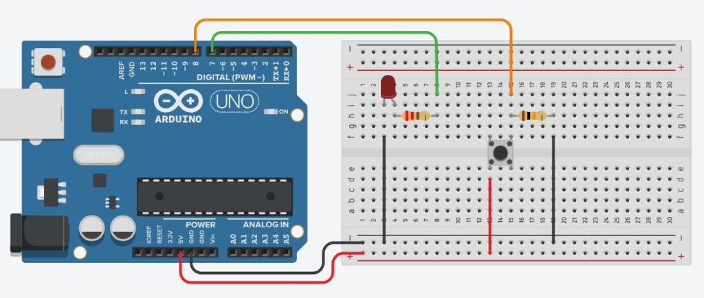
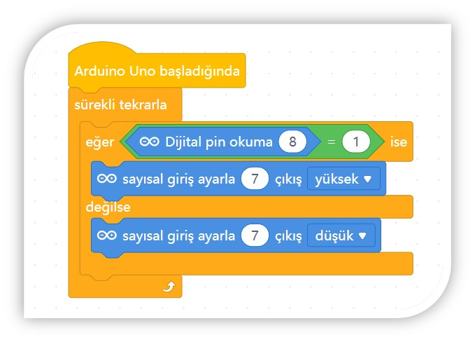

# Ders 35: Bir Buton ile LED Yakma (Anlık Kontrol) 🔘💡

Elektronik devrelerde butonların en temel çalışma biçimini öğrenmeye hazır mısınız? Robotist’in **Bir Buton ile LED Yakma** uygulaması, çocukların butona bastıkları sürece LED'in yanmasını, ellerini çektiklerinde ise sönmesini sağlayan anlık (momentary) kontrol mantığını kavramalarını sağlar.

Bu dersle birlikte çocuklar; dijital okuma komutunu, push butonların mekanik yapısını, pull-down direnç bağlantısının önemini ve `if-else` (eğer-değilse) karar yapılarını öğrenirler!

**Robotist ile keşfet, öğren, eğlen!**

---

## 🔘 Anlık (Momentary) Buton Çalışma Mantığı

*   **Anlık Kontrol:** Bu sistemde buton bir anahtar gibi durumunu korumaz. Tıpkı bir kapı zili veya bilgisayar klavyesi tuşu gibi, sadece üzerine basıldığı sürece elektrik akımını iletir.
*   **Pull-Down Direnci:** Buton açıkken (basılmıyorken) giriş pininin kararsız kalıp rastgele HIGH/LOW değerleri okumasını engellemek için pini bir 10kΩ dirençle toprağa (GND) bağlarız. Butona basılmadığında pin güvenli bir şekilde LOW (0) okur. Butona basıldığında ise 5V akımı direnci aşarak pine ulaşır ve pin HIGH (1) değerini alır.

---

## ⚙️ Gerekli Elemanlar

1.  **Arduino Uno** (Zekamız)
2.  **Breadboard** (Bağlantı tahtamız)
3.  **1x Push Buton** (Dört bacaklı basmalı buton)
4.  **1x LED** (Işığımız)
5.  **1x 220Ω Direnç** (LED koruması için)
6.  **1x 10kΩ Direnç** (Buton pull-down direnci için)
7.  **Jumper Kablolar**

---

## 🔌 Devre Şeması

Bu projede butonu toprağa (GND) çekmek için Pull-Down direnci kullanıyoruz:
*   **LED:** Anot (+) bacağını 220Ω direnç üzerinden Arduino **Pin 7**'ye, katot (-) ucunu **GND**'ye bağlayın.
*   **Buton:** Bir bacağını Arduino **Pin 8**'ye bağlayın. Aynı bacağa 10kΩ direnç bağlayıp direncin diğer ucunu **GND**'ye bağlayın (Pull-Down). Butonun karşısındaki bacağı ise doğrudan Arduino **5V** pinine bağlayın.



---

## 🧩 mBlock Blok Kodları

mBlock 5 üzerinde sürekli tekrarla döngüsü içinde eğer-değilse bloğu kullanırız. Dijital pin 8'in değeri `1` (HIGH) ise pini yakar, değilse söndürürüz:



---

## 💻 Arduino C/C++ Kodları

Aşağıdaki saf C++ kodu, butona basıldığında LED'in yanmasını, bırakıldığında ise sönmesini sağlayan kod yapısıdır:

```cpp
/*
  Ders 35: Bir Buton ile LED Yakma (Anlık Kontrol)
*/

const int ledPin = 7;     // LED'in bağlı olduğu pin
const int buttonPin = 8;  // Butonun bağlı olduğu pin

void setup() {
  pinMode(ledPin, OUTPUT);   // LED pinini çıkış olarak tanımla
  pinMode(buttonPin, INPUT); // Buton pinini giriş olarak tanımla
}

void loop() {
  // Buton durumunu okuyoruz (HIGH veya LOW)
  int butonDurumu = digitalRead(buttonPin);
  
  // Eğer butona basılmışsa (durum HIGH ise)
  if (butonDurumu == HIGH) {
    digitalWrite(ledPin, HIGH); // LED'i yak
  } 
  // Butondan el çekilmişse (durum LOW ise)
  else {
    digitalWrite(ledPin, LOW);  // LED'i söndür
  }
}
```

---

## 🌐 Tinkercad Simülasyonu

Projenin devre şemasını ve çalışmasını Tinkercad üzerinde test etmek isterseniz:
👉 **[Tinkercad Devresini İncele](https://www.tinkercad.com/)**

---

**Hazırlayan:** [sultanamed](https://github.com/sultanamed) 💻  
www.robotist.fun  
Hayal gücünü kodla, geleceği robotla!
