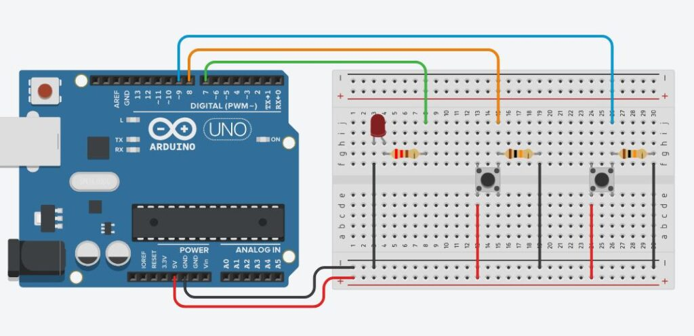
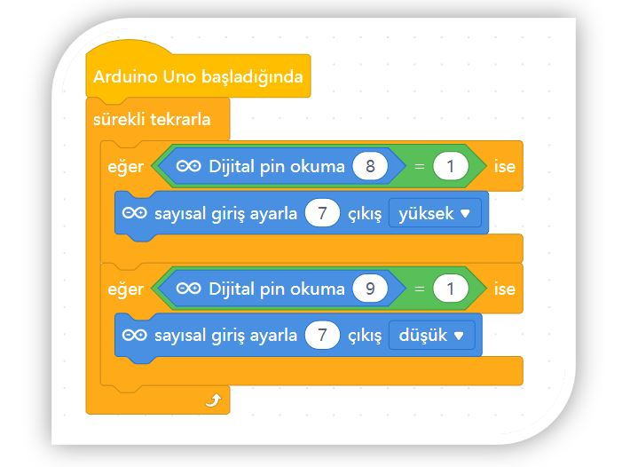

# Ders 36: İki Buton ile LED Yakma Söndürme (Set-Reset) 🔘🔘💡

Endüstriyel makinelerin ve sistemlerin acil durdurma (Start-Stop) mantığını öğrenmeye hazır mısınız? Robotist’in **İki Buton ile LED Yakma Söndürme** uygulaması, çocukların iki farklı buton kullanarak bir sistemi başlatıp (Set) ve durdurmasını (Reset / Stop) sağlayan bellek (latching) mantığını kavramalarını sağlar.

Bu dersle birlikte çocuklar; iki ayrı dijital giriş pini okumayı, pull-down dirençli çoklu buton bağlantısını ve mantıksal hafıza (Set-Reset) yapısını öğrenirler!

**Robotist ile keşfet, öğren, eğlen!**

---

## 🔘 Set-Reset (Çalıştır-Durdur) Mantığı

*   **Set Butonu (Start):** Bu butona basıldığında LED yanar ve elimizi butondan çeksek bile LED yanmaya devam eder (durum kilitlenir / set edilir).
*   **Reset Butonu (Stop):** Diğer butona basıldığında ise LED söner ve elimizi çeksek bile sönük kalır (durum sıfırlanır / reset edilir).
*   **Kullanım Alanları:** Sanayideki makine çalıştırma butonları (yeşil start, kırmızı stop butonları) tamamen bu mantıkla çalışır. Bu güvenlik açısından çok önemlidir; elektrik kesilip geldiğinde makinenin kendi kendine çalışmaya başlamasını engeller.

---

## ⚙️ Gerekli Elemanlar

1.  **Arduino Uno** (Zekamız)
2.  **Breadboard** (Bağlantı tahtamız)
3.  **2x Push Buton** (Dört bacaklı basmalı butonlar)
4.  **1x LED** (Kontrol edeceğimiz ışık)
5.  **1x 220Ω Direnç** (LED koruması için)
6.  **2x 10kΩ Direnç** (Buton pull-down dirençleri için)
7.  **Jumper Kablolar**

---

## 🔌 Devre Şeması

Bu projede her iki buton için de ayrı pull-down dirençleri kullanıyoruz:
*   **LED:** Anot (+) bacağını 220Ω direnç üzerinden Arduino **Pin 7**'ye, katot (-) ucunu **GND**'ye bağlayın.
*   **Start Butonu (Set):** Bacaklarından birini Arduino **Pin 8**'e bağlayın. Aynı bacağa 10kΩ direnç bağlayıp direncin diğer ucunu **GND**'ye bağlayın. Butonun karşısındaki bacağı **5V**'a bağlayın.
*   **Stop Butonu (Reset):** Bacaklarından birini Arduino **Pin 9**'a bağlayın. Aynı bacağa 10kΩ direnç bağlayıp direncin diğer ucunu **GND**'ye bağlayın. Butonun karşısındaki bacağı **5V**'a bağlayın.



---

## 🧩 mBlock Blok Kodları

mBlock 5 üzerinde sürekli tekrarla döngüsü içerisinde iki adet bağımsız `eğer` bloğu kullanırız. Dijital pin 8 (Start) `1` (HIGH) okunduğunda pin 7'yi yüksek (HIGH) yaparız. Dijital pin 9 (Stop) `1` (HIGH) okunduğunda pin 7'yi düşük (LOW) yaparız:



---

## 💻 Arduino C/C++ Kodları

Aşağıdaki saf C++ kodu, Start butonuna basıldığında LED'in sürekli yanık kalmasını, Stop butonuna basıldığında ise sönmesini sağlar:

```cpp
/*
  Ders 36: İki Buton ile LED Yakma Söndürme (Set-Reset)
*/

const int ledPin = 7;        // LED'in bağlı olduğu pin
const int startButtonPin = 8; // LED'i yakacak buton (Start)
const int stopButtonPin = 9;  // LED'i söndürecek buton (Stop)

void setup() {
  pinMode(ledPin, OUTPUT);
  pinMode(startButtonPin, INPUT);
  pinMode(stopButtonPin, INPUT);
}

void loop() {
  // Buton durumlarını okuyoruz
  int startDurum = digitalRead(startButtonPin);
  int stopDurum = digitalRead(stopButtonPin);
  
  // Start butonuna basıldıysa LED'i yak ve açık bırak
  if (startDurum == HIGH) {
    digitalWrite(ledPin, HIGH);
  }
  
  // Stop butonuna basıldıysa LED'i söndür ve sönük bırak
  if (stopDurum == HIGH) {
    digitalWrite(ledPin, LOW);
  }
}
```

---

## 🌐 Tinkercad Simülasyonu

Projenin çift buton kontrol devresini Tinkercad üzerinde test etmek isterseniz:
👉 **[Tinkercad Devresini İncele](https://www.tinkercad.com/)**

---

**Hazırlayan:** [sultanamed](https://github.com/sultanamed) 💻  
www.robotist.fun  
Hayal gücünü kodla, geleceği robotla!
