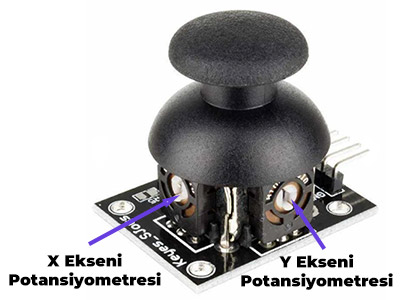
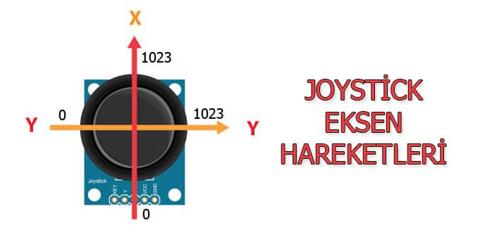
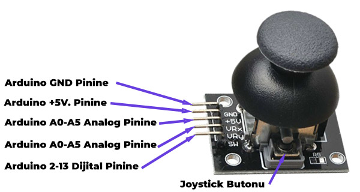
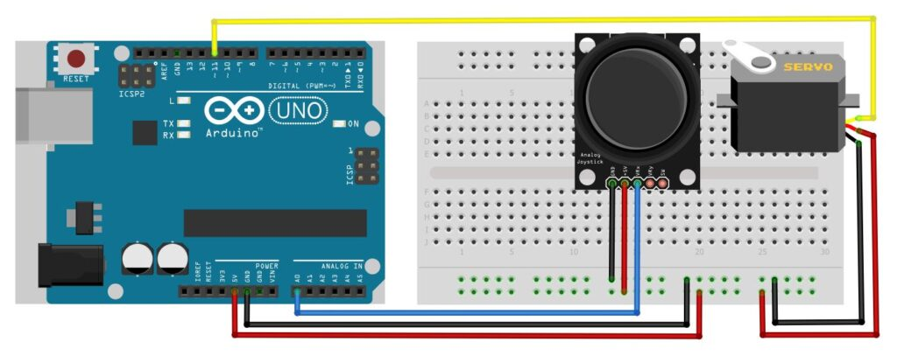
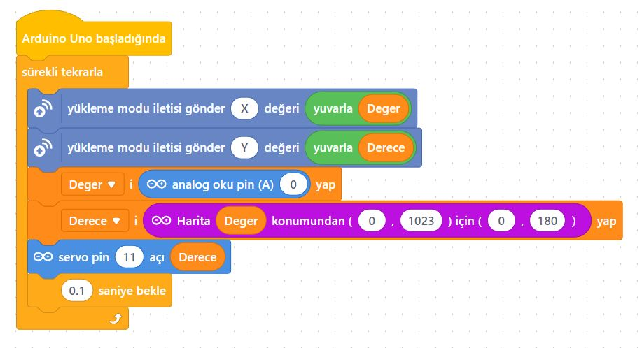
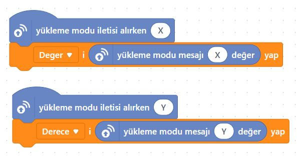
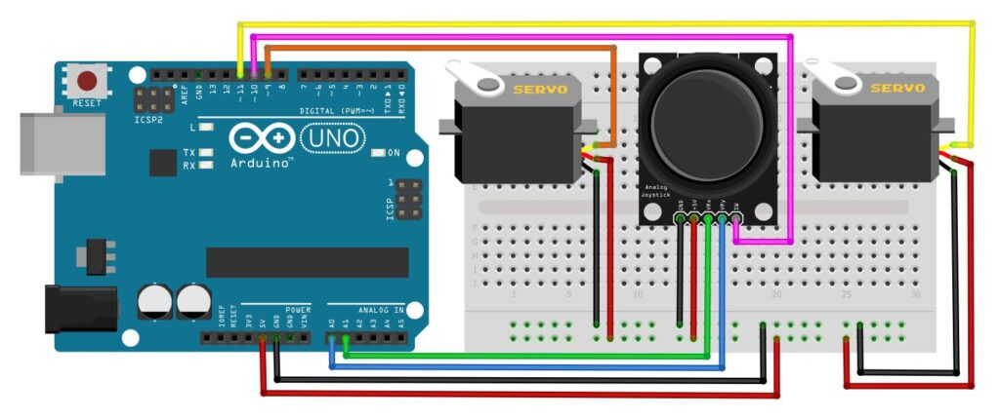
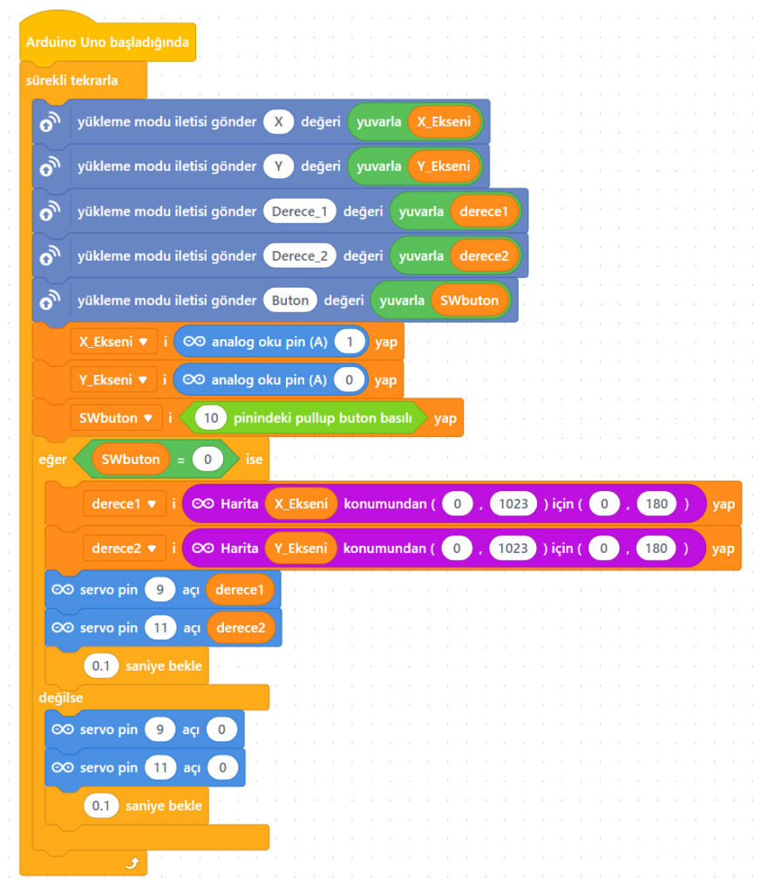
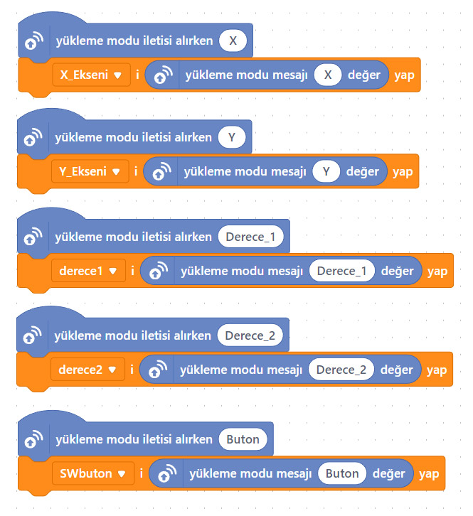
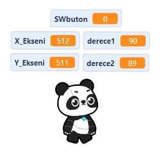

# Ders 37: Joystick ile Servo Motor Kontrolü 🕹️⚙️

Oyun konsollarından aşina olduğumuz joystick kolları ile projelerimizi kontrol etmeye hazır mısınız? Robotist’in **Joystick ile Servo Motor Kontrolü** uygulaması, çocukların joystick modülünün çalışma mantığını kavrayarak, analog eksen hareketleriyle servo motorları istedikleri açılarda döndürmelerini ve üzerindeki buton yardımıyla motorları sıfırlamalarını sağlar.

Bu dersle birlikte çocuklar; iki eksenli potansiyometre yapısını, Pull-Up buton mantığını, analog girişlerin okunup servo motor derecelerine oranlanmasını (map edilmesini) öğrenirler!

**Robotist ile keşfet, öğren, eğlen!**

---

## 🕹️ 2 Eksenli XY Joystick Modülü Nedir?

Joystick, içerisinde yatay (X ekseni) ve dikey (Y ekseni) hareket edebilen iki adet potansiyometre barındıran bir modüldür. Joystick kolunu hareket ettirdiğimizde bu potansiyometrelerin direnç değerleri değişir ve Arduino üzerinden **0 – 1023** arasında analog sinyal okuruz.

*   **SW (Switch) Butonu:** Joystick modülünün üzerine bastırdığınızda çıt sesiyle aktif olan bir butondur. Bu buton bir **Pull-Up** butondur. Yani butona basılmadığında dijital pinden `HIGH` (1), basıldığında ise `LOW` (0) değeri okunur.
*   **Bağlantı Pinleri:** 
    *   **GND:** Toprak bağlantısı (-)
    *   **+5V:** Besleme bağlantısı (+)
    *   **VRx:** X Ekseni analog çıkışı (Yatay hareket)
    *   **VRy:** Y Ekseni analog çıkışı (Dikey hareket)
    *   **SW:** Buton dijital çıkışı





---

## ⚙️ Gerekli Elemanlar

1.  **Arduino Uno** (Zekamız)
2.  **Breadboard** (Bağlantı tahtamız)
3.  **2x SG90 Servo Motor** (Hareketi sağlayacak motorlar)
4.  **1x 2 Eksenli XY Joystick Modülü**
5.  **Jumper Kablolar**

---

## 🔌 Uygulama 1: Joystick ile Tek Servo Motor Kontrolü

Bu uygulamada joystick'in sadece yatay (X ekseni) hareketiyle bir adet servo motoru kontrol edeceğiz.

### Devre Bağlantısı:
*   **Joystick:** VCC ➡️ Arduino 5V, GND ➡️ Arduino GND, **VRx** ➡️ Arduino Analog **A0**.
*   **Servo Motor:** Kırmızı (VCC) ➡️ 5V, Kahverengi (GND) ➡️ GND, Turuncu (Sinyal) ➡️ Arduino **Pin 11**.



### 🧩 mBlock Blok Kodları (Canlı Mod):
Aygıtlar sekmesinde dereceyi oranlayıp yükleme modu yayını ile kuklaya gönderiyoruz:


Kuklalar sekmesinde gelen veriyi ekranda panda yardımıyla okuyoruz:



### 💻 Arduino C/C++ Kodları:
```cpp
/*
  Ders 37-1: mBlock Joystick ile Bir Servo Motor Kontrolü
*/

#include <Servo.h>

Servo servo1; // Servo motor nesnemiz

const int pinX = A0;      // Joystick X ekseni (VRx) pini
const int servoPin = 11;  // Servo motor data pini

void setup() {
  servo1.attach(servoPin); // Servo motoru 11. pine bağlıyoruz
}

void loop() {
  int xDeger = analogRead(pinX);             // X eksenindeki analog değeri okuyoruz (0-1023)
  int aci = map(xDeger, 0, 1023, 0, 180);    // Analog değeri 0-180 derece açısına oranlıyoruz
  servo1.write(aci);                         // Servo motoru bu açıya gönderiyoruz
  delay(15);                                 // Servo motorun hareket etmesi için kısa bir süre bekliyoruz
}
```

---

## 🔌 Uygulama 2: Joystick ile İki Servo Motor Kontrolü ve Butonla Sıfırlama

Bu uygulamada ise X ekseni ile birinci servo motoru, Y ekseni ile ikinci servo motoru kontrol ediyoruz. Joystick butonuna basıldığında ise iki motor da otomatik olarak 0 derece konumuna döner.

### Devre Bağlantısı:
*   **Joystick:** VCC ➡️ 5V, GND ➡️ GND, **VRx** ➡️ Arduino Analog **A1**, **VRy** ➡️ Arduino Analog **A0**, **SW** ➡️ Arduino Dijital **Pin 10**.
*   **Servo 1 (X Ekseni):** VCC ➡️ 5V, GND ➡️ GND, Sinyal ➡️ Arduino **Pin 9**.
*   **Servo 2 (Y Ekseni):** VCC ➡️ 5V, GND ➡️ GND, Sinyal ➡️ Arduino **Pin 11**.



### 🧩 mBlock Blok Kodları (Canlı Mod):
Aygıtlar sekmesinde her iki servo motor için derece değerlerini analog pinlerden oranlayıp atıyoruz. Buton durumunu kontrol edip buton aktifse dereceleri 0 yapıyoruz:


Kuklalar sekmesinde tüm verileri Panda üzerinde canlı izliyoruz:



### 💻 Arduino C/C++ Kodları:
```cpp
/*
  Ders 37-2: mBlock Joystick ile İki Servo Motor Kontrolü (Butonlu Sıfırlama)
*/

#include <Servo.h>

Servo servoX; // 1. Servo motor (Yatay eksen)
Servo servoY; // 2. Servo motor (Dikey eksen)

const int pinX = A1;      // Joystick X ekseni (VRx) pini
const int pinY = A0;      // Joystick Y ekseni (VRy) pini
const int pinSW = 10;     // Joystick buton (SW) pini
const int servoPinX = 9;  // 1. Servo motor pini
const int servoPinY = 11; // 2. Servo motor pini

void setup() {
  servoX.attach(servoPinX); // 1. Servo motoru bağlıyoruz
  servoY.attach(servoPinY); // 2. Servo motoru bağlıyoruz
  pinMode(pinSW, INPUT_PULLUP); // Joystick butonunu Pull-Up giriş olarak tanımlıyoruz
}

void loop() {
  int butonDurum = digitalRead(pinSW); // Buton durumunu okuyoruz (0: basılı, 1: basılı değil)
  
  if (butonDurum == LOW) {
    // Butona basıldığında her iki servo motoru da 0 dereceye getiriyoruz
    servoX.write(0);
    servoY.write(0);
  } else {
    // Butona basılmadığında servo motorlar joystick yönüne göre hareket eder
    int xDeger = analogRead(pinX); // X ekseni okuma (0-1023)
    int yDeger = analogRead(pinY); // Y ekseni okuma (0-1023)
    
    int aciX = map(xDeger, 0, 1023, 0, 180); // X eksenini 0-180 açısına map ediyoruz
    int aciY = map(yDeger, 0, 1023, 0, 180); // Y eksenini 0-180 açısına map ediyoruz
    
    servoX.write(aciX);
    servoY.write(aciY);
  }
  delay(15); // Kararlı çalışma için kısa bir gecikme
}
```

---

## 🌐 Tinkercad Simülasyonu

Projenin devre şemasını Tinkercad üzerinde test etmek isterseniz:
👉 **[Tinkercad Devresini İncele](https://www.tinkercad.com/)**

---

**Hazırlayan:** [sultanamed](https://github.com/sultanamed) 💻  
...  
Hayal gücünü kodla, geleceği robotla!
