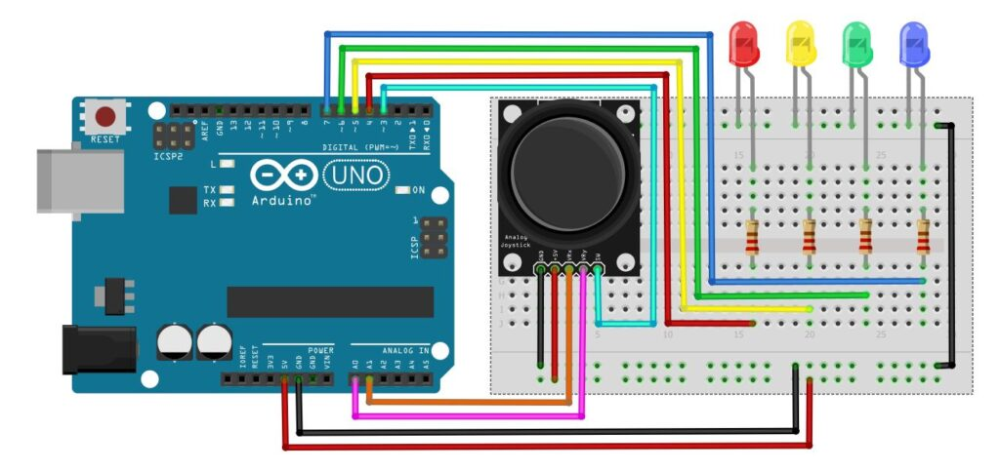
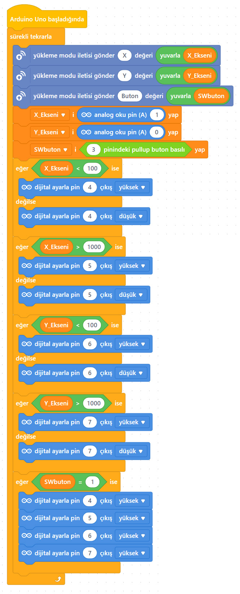
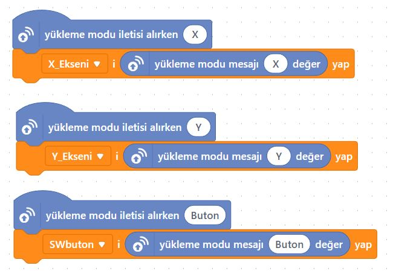
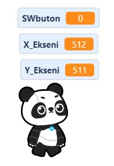

# Ders 38: Joystick ile Sıralı LED Yakma 🕹️🚦

Joystick kolunun yön hareketleriyle farklı yönlerdeki LED lambaları kontrol etmeye ne dersiniz? Robotist’in **Joystick ile Sıralı LED Yakma** uygulaması, çocukların joystick modülünün 2 eksenli (X ve Y) analog hareketleriyle 4 farklı yöne yerleştirilmiş LED diyotları ayrı ayrı yakmasını, joystick üzerindeki butona (SW) bastığında ise tüm LED'leri aynı anda kontrol etmesini sağlar.

Bu dersle birlikte çocuklar; analog eşik değerleriyle (threshold) yön yönlendirme mantığı kurmayı ve çoklu çıkış elemanlarını tek bir joystick ile yönetmeyi öğrenirler!

**Robotist ile keşfet, öğren, eğlen!**

---

## ⚙️ Gerekli Elemanlar

1.  **Arduino Uno** (Zekamız)
2.  **Breadboard** (Bağlantı tahtamız)
3.  **1x 2 Eksenli XY Joystick Modülü**
4.  **4x LED Diyot** (Kırmızı, Sarı, Yeşil, Mavi)
5.  **4x 220Ω Direnç** (LED koruması için)
6.  **Jumper Kablolar**

---

## 🔌 Devre Bağlantısı

Joystick modülünü analog ve dijital pinlere bağlayıp LED'lerimizi pull-down dirençleri ile koruyarak aşağıdaki şemaya göre bağlayın:

*   **Joystick:**
    *   VCC ➡️ Arduino 5V
    *   GND ➡️ Arduino GND
    *   **VRx** ➡️ Arduino Analog **A1**
    *   **VRy** ➡️ Arduino Analog **A0**
    *   **SW** ➡️ Arduino Dijital **Pin 3**
*   **LED Bağlantıları:**
    *   Katot (-) bacakları breadboard üzerindeki ortak **GND** şeridine bağlanır.
    *   Anot (+) bacakları 220Ω dirençler üzerinden sırasıyla Arduino dijital **Pin 4**, **Pin 5**, **Pin 6** ve **Pin 7**'ye bağlanır.



---

## 🧩 mBlock Blok Kodları (Canlı Mod)

mBlock 5 üzerinde sürekli tekrarla döngüsü içerisinde joystick'in analog eksen değerlerini kontrol ederiz:
*   Yatay eksen (X) ve Dikey eksen (Y) okunan değerlerine göre eşik sınırı (800'den büyük veya 200'den küçük) kontrolüyle ilgili LED yakılır.
*   Joystick butonu (SW) tıklandığında (değer 0 olduğunda) tüm LED'ler yakılır.

### 1. Aygıt (Arduino) Blokları:


### 2. Kukla ve Sahne Blokları:
Kuklamız, joystick'in anlık durumunu ekrandaki Panda üzerinden yazılı olarak söyler:



---

## 💻 Arduino C/C++ Kodları

Aşağıdaki C++ kodu, joystick'in yönüne göre ilgili LED pini yakar ve buton basılıyken tüm yön LED'lerini aktif hale getirir:

```cpp
/*
  Ders 38: mBlock Joystick ile Sıralı LED Yakma (Buton Kontrollü)
*/

const int pinX = A1;      // Joystick X ekseni (Yatay)
const int pinY = A0;      // Joystick Y ekseni (Dikey)
const int pinSW = 3;      // Joystick buton pini (SW)

const int led1 = 4;       // Sağa yön LED'i
const int led2 = 5;       // Sola yön LED'i
const int led3 = 6;       // Yukarı yön LED'i
const int led4 = 7;       // Aşağı yön LED'i

void setup() {
  pinMode(pinSW, INPUT_PULLUP); // Joystick butonu giriş (Dahili Pull-Up)
  pinMode(led1, OUTPUT);
  pinMode(led2, OUTPUT);
  pinMode(led3, OUTPUT);
  pinMode(led4, OUTPUT);
}

void loop() {
  int butonDurum = digitalRead(pinSW); // Buton durumu (0: basılı, 1: basılı değil)
  
  if (butonDurum == LOW) {
    // Butona basıldığında tüm LED'ler yanar
    digitalWrite(led1, HIGH);
    digitalWrite(led2, HIGH);
    digitalWrite(led3, HIGH);
    digitalWrite(led4, HIGH);
  } else {
    // Buton basılı değilse joystick yönüne göre ilgili LED yanar, diğerleri söner
    int xDeger = analogRead(pinX);
    int yDeger = analogRead(pinY);
    
    // Tüm LED'leri başlangıçta söndürelim
    digitalWrite(led1, LOW);
    digitalWrite(led2, LOW);
    digitalWrite(led3, LOW);
    digitalWrite(led4, LOW);
    
    // Yön sınır kontrolleri (Eşik değeri: 800 ve 200)
    if (xDeger > 800) {
      digitalWrite(led1, HIGH); // Sağa hareket
    } else if (xDeger < 200) {
      digitalWrite(led2, HIGH); // Sola hareket
    } else if (yDeger > 800) {
      digitalWrite(led3, HIGH); // Yukarı hareket
    } else if (yDeger < 200) {
      digitalWrite(led4, HIGH); // Aşağı hareket
    }
  }
  delay(50); // Kararlı okuma için kısa bir gecikme
}
```

---

## 🌐 Tinkercad Simülasyonu

Projenin çift buton kontrol devresini Tinkercad üzerinde test etmek isterseniz:
👉 **[Tinkercad Devresini İncele](https://www.tinkercad.com/)**

---

**Hazırlayan:** [sultanamed](https://github.com/sultanamed) 💻  
...  
Hayal gücünü kodla, geleceği robotla!
