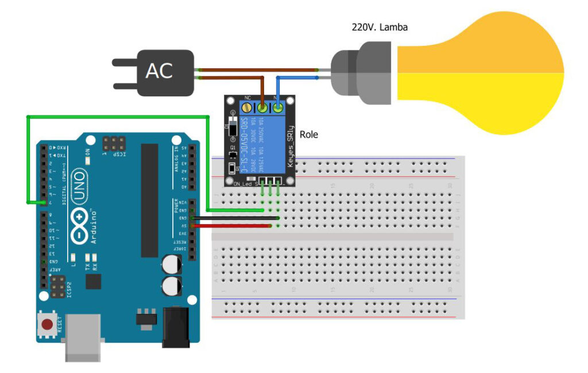
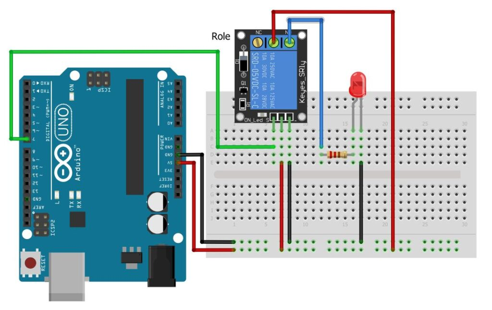
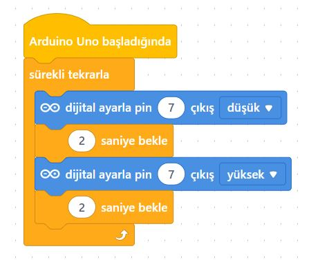

# Ders 39: Röle ile Ev Elektriğinde Lamba Çalıştırma 🔌💡

Arduino gibi 5V seviyesindeki düşük voltajlı mikrodenetleyicilerle, evlerimizde kullandığımız 220V yüksek voltajlı lambaları veya elektrikli ev aletlerini güvenli bir şekilde nasıl açıp kapatabiliriz? Robotist’in **Röle ile Ev Elektriğinde Lamba Çalıştırma** uygulaması, çocukların bir elektromekanik anahtar olan rölenin çalışma prensibini öğrenmesini, yüksek voltajı düşük voltajlı kontrol sinyalleriyle güvenle kumanda etmesini sağlar.

Bu dersle birlikte çocuklar; röle kontakları (C, NO, NC) yapısını, aktif yüksek (active-high) / aktif düşük (active-low) röle sürücü tiplerini ve yüksek gerilimle çalışırken dikkat edilmesi gereken temel güvenlik kurallarını kavrar!

> [!WARNING]
> **YÜKSEK GERİLİM UYARISI:** Bu projede 220V şehir elektriği kullanılmaktadır. Yüksek voltaj hayati tehlike taşır! Devre kurulumunun mutlaka bir yetişkin, öğretmen veya uzman gözetiminde yapılması gerekir. 220V bağlantı yaparken elektriğin kesik olduğundan emin olun.
> 
> *Alternatif olarak projeyi 220V yerine tamamen güvenli 5V LED diyot ile de kurup mantığını öğrenebilirsiniz. (Devre şeması aşağıda paylaşılmıştır).*

---

## ⚙️ Gerekli Elemanlar

1.  **Arduino Uno** (Zekamız)
2.  **1x 5V Tekli Röle Kartı** (Aktif Düşük - Active Low)
3.  **Jumper Kablolar**
4.  **220V Uygulaması İçin:**
    *   1x 220V Lamba & Duy
    *   1x Erkek Fişli Elektrik Kablosu (yaklaşık 1 metre)
5.  **Güvenli LED Uygulaması İçin:**
    *   Breadboard
    *   1x LED Diyot
    *   1x 220Ω Direnç

---

## 🔌 Devre Bağlantısı

### 1. Seçenek: 220V Lamba ile Bağlantı (Yetişkin Gözetiminde):
*   **Röle Modülü Girişi:**
    *   VCC ➡️ Arduino 5V
    *   GND ➡️ Arduino GND
    *   **IN (Giriş)** ➡️ Arduino Dijital **Pin 7**
*   **220V Lamba Kontak Bağlantısı:**
    *   Elektrik fişinden gelen 220V faz/nötr kablosunun biri doğrudan duyun bir ucuna bağlanır.
    *   Fişten gelen diğer kablo röle modülünün **Ortak (COM - C)** ucuna bağlanır.
    *   Röle modülünün **Normalde Açık (NO)** ucundan çıkan kablo ise duyun diğer ucuna bağlanır.



---

### 2. Seçenek: Güvenli LED ile Alternatif Bağlantı:
Eğer 220V ile çalışmak istemiyorsanız, röle kontaklarını kullanarak LED diyotu yakıp söndürebilirsiniz:
*   Rölenin **Ortak (COM - C)** ucunu Arduino **5V** hattına bağlayın.
*   Rölenin **Normalde Açık (NO)** ucunu 220Ω direnç üzerinden LED'in anot (+) bacağına bağlayın.
*   LED'in katot (-) bacağını Arduino **GND** pinine bağlayın.



---

## 🧩 mBlock Blok Kodları

Rölemiz **Aktif Düşük (Active Low)** özelliğe sahip olduğu için, Arduino pini `0` (LOW) yapıldığında röle kontakları çeker ve lamba yanar; `1` (HIGH) yapıldığında kontaklar bırakılır ve lamba söner:



---

## 💻 Arduino C/C++ Kodları

Aşağıdaki C++ kodu, rölenin aktif düşük mantığına göre lambayı 2 saniye açık, 2 saniye kapalı tutar:

```cpp
/*
  Ders 39: mBlock Röle İle Ev Elektriğinde Lamba Çalıştırma
*/

const int rolePin = 7; // Rölenin IN pininin bağlı olduğu Arduino pini

void setup() {
  pinMode(rolePin, OUTPUT); // Röle pini çıkış olarak ayarlanıyor
}

void loop() {
  // Aktif Düşük (Active Low) röle mantığı:
  
  digitalWrite(rolePin, LOW);  // Röle kontaklarını çekerek lambayı yakar
  delay(2000);                 // 2 saniye bekler
  
  digitalWrite(rolePin, HIGH); // Röle kontaklarını bırakarak lambayı söndürür
  delay(2000);                 // 2 saniye bekler
}
```

---

## 🌐 Tinkercad Simülasyonu

Projenin simülasyonunu Tinkercad üzerinde test etmek isterseniz:
👉 **[Tinkercad Devresini İncele](https://www.tinkercad.com/)**

---

**Hazırlayan:** [sultanamed](https://github.com/sultanamed) 💻  
...  
Hayal gücünü kodla, geleceği robotla!
