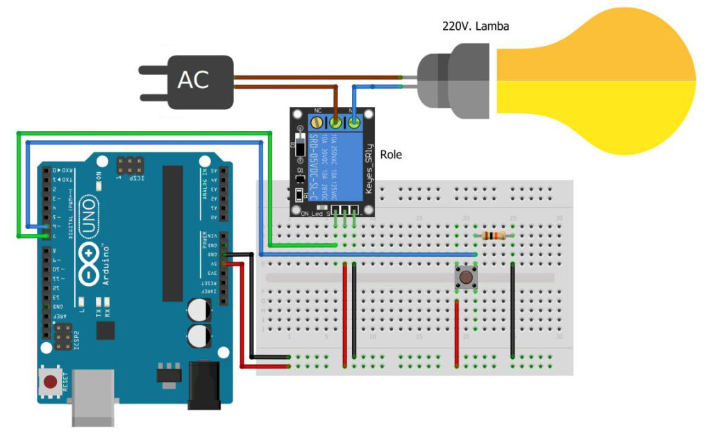
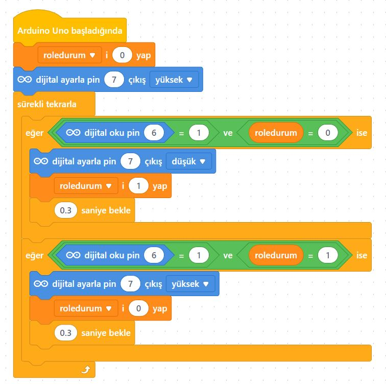

# Ders 40: Röle ve Buton ile Lamba Yakma Söndürme 🔘🔌💡

Günlük hayatta evimizdeki odaların ışıklarını açıp kapatırken bastığımız elektrik anahtarlarının arkasındaki çalışma mantığını öğrenmeye ne dersiniz? Robotist’in **Röle ve Buton ile Lamba Yakma Söndürme** uygulaması, çocukların bas-bırak (push) buton yardımıyla röle üzerinden 220V bir lambayı basıldığında yanan, tekrar basıldığında ise sönen (toggle - kilitli anahtarlama) bir akıllı anahtar sistemine dönüştürmesini sağlar.

Bu dersle birlikte çocuklar; buton ile durum kontrolü (durum değişkeni tutma) yapmayı, buton ark (debouncing) engelleme mantığını ve röleyi bir buton ile tetiklemeyi öğrenirler!

> [!WARNING]
> **YÜKSEK GERİLİM UYARISI:** Bu projede 220V şehir elektriği kullanılmaktadır. Yüksek voltaj hayati tehlike taşır! Devre kurulumunun mutlaka bir yetişkin, öğretmen veya uzman gözetiminde yapılması gerekir. Elektrik bağlantılarını yapmadan önce fişin takılı olmadığından emin olun.
> 
> *Dilerseniz projeyi 220V lamba yerine, rölenin kontaklarına 5V LED ve 220Ω direnç bağlayarak tamamen güvenli bir şekilde de deneyebilirsiniz.*

---

## ⚙️ Gerekli Elemanlar

1.  **Arduino Uno** (Zekamız)
2.  **Breadboard** (Bağlantı tahtamız)
3.  **1x 5V Tekli Röle Kartı** (Aktif Düşük - Active Low)
4.  **1x 4 Pinli Push Buton**
5.  **1x 10 kΩ Direnç** (Buton pull-down direnci için)
6.  **Jumper Kablolar**
7.  **Lamba Devresi İçin:**
    *   1x 220V Lamba & Duy
    *   1x Erkek Fişli Elektrik Kablosu

---

## 🔌 Devre Bağlantısı

Aşağıdaki bağlantıları breadboard üzerinde kurun:

*   **Buton Bağlantısı (Pull-down):**
    *   Butonun bir bacağı Arduino **5V** hattına bağlanır.
    *   Butonun karşısındaki bacağı 10kΩ direnç üzerinden Arduino **GND** hattına bağlanır.
    *   Direnç ile butonun birleştiği bacaktan kablo çıkartılarak Arduino **Pin 6**'ya bağlanır.
*   **Röle Girişi:**
    *   VCC ➡️ Arduino 5V
    *   GND ➡️ Arduino GND
    *   **IN (Giriş)** ➡️ Arduino Dijital **Pin 7**
*   **Lamba Bağlantısı:**
    *   Şehir şebekesinden (fişten) gelen kablonun biri doğrudan duyun bir ucuna.
    *   Fişten gelen diğer kablo rölenin **Ortak (COM - C)** ucuna.
    *   Rölenin **Normalde Açık (NO)** ucu ise duyun diğer ucuna bağlanır.



---

## 🧩 mBlock Blok Kodları

mBlock 5 üzerinde butona her basılıp bırakıldığında lambanın durumunu tersine çevirmek (1 ise 0, 0 ise 1 yapmak) için bir durum değişkeni kullanırız. Röle aktif düşük olduğu için durum değişkeninin durumuna göre dijital 7 pini kontrol edilir:



---

## 💻 Arduino C/C++ Kodları

Aşağıdaki C++ kodu, butona her basıldığında lambanın durumunu değiştirir (açıksa kapatır, kapalıysa açar) ve kararlı çalışma için buton arkı engelleme (debounce) filtresi kullanır:

```cpp
/*
  Ders 40: mBlock Röle ve Buton İle Lamba Yakma Söndürme (Toggle Kontrolü)
*/

const int butonPin = 6; // Butonun bağlı olduğu pin (Pull-down dirençli)
const int rolePin = 7;  // Rölenin bağlı olduğu pin (Aktif Düşük)

int roleDurum = HIGH;      // Röle başlangıçta kapalı (HIGH)
int sonButonDurum = LOW;  // Butonun bir önceki durumu
unsigned long sonDebounceSure = 0;
unsigned long debounceGecikme = 50;

void setup() {
  pinMode(butonPin, INPUT);
  pinMode(rolePin, OUTPUT);
  digitalWrite(rolePin, roleDurum); // Başlangıçta lambayı söndür
}

void loop() {
  int okuma = digitalRead(butonPin);
  
  // Butona basılma durumunda toggle işlemi (yükselen kenar)
  if (okuma != sonButonDurum) {
    sonDebounceSure = millis();
  }
  
  if ((millis() - sonDebounceSure) > debounceGecikme) {
    if (okuma == HIGH && sonButonDurum == LOW) {
      // Röle durumunu tersine çevir (HIGH ise LOW, LOW ise HIGH yap)
      if (roleDurum == HIGH) {
        roleDurum = LOW; // Lambayı yak
      } else {
        roleDurum = HIGH; // Lambayı söndür
      }
      digitalWrite(rolePin, roleDurum);
      delay(200); // Ekstra debouncing için kısa gecikme
    }
  }
  
  sonButonDurum = okuma;
}
```

---

## 🌐 Tinkercad Simülasyonu

Projenin devre şemasını Tinkercad üzerinde test etmek isterseniz:
👉 **[Tinkercad Devresini İncele](https://www.tinkercad.com/)**

---

**Hazırlayan:** [sultanamed](https://github.com/sultanamed) 💻  
...  
Hayal gücünü kodla, geleceği robotla!
