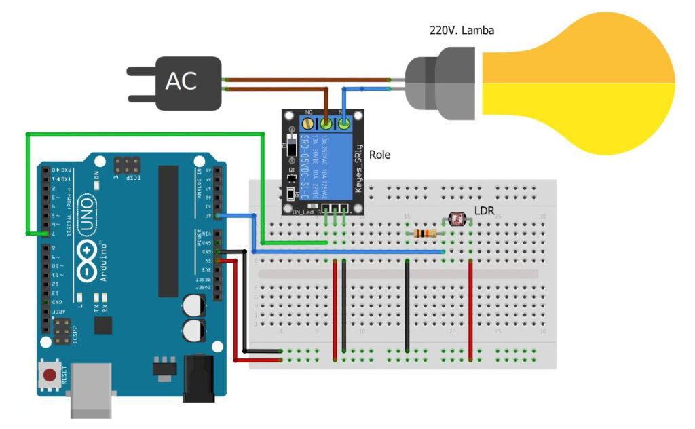
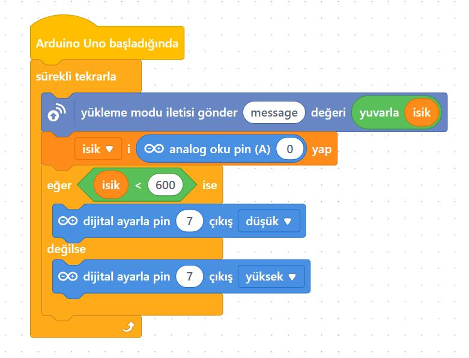
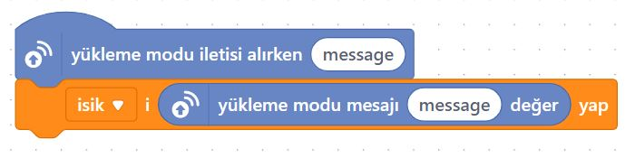

# Ders 41: Röle ve LDR ile Akşam Yanan Sokak Lambası ☀️🌙🔌💡

Hava karardığında caddelerdeki sokak lambalarının veya evlerimizin bahçe aydınlatmalarının kendiliğinden nasıl yandığını hiç merak ettiniz mi? Robotist’in **Röle ve LDR ile Akşam Yanan Sokak Lambası** uygulaması, çocukların bir ışık sensörü (LDR) ve röle modülü kullanarak, gün ışığı azaldığında otomatik olarak 220V bir lambayı yakan akıllı sokak lambası sistemini tasarlamasını sağlar.

Bu dersle birlikte çocuklar; LDR yardımıyla analog veri okumayı, ışık şiddeti eşik değeri kontrolü yapmayı ve sensör verilerine göre röle tetikleme mekanizmalarını öğrenirler!

> [!WARNING]
> **YÜKSEK GERİLİM UYARISI:** Bu projede 220V şehir elektriği kullanılmaktadır. Yüksek voltaj hayati tehlike taşır! Devre kurulumunun mutlaka bir yetişkin, öğretmen veya uzman gözetiminde yapılması gerekir. 220V bağlantı yaparken elektriğin kesik olduğundan emin olun.
> 
> *Alternatif olarak projeyi 220V yerine tamamen güvenli 5V LED diyot ile de kurup LDR-Röle mantığını öğrenebilirsiniz.*

---

## ⚙️ Gerekli Elemanlar

1.  **Arduino Uno** (Zekamız)
2.  **Breadboard** (Bağlantı tahtamız)
3.  **1x 5V Tekli Röle Kartı** (Aktif Düşük - Active Low)
4.  **1x LDR (Işık Sensörü)**
5.  **1x 10 kΩ Direnç** (LDR pull-down direnci için)
6.  **Jumper Kablolar**
7.  **Lamba Devresi İçin:**
    *   1x 220V Lamba & Duy
    *   1x Fişli Kablo

---

## 🔌 Devre Bağlantısı

Aşağıdaki bağlantı düzenini breadboard üzerinde oluşturun:

*   **LDR Bağlantısı (Pull-down):**
    *   LDR'nin bir ucunu Arduino **5V** hattına bağlayın.
    *   LDR'nin diğer ucunu 10kΩ direnç üzerinden Arduino **GND** hattına bağlayın.
    *   Direnç ile LDR'nin birleştiği noktadan kablo çıkartarak Arduino **A0** analog giriş pini bağlayın.
*   **Röle Girişi:**
    *   VCC ➡️ Arduino 5V
    *   GND ➡️ Arduino GND
    *   **IN (Giriş)** ➡️ Arduino Dijital **Pin 7**
*   **Lamba Bağlantısı:**
    *   Fişten gelen elektrik kablosunun biri duya.
    *   Fişten gelen diğer kablo röle üzerindeki **Ortak (COM - C)** terminaline.
    *   Rölenin **Normalde Açık (NO)** çıkışı ise duyun diğer ucuna bağlanır.



---

## 🧩 mBlock Blok Kodları (Canlı Mod)

mBlock 5 üzerinde sürekli tekrarla döngüsü içerisinde LDR'den okunan analog A0 verisini `isik` değişkenine aktarırız. Eğer `isik < 600` ise (karanlık seviyesi) Pin 7'yi düşük (LOW) yaparak röleyi tetikleriz. Aksi durumda Pin 7'yi yüksek (HIGH) yaparak söndürürüz.

### 1. Aygıt (Arduino) Blokları:


### 2. Kukla ve Sahne Blokları:
Kuklamız, sokak lambasının açık veya kapalı olma durumunu Panda yardımıyla ekranda söyler:



---

## 💻 Arduino C/C++ Kodları

Aşağıdaki C++ kodu, LDR'den gelen ışık verisini sürekli okur. Işık seviyesi belirlenen eşik değerinin (600) altına indiğinde röle çıkışını aktif (LOW) yaparak lambayı yakar:

```cpp
/*
  Ders 41: mBlock Röle ve LDR İle Hava Kararınca Yanan Sokak Lambası
*/

const int ldrPin = A0;   // LDR'nin bağlı olduğu analog pin
const int rolePin = 7;   // Rölenin bağlı olduğu dijital pin (Aktif Düşük)
const int esikDegeri = 600; // Işık eşik değeri (Ortama göre ayarlanabilir)

void setup() {
  pinMode(rolePin, OUTPUT);
  digitalWrite(rolePin, HIGH); // Başlangıçta lambayı söndür
}

void loop() {
  int isikSeviyesi = analogRead(ldrPin); // LDR analog değerini oku (0-1023)
  
  if (isikSeviyesi < esikDegeri) {
    // Hava karardıysa röle kontaklarını çek ve lambayı yak (LOW)
    digitalWrite(rolePin, LOW);
  } else {
    // Hava aydınlıksa röle kontaklarını bırak ve lambayı söndür (HIGH)
    digitalWrite(rolePin, HIGH);
  }
  delay(500); // Yarım saniye bekleyip tekrar kontrol et
}
```

---

## 🌐 Tinkercad Simülasyonu

Projenin simülasyonunu Tinkercad üzerinde test etmek isterseniz:
👉 **[Tinkercad Devresini İncele](https://www.tinkercad.com/)**

---

**Hazırlayan:** [sultanamed](https://github.com/sultanamed) 💻  
...  
Hayal gücünü kodla, geleceği robotla!
