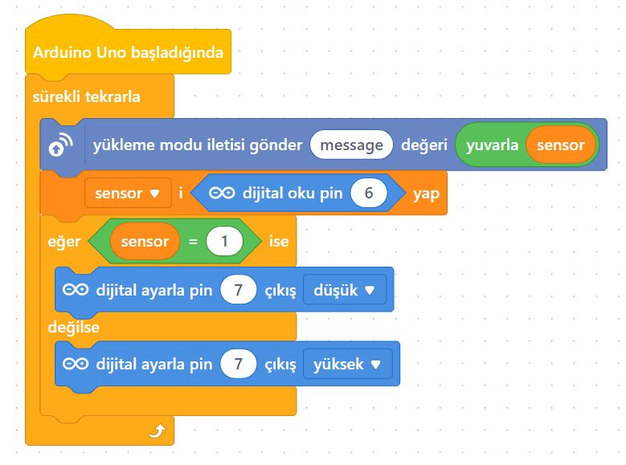
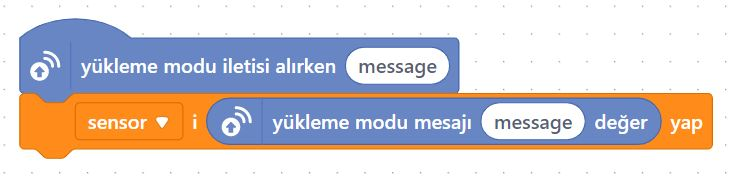
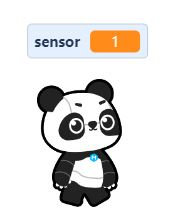

# Ders 42: Röle ve PIR Sensörlü Harekete Duyarlı Lamba (Merdiven Otomatiği) 🏃‍♂️🔌💡

Apartman merdivenlerinden çıkarken lambaların biz yaklaştığımızda kendiliğinden yanmasını ve arkamızdan sönmesini sağlayan sistemlerin nasıl yapıldığını öğrenmek ister misiniz? Robotist’in **Röle ve PIR Sensörlü Harekete Duyarlı Lamba** uygulaması, çocukların pasif kızılötesi hareket sensörü (PIR) ve röle kullanarak, hareket algılandığında 220V bir lambayı yakan merdiven otomatiği ve hırsız alarm sistemleri tasarlamasını sağlar.

Bu dersle birlikte çocuklar; dijital giriş veren hareket sensörlerinin (PIR) çalışma mekanizmasını, hareket algılama hassasiyeti ve süre ayarlarını yapmayı öğrenirler!

> [!WARNING]
> **YÜKSEK GERİLİM UYARISI:** Bu projede 220V şehir elektriği kullanılmaktadır. Yüksek voltaj hayati tehlike taşır! Devre kurulumunun mutlaka bir yetişkin, öğretmen veya uzman gözetiminde yapılması gerekir. Elektrik bağlantısı sırasında prizin takılı olmadığından emin olun.
> 
> *Alternatif olarak projeyi 220V yerine tamamen güvenli 5V LED diyot ile de kurup mantığını öğrenebilirsiniz.*

---

## ⚙️ Gerekli Elemanlar

1.  **Arduino Uno** (Zekamız)
2.  **Breadboard** (Bağlantı tahtamız)
3.  **1x 5V Tekli Röle Kartı** (Aktif Düşük - Active Low)
4.  **1x HC-SR501 PIR Hareket Sensörü**
5.  **Jumper Kablolar**
6.  **Lamba Devresi İçin:**
    *   1x 220V Lamba & Duy
    *   1x Fişli Kablo

---

## 🔌 Devre Bağlantısı

Aşağıdaki bağlantıları breadboard üzerinde kurun:

*   **PIR Sensör Bağlantısı:**
    *   VCC ➡️ Arduino **5V**
    *   GND ➡️ Arduino **GND**
    *   **OUT (DATA)** ➡️ Arduino Dijital **Pin 6**
*   **Röle Bağlantısı:**
    *   VCC ➡️ Arduino **5V**
    *   GND ➡️ Arduino **GND**
    *   **IN** ➡️ Arduino Dijital **Pin 7**
*   **Lamba Bağlantısı:**
    *   Fişten gelen elektrik kablosunun biri duya.
    *   Fişten gelen diğer kablo rölenin **Ortak (COM - C)** terminaline.
    *   Rölenin **Normalde Açık (NO)** çıkışı ise duyun diğer ucuna bağlanır.

> [!NOTE]
> *Not: Orijinal kaynak sayfasında montaj şeması görseli olarak LDR bağlantı görseli kullanılmıştır. Kablolama esnasında PIR sensörünün orta (Data) bacağını Arduino'nun **6. dijital pini**ne bağlamaya dikkat ediniz.*


---

## 🧩 mBlock Blok Kodları (Canlı Mod)

mBlock 5 üzerinde sürekli tekrarla döngüsü içerisinde PIR sensöründen okunan dijital pindeki değer `sensor` değişkenine aktarırız. Eğer `sensor == 1` ise (hareket algılandıysa) Pin 7'yi düşük (LOW) yaparak röleyi tetikleriz. Aksi durumda Pin 7'yi yüksek (HIGH) yaparak söndürürüz.

### 1. Aygıt (Arduino) Blokları:


### 2. Kukla ve Sahne Blokları:
Kuklamız, sensörün hareket algılayıp algılamadığını Panda yardımıyla ekranda söyler:



---

## 💻 Arduino C/C++ Kodları

Aşağıdaki C++ kodu, PIR sensöründen gelen hareket sinyalini sürekli dinler. Hareket tespit edildiğinde röleyi aktif (LOW) ederek lambayı yakar, hareket kesildiğinde söndürür:

```cpp
/*
  Ders 42: mBlock Röle ve PIR Sensörü İle Harekete Duyarlı Lamba
*/

const int pirPin = 6;  // PIR Sensörünün DATA pini
const int rolePin = 7; // Rölenin IN pini (Aktif Düşük)

void setup() {
  pinMode(pirPin, INPUT);
  pinMode(rolePin, OUTPUT);
  digitalWrite(rolePin, HIGH); // Başlangıçta lambayı söndür
}

void loop() {
  int hareket = digitalRead(pirPin); // Hareketi oku (1: hareket var, 0: hareket yok)
  
  if (hareket == HIGH) {
    // Hareket algılandıysa röleyi çek ve lambayı yak (LOW)
    digitalWrite(rolePin, LOW);
  } else {
    // Hareket yoksa röleyi bırak ve lambayı söndür (HIGH)
    digitalWrite(rolePin, HIGH);
  }
  delay(100); // Küçük bir gecikme
}
```

---

## 🌐 Tinkercad Simülasyonu

Projenin simülasyonunu Tinkercad üzerinde test etmek isterseniz:
👉 **[Tinkercad Devresini İncele](https://www.tinkercad.com/)**

---

**Hazırlayan:** [sultanamed](https://github.com/sultanamed) 💻  
...  
Hayal gücünü kodla, geleceği robotla!
