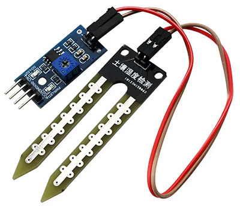
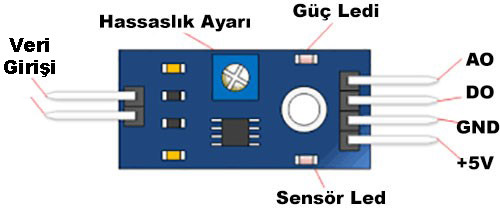
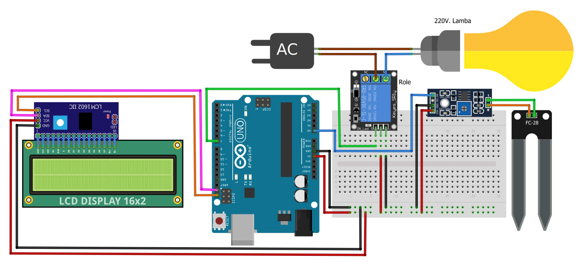
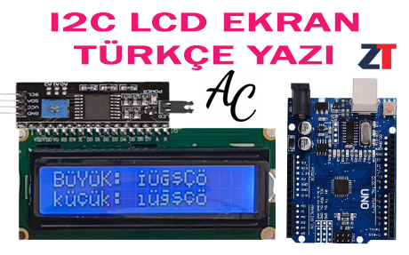
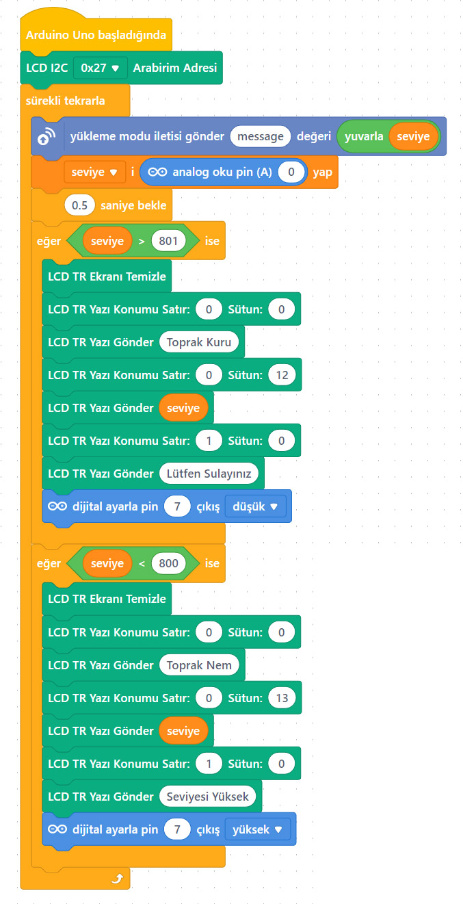

# Ders 43: LCD Ekranlı ve Toprak Nem Sensörlü Akıllı Sulama  🌱🔌💧📟

Evde yokken çiçeklerinizin susuz kalmasından veya aşırı sulanıp solmasından mı korkuyorsunuz? Robotist’in **LCD Ekranlı ve Toprak Nem Sensörlü Akıllı Sulama** uygulaması, çocukların bir toprak nem sensörü (FC-28), röle modülü ve I2C LCD ekran kullanarak, toprağın nem oranını ölçüp ihtiyaç anında su motorunu otomatik çalıştıran ve durum bilgilerini anlık ekranda gösteren profesyonel bir akıllı tarım projesi yapmasını sağlar.

Bu dersle birlikte çocuklar; toprak nem sensörünün çalışma mantığını, I2C protokolünü kullanarak LCD ekran kontrol etmeyi ve tam otonom bir geri beslemeli kontrol (feedback control) sistemi kurmayı öğrenirler!

---

## ⚙️ FC-28 Toprak Nem Sensörü Modülü Nedir?

FC-28, toprağın içerisindeki nem miktarını ölçmek için kullanılan bir sensördür. İki ana parçadan oluşur:
1.  **Toprak Probu:** Toprağa batırılan kısımdır. Topraktaki nem oranı arttıkça toprağın iletkenliği artar ve prob uçları arasındaki direnç düşer.
2.  **Karşılaştırıcı Kart:** Hassasiyet ayarı yapabileceğimiz trimpot barındıran kontrol ünitesidir.

*   **Çıkış Tipleri:** Hem analog çıkış (**AO**) hem de dijital çıkış (**DO**) verebilir. Biz nem miktarını adım adım ölçmek için analog çıkış kullanacağız.
*   **Ölçüm Mantığı:** Toprak tamamen kuru iken okunan analog değer **1023** olur. Toprak nemlendikçe (iletkenlik arttıkça) bu değer **0**'a doğru azalır.




---

## ⚙️ Gerekli Elemanlar

1.  **Arduino Uno** (Zekamız)
2.  **Breadboard** (Bağlantı tahtamız)
3.  **1x 5V Tekli Röle Kartı** (Su motorunu sürmek için - Aktif Düşük)
4.  **1x FC-28 Toprak Nem Seviye Sensörü**
5.  **1x I2C 16x2 Karakter LCD Ekran**
6.  **Jumper Kablolar**
7.  **Su Motoru / Lamba Devresi İçin:**
    *   1x 5V Mini Su Pompası (veya test amaçlı 220V lamba)

---

## 🔌 Devre Bağlantısı

Aşağıdaki bağlantıları breadboard üzerinde kurun:

*   **FC-28 Sensör Bağlantısı:**
    *   VCC (+) ➡️ Arduino **5V**
    *   GND (-) ➡️ Arduino **GND**
    *   **AO (Analog Çıkış)** ➡️ Arduino Analog **A0**
*   **I2C LCD Ekran Bağlantısı:**
    *   VCC ➡️ Arduino **5V**
    *   GND ➡️ Arduino **GND**
    *   **SDA** ➡️ Arduino **SDA** (A4)
    *   **SCL** ➡️ Arduino **SCL** (A5)
*   **Röle Girişi:**
    *   VCC ➡️ Arduino **5V**
    *   GND ➡️ Arduino **GND**
    *   **IN** ➡️ Arduino Dijital **Pin 7**
*   **Su Pompası / Lamba Bağlantısı:**
    *   Su pompası besleme hattının bir ucu rölenin **Ortak (COM - C)** terminaline bağlanır.
    *   Rölenin **Normalde Açık (NO)** çıkışı motora bağlanır. Motorun diğer ucu beslemeye bağlanır.



---

## 🧩 mBlock Blok Kodları (Canlı Mod)

mBlock 5 üzerinde toprak nem değerini sürekli olarak `seviye` değişkenine okuruz. Türkçe LCD uzantısını kullanarak ekranda nem durumuna göre uyarı yazıları yazdırırız. Toprak kuruysa (nem değeri eşik seviyesi olan 600'ün üzerindeyse) röle aktif edilir (LOW yapılıyor).

### mBlock Uzantısı Kurulumu:
1.  **Uzantılar** penceresine gelin.
2.  Arama motoruna **"I2C LCD Ekran Türkçe"** yazarak eklentiyi ekleyin.



### 1. Aygıt (Arduino) Blokları:


### 2. Kukla ve Sahne Blokları:
Kuklamız, anlık toprak nem durumunu Panda yardımıyla ekranda söyler:


---

## 💻 Arduino C/C++ Kodları

Aşağıdaki C++ kodu, toprak nemini A0 analog pini üzerinden ölçer. Toprak kuru ise röle kontaklarını tetikleyerek su motorunu çalıştırır ve I2C LCD ekranda Türkçe karakterlerle uyarı yazısı yayınlar:

```cpp
/*
  Ders 43: mBlock LCD Ekranlı Röle ve Toprak Nem Sensörü İle Sulama Sistemi
*/

#include <Wire.h>
#include <LiquidCrystal_I2C.h>

LiquidCrystal_I2C lcd(0x27, 16, 2); // 16x2 LCD Ekran nesnesi (I2C adresi 0x27)

const int nemPin = A0;   // Toprak nem sensörü analog pini
const int rolePin = 7;   // Su pompası rölesi (Aktif Düşük)
const int esikDegeri = 600; // Toprak kuruluğu eşik değeri (500-700 arası ayarlanabilir)

void setup() {
  pinMode(rolePin, OUTPUT);
  digitalWrite(rolePin, HIGH); // Başlangıçta pompayı kapat
  
  lcd.init();
  lcd.backlight();
  
  lcd.setCursor(0, 0);
  lcd.print("Robotist Akilli");
  lcd.setCursor(0, 1);
  lcd.print("Sulama Sistemi");
  delay(2000);
  lcd.clear();
}

void loop() {
  int nemDegeri = analogRead(nemPin); // Sensör değerini oku (0-1023)
  
  lcd.clear();
  if (nemDegeri > esikDegeri) {
    // Toprak kuru (Değer yüksekse nem azdır)
    digitalWrite(rolePin, LOW); // Pompayı çalıştır (Röleyi tetikle)
    
    lcd.setCursor(0, 0);
    lcd.print("Toprak Kuru");
    lcd.setCursor(0, 1);
    lcd.print("Lutfen Sulayiniz");
  } else {
    // Toprak nemli
    digitalWrite(rolePin, HIGH); // Pompayı durdur
    
    lcd.setCursor(0, 0);
    lcd.print("Toprak Nemi:");
    lcd.print(1023 - nemDegeri); // Nemi anlaşılır bir ölçekte yazdır
    lcd.setCursor(0, 1);
    lcd.print("Durum: Normal");
  }
  delay(1000); // 1 saniye bekleyip tekrar ölç
}
```

---

## 🌐 Tinkercad Simülasyonu

Projenin simülasyonunu Tinkercad üzerinde test etmek isterseniz:
👉 **[Tinkercad Devresini İncele](https://www.tinkercad.com/)**

---

**Hazırlayan:** [sultanamed](https://github.com/sultanamed) 💻  
...  
Hayal gücünü kodla, geleceği robotla!
