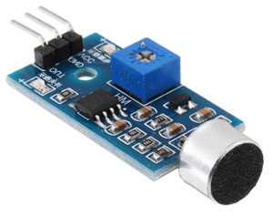
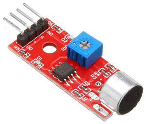
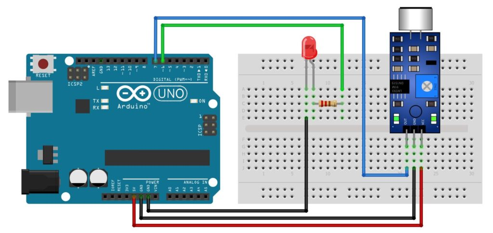
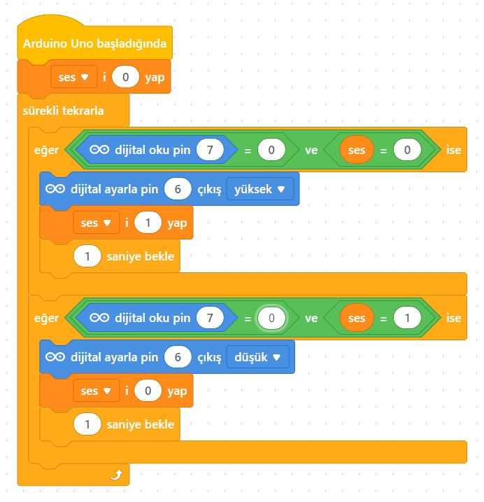
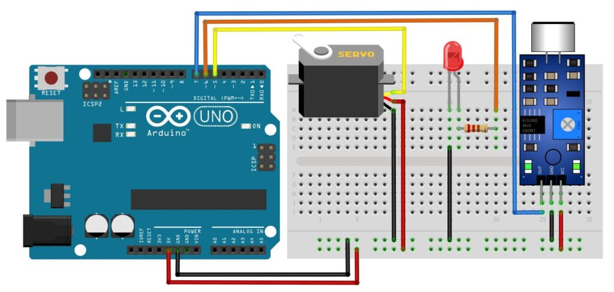
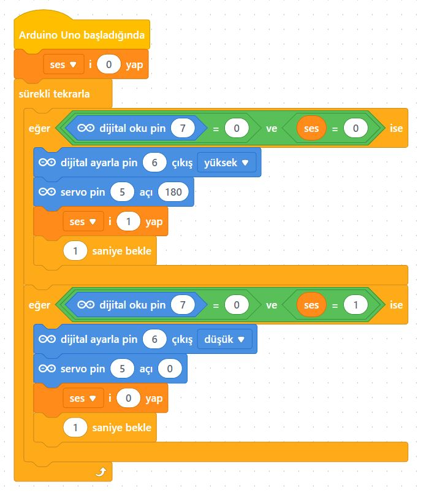
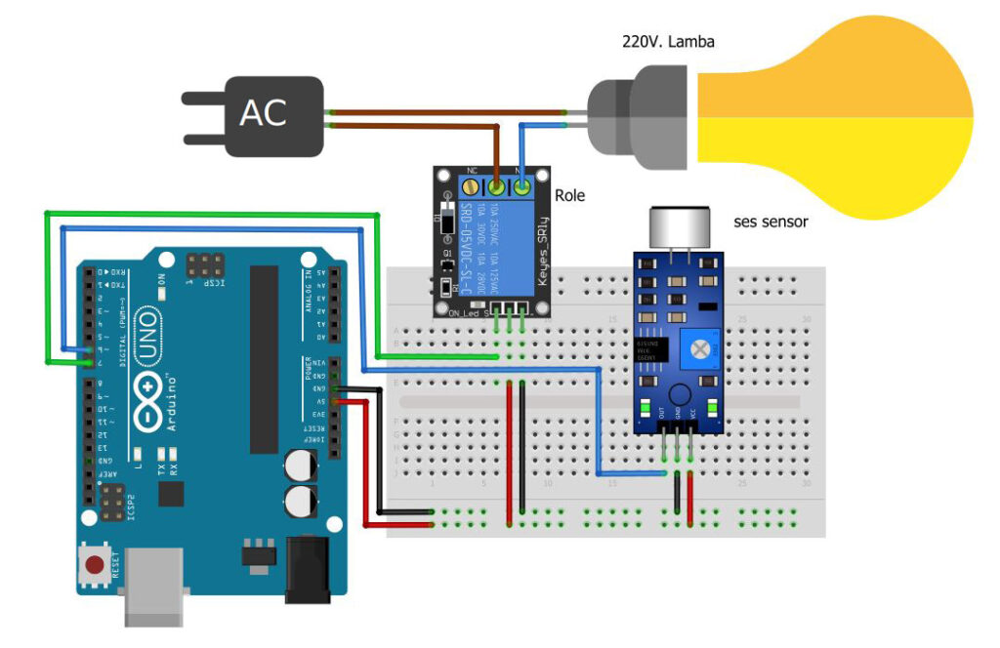
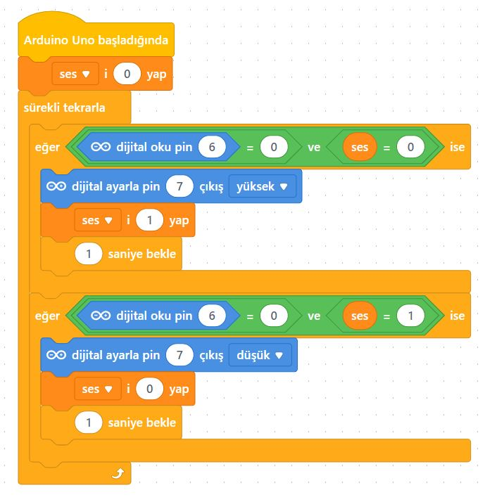

# Ders 44: Ses ile Servo Motor ve Lamba Kontrolü 🎙️⚙️💡

Çevrenizdeki sesleri algılayıp el çırpma (alkış) sesinizle lambaları açıp kapatan veya kapı kilidini açan akıllı bir ev sistemi kurmak ister misiniz? Robotist’in **Ses ile Servo Motor ve Lamba Kontrolü** uygulaması, çocukların ses sensörleri (KY-037 / KY-038) yardımıyla ses dalgalarını elektrik sinyaline dönüştürmesini, el çırpma sesiyle LED lambaları, servo motor mekanizmalarını ve röle vasıtasıyla 220V ev cihazlarını kontrol etmesini sağlar.

Bu dersle birlikte çocuklar; ses sensörlerinin çalışma prensibini, eşik değer (sensitivite) ayarı yapmayı ve sesle tetiklenen çok yönlü sistemler tasarlamayı öğrenirler!

---

## 🎙️ KY-037 / KY-038 Ses Sensörü Modülü Nedir?

Ses sensörleri, ortamdaki ses dalgalarını üzerlerindeki mikrofon aracılığıyla algılayan ve mikrodenetleyiciye aktaran modüllerdir.
*   **KY-038 (3 Pinli Modül):** VCC, GND ve Dijital Çıkış (OUT) pinlerine sahiptir. Üzerindeki trimpot ile belirlenen ses seviyesi aşıldığında dijital olarak tetiklenir.
*   **KY-037 (4 Pinli Modül):** VCC, GND, DO (Dijital Çıkış) ve AO (Analog Çıkış) pinlerine sahiptir. Hem sesin anlık şiddet seviyesini (analog) hem de eşik kontrolünü (dijital) okumayı sağlar.




---

## ⚙️ Uygulama 1: Ses Sensörü ile LED Kontrolü (Aç-Kapa)

Ses sensöründen gelen ilk ses algılamasında LED yanar, ikinci ses algılamasında LED söner (Toggle Kontrol).

### Gerekli Elemanlar:
1.  Arduino Uno, Breadboard, Jumper Kablolar
2.  1x KY-038 Ses Sensörü
3.  1x LED Diyot + 1x 220Ω Direnç

### Devre Bağlantısı:
*   **Ses Sensörü:** VCC ➡️ 5V, GND ➡️ GND, **OUT** ➡️ Arduino Dijital **Pin 7**.
*   **LED:** Anot (+) ➡️ 220Ω direnç ile Arduino **Pin 6**, Katot (-) ➡️ GND.



### 🧩 mBlock Blok Kodları:


### 💻 Arduino C/C++ Kodları:
```cpp
/*
  Ders 44-1: mBlock Ses Sensörü ile LED Kontrolü (Aç-Kapa)
*/

const int sesPin = 7; // Ses sensörü dijital çıkış pini
const int ledPin = 6; // LED pini

int ledDurum = LOW;
int sonSesDurum = LOW;

void setup() {
  pinMode(sesPin, INPUT);
  pinMode(ledPin, OUTPUT);
  digitalWrite(ledPin, ledDurum);
}

void loop() {
  int okuma = digitalRead(sesPin); // Sesi oku (Ses algılandığında tetiklenir)
  
  if (okuma == HIGH && sonSesDurum == LOW) {
    ledDurum = !ledDurum; // LED durumunu tersine çevir
    digitalWrite(ledPin, ledDurum);
    delay(200); // Kararlılık gecikmesi
  }
  sonSesDurum = okuma;
}
```

---

## ⚙️ Uygulama 2: Ses Sensörü ile Servo Motor Çalıştırma

Ses algılandığında LED yanar ve servo motor kapıyı veya kapağı açmak üzere 180 dereceye döner. İkinci ses algılandığında LED söner ve motor 0 dereceye (kapalı) geri döner.

### Gerekli Elemanlar:
1.  Arduino Uno, Breadboard, Jumper Kablolar
2.  1x KY-038 Ses Sensörü
3.  1x SG90 Servo Motor
4.  1x LED Diyot + 1x 220Ω Direnç

### Devre Bağlantısı:
*   **Ses Sensörü:** VCC ➡️ 5V, GND ➡️ GND, OUT ➡️ Arduino **Pin 7**.
*   **LED:** Anot (+) ➡️ 220Ω direnç ile Arduino **Pin 6**, Katot (-) ➡️ GND.
*   **Servo Motor:** VCC ➡️ 5V, GND ➡️ GND, Sinyal ➡️ Arduino **Pin 5**.



### 🧩 mBlock Blok Kodları:


### 💻 Arduino C/C++ Kodları:
```cpp
/*
  Ders 44-2: mBlock Ses Sensörü ile Servo Motor Kontrolü
*/

#include <Servo.h>

Servo kapakServo;

const int sesPin = 7;
const int ledPin = 6;
const int servoPin = 5;

int sistemAcik = false;
int sonSesDurum = LOW;

void setup() {
  kapakServo.attach(servoPin);
  kapakServo.write(0); // Başlangıçta kapalı
  pinMode(sesPin, INPUT);
  pinMode(ledPin, OUTPUT);
  digitalWrite(ledPin, LOW);
}

void loop() {
  int okuma = digitalRead(sesPin);
  
  if (okuma == HIGH && sonSesDurum == LOW) {
    sistemAcik = !sistemAcik;
    if (sistemAcik) {
      digitalWrite(ledPin, HIGH);
      kapakServo.write(180); // Kapağı aç
    } else {
      digitalWrite(ledPin, LOW);
      kapakServo.write(0); // Kapağı kapat
    }
    delay(300); // Gecikme
  }
  sonSesDurum = okuma;
}
```

---

## ⚙️ Uygulama 3: Ses Sensörü ve Röle ile 220V Lamba Çalıştırma

Ses algılandığında röle tetiklenir ve 220V ev lambası yanar, ikinci seste lamba söner.

> [!WARNING]
> **YÜKSEK GERİLİM UYARISI:** 220V şebeke elektriği ile çalışırken mutlaka yetişkin gözetiminde olunuz.

### Gerekli Elemanlar:
1.  Arduino Uno, Breadboard, Jumper Kablolar
2.  1x KY-038 Ses Sensörü
3.  1x 5V Tekli Röle (Aktif Düşük)
4.  1x 220V Lamba ve Fişli Kablo

### Devre Bağlantısı:
*   **Ses Sensörü:** VCC ➡️ 5V, GND ➡️ GND, OUT ➡️ Arduino **Pin 6**.
*   **Röle:** VCC ➡️ 5V, GND ➡️ GND, IN ➡️ Arduino **Pin 7**.
*   **Lamba:** Fiş hattı rölenin Ortak (C) ucuna, rölenin Normalde Açık (NO) ucu ise duyun girişine bağlanır.



### 🧩 mBlock Blok Kodları:


### 💻 Arduino C/C++ Kodları:
```cpp
/*
  Ders 44-3: mBlock Ses Sensörü ve Röle ile 220V Lamba Kontrolü
*/

const int sesPin = 6;  // Ses sensörü çıkış pini
const int rolePin = 7; // Röle tetikleme pini (Aktif Düşük)

int lambaAcik = false;
int sonSesDurum = LOW;

void setup() {
  pinMode(sesPin, INPUT);
  pinMode(rolePin, OUTPUT);
  digitalWrite(rolePin, HIGH); // Başlangıçta söndür (Aktif Düşük için HIGH kapalıdır)
}

void loop() {
  int okuma = digitalRead(sesPin);
  
  if (okuma == HIGH && sonSesDurum == LOW) {
    lambaAcik = !lambaAcik;
    if (lambaAcik) {
      digitalWrite(rolePin, LOW);  // Lambayı yak
    } else {
      digitalWrite(rolePin, HIGH); // Lambayı söndür
    }
    delay(300); // Kararlılık gecikmesi
  }
  sonSesDurum = okuma;
}
```

---

**Hazırlayan:** [sultanamed](https://github.com/sultanamed) 💻  
...  
Hayal gücünü kodla, geleceği robotla!
