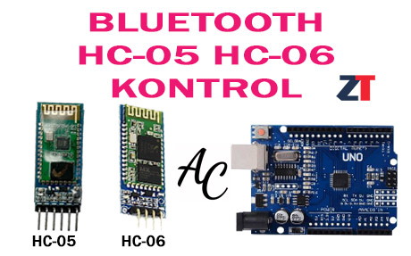
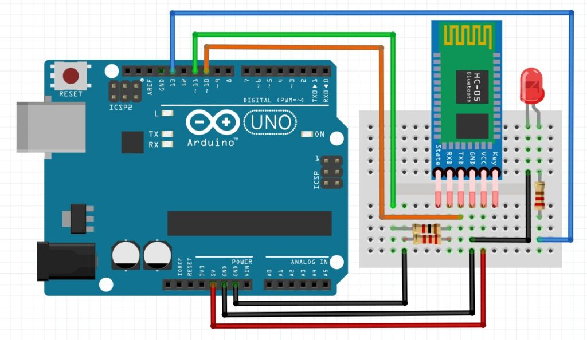
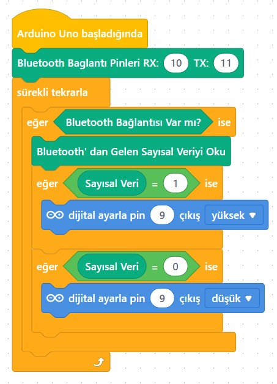
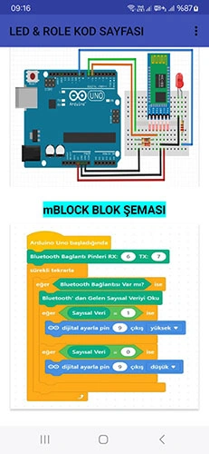

# Ders 45: Bluetooth Modülü (HC-05) ile LED Yakma 📱📡💡

Akıllı telefonunuzu kullanarak odanızdaki ışıkları uzaktan kontrol etmek ister misiniz? Robotist’in **Bluetooth Modülü (HC-05) ile LED Yakma** uygulaması, çocukların kablosuz haberleşme teknolojilerini kavramasını, HC-05 Bluetooth modülü kurarak cep telefonu veya tablet üzerindeki özel bir Android uygulama aracılığıyla Arduino'ya bağlı bir LED'i uzaktan açıp kapatmasını sağlar.

Bu dersle birlikte çocuklar; kablosuz seri haberleşmeyi (UART), RX-TX veri iletim hatlarını, voltaj bölücü direnç bağlantı mantığını (5V'tan 3.3V seviyesine düşürme) ve mobil arayüzle donanım kontrolünü öğrenirler!

---

## 📡 HC-05 Bluetooth Modülü Nedir?

HC-05, Arduino projelerinde kablosuz seri haberleşme yapmamızı sağlayan popüler bir Bluetooth modülüdür.
*   **Voltaj Bölücü Gereksinimi:** Arduino'nun TX pini 5V çıkış verirken, HC-05'in RX pini 3.3V seviyesinde çalışır. Modülün zarar görmemesi için Arduino TX (Pin 11) ile HC-05 RX arasına **1 kΩ** ve **2.2 kΩ** dirençler kullanılarak bir gerilim bölücü devre kurulmalıdır.
*   **Bağlantı Pinleri:**
    *   **VCC:** +5V Güç Girişi
    *   **GND:** Toprak Bağlantısı (-)
    *   **TXD:** Veri Gönderme (Arduino SoftwareSerial RX - Pin 10'a bağlanır)
    *   **RXD:** Veri Alma (Arduino SoftwareSerial TX - Pin 11'e voltaj bölücüyle bağlanır)



---

## ⚙️ Gerekli Elemanlar

1.  **Arduino Uno** (Zekamız)
2.  **Breadboard** (Bağlantı tahtamız)
3.  **1x HC-05 Bluetooth Modülü**
4.  **1x LED Diyot**
5.  **1x 220Ω Direnç** (LED koruması)
6.  **1x 1 kΩ Direnç** ve **1x 2.2 kΩ Direnç** (Voltaj bölücü için)
7.  **Jumper Kablolar**

---

## 🔌 Devre Bağlantısı

Aşağıdaki bağlantıları şemaya uygun şekilde kurun:

*   **HC-05 Bluetooth Modülü Bağlantısı:**
    *   VCC ➡️ Arduino **5V**
    *   GND ➡️ Arduino **GND**
    *   **TXD** ➡️ Arduino **Pin 10** (Software RX)
    *   **RXD** ➡️ 1kΩ direnç üzerinden Arduino **Pin 11**'e (Software TX). Ayrıca RXD pini ile GND arasına 2.2kΩ direnç bağlanarak gerilim 3.3V'a bölünür.
*   **LED Bağlantısı:**
    *   Anot (+) bacağı 220Ω direnç üzerinden Arduino Dijital **Pin 13**'e bağlanır.
    *   Katot (-) bacağı Arduino **GND** pinine bağlanır.



---

## 🧩 mBlock Blok Kodları

mBlock 5 üzerinde kablosuz kontrol sağlamak için **SoftwareSerial** (Yazılımsal Seri Port) bloklarını kullanırız. 
*   **Uzantı Yükleme:** Uzantılar penceresinden **"Bluetooth HC-05 / 06"** eklentisini aratarak ekleyin.
*   Seri porttan gelen karakter **'a'** (veya '1') ise Pin 13 yüksek yapılır; **'b'** (veya '0') ise Pin 13 düşük yapılır.




---

## 💻 Arduino C/C++ Kodları

Aşağıdaki C++ kodu, Arduino'nun SoftwareSerial kütüphanesini kullanarak Bluetooth modülünden veri okur ve gelen komuta göre LED'i kontrol eder:

```cpp
/*
  Ders 45: mBlock 5 Bluetooth Modülü HC-05 İle LED Yakma
*/

#include <SoftwareSerial.h>

// RX = Pin 10 (Bluetooth TX), TX = Pin 11 (Bluetooth RX)
SoftwareSerial bluetooth(10, 11);

const int ledPin = 13; // Kontrol edilecek LED pini

void setup() {
  pinMode(ledPin, OUTPUT);
  digitalWrite(ledPin, LOW); // LED başlangıçta kapalı
  
  bluetooth.begin(9600); // HC-05 varsayılan haberleşme hızı
}

void loop() {
  if (bluetooth.available()) {
    char veri = bluetooth.read(); // Bluetooth'tan gelen karakteri oku
    
    if (veri == 'a' || veri == '1') {
      digitalWrite(ledPin, HIGH); // LED'i yak
    } 
    else if (veri == 'b' || veri == '0') {
      digitalWrite(ledPin, LOW); // LED'i söndür
    }
  }
}
```

---

## 📱 Mobil Uygulama Kurulumu

Projeyi telefon veya tabletinizden kontrol etmek için Google Play Store'da bulunan ücretsiz ve güvenilir alternatifleri kullanabilirsiniz:

### Alternatif 1: Arduino Bluetooth Controller (Giri Studio)
1. Google Play Store'dan **[Arduino Bluetooth Controller](https://play.google.com/store/apps/details?id=com.giristudio.hc05.bluetooth.arduino.control)** uygulamasını aratıp indirin veya aşağıdaki özel QR kodu taratın:
   
2. Telefonunuzun Bluetooth ayarlarına girerek HC-05 modülünü bulun. Eşleşme şifresi olarak **1234** veya **0000** girin.
3. Uygulamayı açın, HC-05 modülünüzü seçip bağlayın ve **Switch Mode** veya **Button Mode** seçeneğini seçin.
4. Buton ayarlarından yeşil buton (açma) için gönderilecek karakteri **"a"** (veya **"1"**), kırmızı buton (kapatma) için ise **"b"** (veya **"0"**) olarak ayarlayarak LED'i kontrol edin.

### Alternatif 2: Serial Bluetooth Terminal (Kai Morich)
Daha genel ve özelleştirilebilir bir terminal kontrolü için:
1. Google Play Store'dan **[Serial Bluetooth Terminal](https://play.google.com/store/apps/details?id=de.kai_morich.serial_bluetooth_terminal)** uygulamasını indirin.
2. HC-05 cihazına bağlanın.
3. Uygulamanın altındaki butonlara (M1, M2...) uzun basarak makroları düzenleyin:
   * **M1 Butonu (AÇ):** Değer (Value) = `a` veya `1`
   * **M2 Butonu (KAPAT):** Değer (Value) = `b` veya `0`

---

**Hazırlayan:** [sultanamed](https://github.com/sultanamed) 💻  
...  
Hayal gücünü kodla, geleceği robotla!
