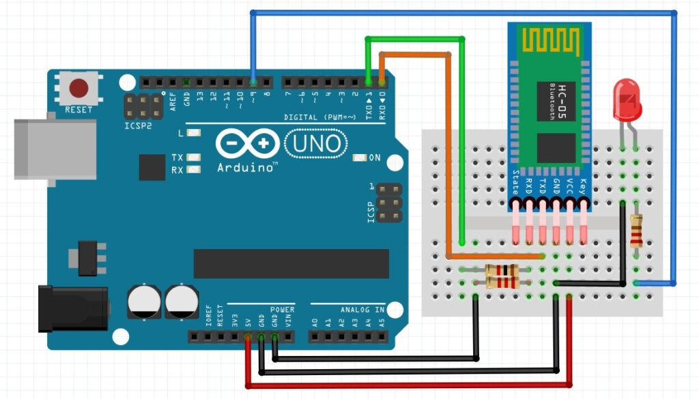
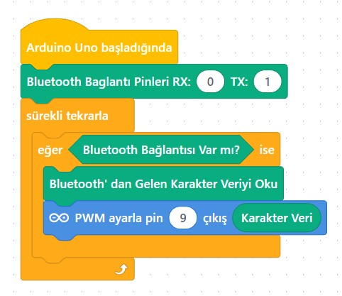
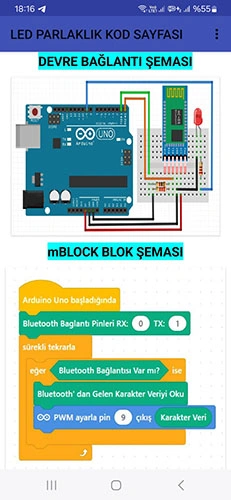

# Ders 46: Bluetooth ile LED Parlaklığı Ayarlama (PWM) 📱📡🔆💡

Telefonunuzdaki bir kaydırıcı (slider) çubuğu sağa sola sürükleyerek odanızdaki lambanın ışık şiddetini kısmaya veya açmaya ne dersiniz? Robotist’in **Bluetooth ile LED Parlaklığı Ayarlama** uygulaması, çocukların analog çıkış sinyali taklidi yapan PWM (Sinyal Genişlik Modülasyonu) tekniğini anlamasını, HC-05 Bluetooth modülü üzerinden telefondan gönderilen 0-255 arası parlaklık verileriyle bir LED'in parlaklığını uzaktan değiştirmesini sağlar.

Bu dersle birlikte çocuklar; PWM sinyal mantığını, analogWrite fonksiyonunu, donanımsal seri port (Hardware Serial Pins 0 & 1) kullanımını ve mobil uygulamadan gelen sayısal verilerin işlenmesini öğrenirler!

---

## ⚙️ Gerekli Elemanlar

1.  **Arduino Uno** (Zekamız)
2.  **Breadboard** (Bağlantı tahtamız)
3.  **1x HC-05 Bluetooth Modülü**
4.  **1x LED Diyot**
5.  **1x 220Ω Direnç** (LED koruması)
6.  **1x 1 kΩ Direnç** ve **1x 2.2 kΩ Direnç** (Voltaj bölücü için)
7.  **Jumper Kablolar**

---

## 🔌 Devre Bağlantısı

Aşağıdaki bağlantıları kurarken, Bluetooth RX bacağının voltaj seviyesini korumaya dikkat edin:

*   **HC-05 Bluetooth Modülü Bağlantısı (Donanımsal Seri Port):**
    *   VCC ➡️ Arduino **5V**
    *   GND ➡️ Arduino **GND**
    *   **TXD** ➡️ Arduino **Pin 0 (RX)**
    *   **RXD** ➡️ 1kΩ direnç üzerinden Arduino **Pin 1 (TX)**'e bağlanır. Ayrıca RXD pini ile GND arasına 2.2kΩ direnç bağlanır.
*   **LED Bağlantısı (PWM):**
    *   Anot (+) bacağı 220Ω direnç üzerinden Arduino'nun PWM özellikli **Pin 9**'una bağlanır.
    *   Katot (-) bacağı Arduino **GND** pinine bağlanır.

> [!IMPORTANT]
> **KOD YÜKLEME UYARISI:** Arduino'ya bilgisayardan kod yüklerken, Bluetooth modülünün **TXD (Pin 0)** ve **RXD (Pin 1)** bağlantılarını geçici olarak çıkartmanız gerekir. Aksi takdirde bilgisayardan gelen kodlar karta yüklenemez ve yükleme hatası alırsınız. Yükleme tamamlandıktan sonra kabloları tekrar bağlayabilirsiniz.



---

## 🧩 mBlock Blok Kodları

mBlock 5 üzerinde bu projede donanımsal seri porttan okunan 1 baytlık veriyi (0-255 arası slider değeri) doğrudan PWM destekli 9 numaralı dijital pine yazarız:

*   **Uzantı:** Önceki dersteki **"Bluetooth HC-05 / 06"** eklentisi kullanılır.
*   Okunan seri veri doğrudan analog 9 çıkışına atanır.




---

## 💻 Arduino C/C++ Kodları

Aşağıdaki C++ kodu, donanımsal seri portu (Pins 0 & 1) kullanarak Bluetooth modülünden gelen parlaklık verisini okur ve analogWrite ile LED'e aktarır:

```cpp
/*
  Ders 46: mBlock ve Bluetooth Modülü HC-05 İle LED Parlaklığı Ayarlama
*/

const int ledPin = 9; // PWM destekli LED pini

void setup() {
  Serial.begin(9600); // Bluetooth modülü ile haberleşmeyi başlat (Pins 0 & 1)
  pinMode(ledPin, OUTPUT);
  analogWrite(ledPin, 0); // Başlangıçta LED sönük
}

void loop() {
  if (Serial.available() > 0) {
    int parlaklik = Serial.read(); // Bluetooth uygulamasından gelen değeri oku (0-255)
    
    // Gelen değerin geçerli aralıkta olduğunu kontrol et
    if (parlaklik >= 0 && parlaklik <= 255) {
      analogWrite(ledPin, parlaklik); // LED parlaklığını ayarla
    }
  }
}
```

---

## 📱 Mobil Uygulama Kurulumu

Projeyi telefon veya tabletinizden kontrol etmek için Google Play Store'da bulunan ücretsiz ve güvenilir alternatifleri kullanabilirsiniz:

### Alternatif 1: Arduino Bluetooth Controller (Giri Studio)
1. Google Play Store'dan **[Arduino Bluetooth Controller](https://play.google.com/store/apps/details?id=com.giristudio.hc05.bluetooth.arduino.control)** uygulamasını aratıp indirin veya aşağıdaki özel QR kodu taratın:
   
2. Telefonunuzun Bluetooth ayarlarına girerek HC-05 modülünü bulun. Eşleşme şifresi olarak **1234** veya **0000** girerek eşleştirin.
3. Uygulamayı açıp **"Dimmer Mode"** (veya **"Slider Mode"**) seçeneğine tıklayın, HC-05 modülünüzü seçin.
4. Kaydırıcıyı (slider) sürükleyerek LED parlaklığını 0 ile 255 arasındaki değerlerle kontrol edebilirsiniz. (Uygulama arka planda sürgünün konumunu 1 baytlık sayısal veri olarak gönderir.)

### Alternatif 2: Serial Bluetooth Terminal (Kai Morich)
Daha genel bir terminal arayüzü ile test etmek isterseniz:
1. Google Play Store'dan **[Serial Bluetooth Terminal](https://play.google.com/store/apps/details?id=de.kai_morich.serial_bluetooth_terminal)** uygulamasını indirin.
2. HC-05 cihazına bağlanın.
3. Belirli parlaklık değerlerini (örneğin 0, 100, 200, 255) göndermek için alt kısımdaki makro butonlarına uzun basıp düzenleyin:
   * Makro türünü **"HEX"** veya **"Byte"** seçip göndermek istediğiniz sayısal değeri girin (örn. `00` ile kapalı, `FF` ile tam parlak).

---

**Hazırlayan:** [sultanamed](https://github.com/sultanamed) 💻  
...  
Hayal gücünü kodla, geleceği robotla!
