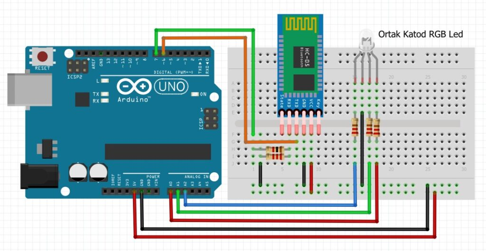
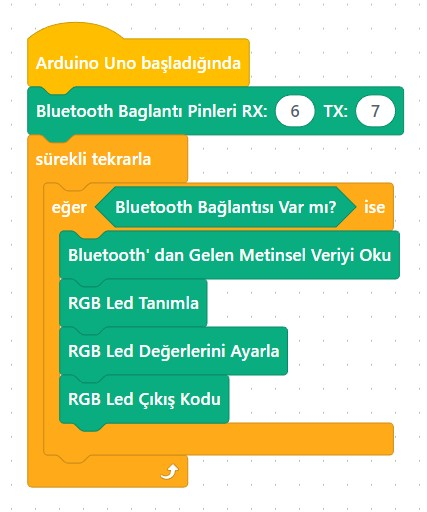
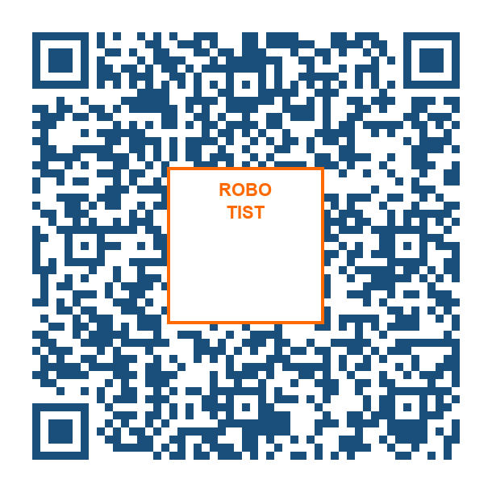

# Ders 47: Bluetooth ile RGB LED Kontrolü 📱📡🌈💡

Akıllı telefonunuzdaki bir renk paletinden dilediğiniz rengi seçerek odanızın havasını değiştirmek veya kendi ambiyans ışığınızı tasarlamak ister miydiniz? Robotist’in **Bluetooth ile RGB LED Kontrolü** uygulaması, çocukların kırmızı, yeşil ve mavi renkleri karıştırarak milyonlarca renk elde edilmesini sağlayan RGB LED teknolojisini kavramasını, HC-05 Bluetooth modülü üzerinden kablosuz olarak cep telefonuyla RGB LED renklerini değiştirmesini sağlar.

Bu dersle birlikte çocuklar; ortak katot (common-cathode) RGB LED kullanımını, SoftwareSerial kütüphanesini, telefondan gelen karmaşık veri dizgelerini (string) çözümlerini (parse etmeyi) ve kablosuz renk paleti kontrolünü öğrenirler!

---

## ⚙️ Gerekli Elemanlar

1.  **Arduino Uno** (Zekamız)
2.  **Breadboard** (Bağlantı tahtamız)
3.  **1x HC-05 Bluetooth Modülü**
4.  **1x Ortak Katot (Common Cathode) RGB LED**
5.  **3x 220Ω Direnç** (RGB LED koruması)
6.  **1x 1 kΩ Direnç** ve **1x 2.2 kΩ Direnç** (Bluetooth voltaj bölücü)
7.  **Jumper Kablolar**

---

## 🔌 Devre Bağlantısı

Aşağıdaki bağlantıları breadboard üzerinde kurun:

*   **HC-05 Bluetooth Modülü Bağlantısı:**
    *   VCC ➡️ Arduino **5V**
    *   GND ➡️ Arduino **GND**
    *   **TXD** ➡️ Arduino Dijital **Pin 6** (Software RX)
    *   **RXD** ➡️ 1kΩ direnç üzerinden Arduino Dijital **Pin 7**'ye (Software TX). Ayrıca RXD pini ile GND arasına 2.2kΩ direnç bağlanır.
*   **RGB LED Bağlantısı (Ortak Katot):**
    *   **Uzun Bacak (Katot - Eksi):** Doğrudan Arduino **GND** pinine bağlanır.
    *   **Kırmızı Bacak (R):** 220Ω direnç üzerinden Arduino Analog **A0** pinine bağlanır.
    *   **Yeşil Bacak (G):** 220Ω direnç üzerinden Arduino Analog **A1** pinine bağlanır.
    *   **Mavi Bacak (B):** 220Ω direnç üzerinden Arduino Analog **A2** pinine bağlanır.



---

## 🧩 mBlock Blok Kodları

mBlock 5 üzerinde kablosuz kontrol sağlamak için **SoftwareSerial** (Yazılımsal Seri Port) bloklarını kullanırız.
*   **Uzantı Yükleme:** Uzantılar penceresinden **"Bluetooth HC-05 / 06"** eklentisi eklenir.
*   Gelen metinsel veriler okunarak RGB LED çıkış koduna aktarılır.



---

## 💻 Arduino C/C++ Kodları

Aşağıdaki C++ kodu, SoftwareSerial kütüphanesini kullanarak Bluetooth modülünden veri paketlerini (`R,G,B\n` veya `R255G128B0`) okur, bunları ayrıştırır (parse eder) ve analogWrite fonksiyonuyla RGB LED'in renklerini değiştirir:

```cpp
/*
  Ders 47: mBlock ile Bluetooth Modülü HC-05 Kullanarak RGB LED Yakma
*/

#include <SoftwareSerial.h>

// SoftwareSerial pin tanımlamaları: RX = Pin 6 (Bluetooth TX), TX = Pin 7 (Bluetooth RX)
SoftwareSerial bluetooth(6, 7);

// RGB LED Anot (+) pin tanımlamaları (Ortak Katot LED)
const int redPin = A0;   // Kırmızı led pini
const int greenPin = A1; // Yeşil led pini
const int bluePin = A2;  // Mavi led pini

String gelenVeri = "";

void setup() {
  pinMode(redPin, OUTPUT);
  pinMode(greenPin, OUTPUT);
  pinMode(bluePin, OUTPUT);
  
  // LED'leri başlangıçta söndür
  analogWrite(redPin, 0);
  analogWrite(greenPin, 0);
  analogWrite(bluePin, 0);
  
  bluetooth.begin(9600); // Bluetooth haberleşmesini başlat
  Serial.begin(9600);    // Seri monitör takibi için
}

void loop() {
  while (bluetooth.available() > 0) {
    char karakter = bluetooth.read();
    
    // Satır sonu karakteri gelene kadar veriyi biriktir
    if (karakter == '\n' || karakter == '\r') {
      if (gelenVeri.length() > 0) {
        gelenVeri.trim();
        Serial.print("Gelen Veri: ");
        Serial.println(gelenVeri);
        
        // RGB renk verisini çözümle ve uygula
        cozumleVeUygula(gelenVeri);
        gelenVeri = ""; // Veri hafızasını sıfırla
      }
    } else {
      gelenVeri += karakter;
    }
  }
}

// Gelen metni çözümleyen fonksiyon
void cozumleVeUygula(String veri) {
  // Giri Studio veya standart renk paletlerinin gönderdiği "R,G,B" formatını çözümler
  // Örn: "255,128,0"
  int ilkVirgul = veri.indexOf(',');
  int ikinciVirgul = veri.indexOf(',', ilkVirgul + 1);
  
  if (ilkVirgul != -1 && ikinciVirgul != -1) {
    int r = veri.substring(0, ilkVirgul).toInt();
    int g = veri.substring(ilkVirgul + 1, ikinciVirgul).toInt();
    int b = veri.substring(ikinciVirgul + 1).toInt();
    
    // Değerleri sınırla (0-255)
    r = constrain(r, 0, 255);
    g = constrain(g, 0, 255);
    b = constrain(b, 0, 255);
    
    // Ortak katot RGB LED için analogWrite (0: Kapalı, 255: Tam Parlak)
    analogWrite(redPin, r);
    analogWrite(greenPin, g);
    analogWrite(bluePin, b);
  } 
  // Alternatif format: "R255G128B0" veya "r255g128b0"
  else if (veri.startsWith("R") || veri.startsWith("r")) {
    int rIndex = veri.indexOf('R') != -1 ? veri.indexOf('R') : veri.indexOf('r');
    int gIndex = veri.indexOf('G') != -1 ? veri.indexOf('G') : veri.indexOf('g');
    int bIndex = veri.indexOf('B') != -1 ? veri.indexOf('B') : veri.indexOf('b');
    
    if (rIndex != -1 && gIndex != -1 && bIndex != -1) {
      int r = veri.substring(rIndex + 1, gIndex).toInt();
      int g = veri.substring(gIndex + 1, bIndex).toInt();
      int b = veri.substring(bIndex + 1).toInt();
      
      analogWrite(redPin, r);
      analogWrite(greenPin, g);
      analogWrite(bluePin, b);
    }
  }
}
```

---

## 📱 Mobil Uygulama Kurulumu

Projeyi telefon veya tabletinizden kontrol etmek için Google Play Store'da bulunan ücretsiz ve güvenilir alternatifleri kullanabilirsiniz:

### Alternatif 1: Arduino Bluetooth Controller (Giri Studio)
1. Google Play Store'dan **[Arduino Bluetooth Controller](https://play.google.com/store/apps/details?id=com.giristudio.hc05.bluetooth.arduino.control)** uygulamasını aratıp indirin veya aşağıdaki özel QR kodu taratın:
   
2. Telefonunuzun Bluetooth ayarlarına girerek HC-05 modülünü bulun. Eşleşme şifresi olarak **1234** veya **0000** girerek eşleştirin.
3. Uygulamayı açıp **"RGB Mode"** seçeneğine tıklayın, HC-05 modülünüzü seçin.
4. Ekranda beliren renk tekerleğinden istediğiniz renge dokunarak veya sürgüler yardımıyla RGB LED rengini değiştirebilirsiniz.

---

**Hazırlayan:** [sultanamed](https://github.com/sultanamed) 💻  
...  
Hayal gücünü kodla, geleceği robotla!
