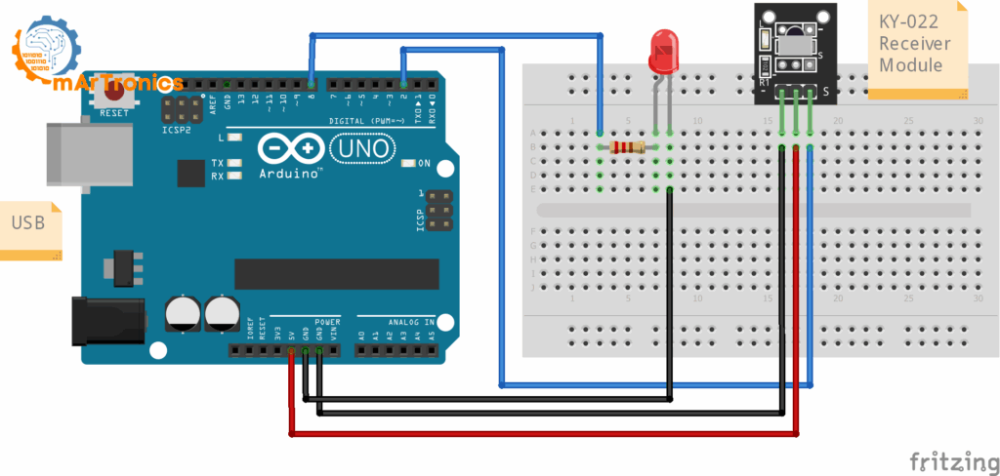
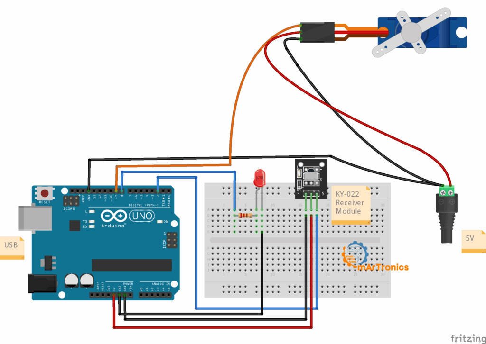

# Ders 47: Kızılötesi (IR) Alıcı Modülü ve Kumanda ile Kapı Kontrolü 📡🔑🚪

Akıllı ev sistemlerinde veya otopark bariyerlerinde kumandaya basarak kapıyı uzaktan açıp kapatmak ister miydiniz? Robotist’in **Kızılötesi (IR) Kumanda ile Kapı Kontrolü** uygulaması, çocukların kızılötesi ışık dalgalarıyla kablosuz veri iletimini kavramasını, kumanda tuşlarının benzersiz hex kodlarını çözümlemesini, ve bu kodlara göre bir servo motoru (kapı kilidi/mekanizması) ile durum LED'lerini uzaktan kontrol etmesini sağlar.

Bu dersle birlikte çocuklar; kızılötesi (IR) alıcı modüllerinin (VS1838B veya KY-022) çalışma mantığını, kumanda protokollerini, hexadecimal (onaltılık) sayı sistemini ve donanımsal koşul kurgularını öğrenirler!

---

## 📡 Kızılötesi (IR) Haberleşme Nedir?

Kızılötesi haberleşme, günlük hayatta televizyon kumandalarından klima kontrolcülerine kadar en sık kullanılan kablosuz iletişim yöntemidir.
*   **Çalışma Prensibi:** Kumanda üzerindeki tuşa basıldığında, görünmez bir kızılötesi LED ışık yardımıyla 38kHz frekansında modüle edilmiş ışık sinyalleri gönderilir.
*   **IR Alıcı (VS1838B / KY-022):** Bu sinyalleri yakalayarak elektrik sinyallerine ve ardından dijital verilere dönüştürür. Her butonun gönderdiği sinyal benzersiz bir sayı dizisidir (Hexadecimal kod).

---

## ⚙️ Gerekli Elemanlar

1.  **Arduino Uno** (Zekamız)
2.  **Breadboard** (Bağlantı tahtamız)
3.  **1x Kızılötesi (IR) Alıcı Modülü** (VS1838B veya KY-022)
4.  **1x Kızılötesi (IR) Kumanda** (CR2025 pilli)
5.  **1x SG90 Servo Motor** (Kapı mekanizması)
6.  **1x Kırmızı LED** (Kapı kilitli göstergesi)
7.  **1x Yeşil LED** (Kapı açık göstergesi)
8.  **2x 220Ω Direnç** (LED koruması)
9.  **Jumper Kablolar**

---

## 🔌 Devre Bağlantısı

Aşağıdaki bağlantıları breadboard üzerinde kurun:

| Eleman | Arduino Pini | Açıklama |
| :--- | :---: | :--- |
| **IR Alıcı - OUT (Sinyal)** | **Pin 2** | Sinyal okuma pini |
| **IR Alıcı - VCC** | **5V** | Besleme (+) |
| **IR Alıcı - GND** | **GND** | Toprak (-) |
| **Kırmızı LED (Anot)** | **Pin 7** | 220Ω direnç üzerinden bağlantı |
| **Yeşil LED (Anot)** | **Pin 8** | 220Ω direnç üzerinden bağlantı |
| **LED'ler (Katot - Kısa bacak)**| **GND** | Toprak (-) |
| **Servo Motor - Sinyal (Turuncu)**| **Pin 9** | PWM sinyal pini |
| **Servo Motor - VCC (Kırmızı)** | **5V** (veya harici 5V) | Güç beslemesi |
| **Servo Motor - GND (Kahverengi)**| **GND** | Toprak (-) |

---

## 🔍 Aşama 1: Kumanda Buton Kodlarını Tespit Etme

Piyasadaki her kumandanın tuş kodları farklılık gösterebilir. Projeye başlamadan önce kendi kumandanızdaki tuşların kodlarını öğrenmeniz gerekir.

### Devre Bağlantısı (Aşama 1):
Sadece IR Alıcı modülü ve durum tespiti için bir LED bağlantısı kurulur.



### Buton Tespit Kodu (Arduino C++):
Aşağıdaki kodu Arduino'nuza yükleyin ve **Seri Port Ekranını (Serial Monitor - 9600 baud)** açın. Kumandanızdan butonlara bastığınızda ekranda `0xFFA25D` gibi hexadecimal kodlar belirecektir. Buradaki kodları not edin.

```cpp
#include <IRremote.h>

const int RECV_PIN = 2; // IR alıcı sinyal pini

void setup() {
  Serial.begin(9600);
  IrReceiver.begin(RECV_PIN, ENABLE_LED_FEEDBACK); // Alıcıyı başlat
  Serial.println("Sinyal bekleniyor... Kumanda tuslarina basiniz.");
}

void loop() {
  if (IrReceiver.decode()) {
    unsigned long kod = IrReceiver.decodedIRData.decodedRawData;
    if (kod != 0) {
      Serial.print("Basilan Buton Kodu (HEX): 0x");
      Serial.println(kod, HEX);
    }
    IrReceiver.resume(); // Yeni sinyal alımına hazır ol
  }
}
```

---

## 🔍 Aşama 2: Kapı Kontrol Projesi

Kodları tespit ettikten sonra servo motoru ve durum LED'lerini devreye dahil ediyoruz.

### Devre Bağlantısı (Aşama 2):
Aşağıdaki şemaya göre tüm bağlantıları kurun. 

> [!TIP]
> Şemada bağlantıları sade tutmak amacıyla tek bir yeşil LED gösterilmiştir. Gerçek uygulamanızda kilitli durumunu göstermek için **D7** pinine Kırmızı LED'i, açık durumunu göstermek için **D8** pinine Yeşil LED'i bağlayın.
> Servo motorlar yüksek akım çektiği için harici bir 5V güç kaynağından beslenmesi tavsiye edilir (GND hatlarını birleştirmeyi unutmayın).



---

## 🧩 mBlock Blok Kodları

mBlock 5 üzerinde kızılötesi alıcı kontrolü için **Makers Platform** veya **Arduino Uzantıları** arasından **IR Receiver** eklentisi eklenmelidir. 

Uzantı eklendikten sonra, kodlama mantığı şu şekildedir:

```text
[ Arduino Uno başladığında ]
 ├─ [ kızılötesi alıcı pin (2) başlat ]
 ├─ [ servo pin (9) açısını (20) yap ]  <-- Başlangıçta kapı kapalı
 ├─ [ sayısal pin (7) çıkışını (Yüksek) yap ] <-- Kırmızı LED ON
 ├─ [ sayısal pin (8) çıkışını (Düşük) yap ]  <-- Yeşil LED OFF
 └─ [ sürekli tekrarla ]
      └─ [ eğer <kızılötesi alıcı pin (2) veri okuyor mu?> ise ]
           ├─ [ gelen_kod ] değişkenini [ kızılötesi alıcı pin (2) okunan veri ] yap
           ├─ [ eğer < (gelen_kod) = (FFA25D) > ise ]  <-- Buton 1 (Kapat)
           │    ├─ [ sayısal pin (7) çıkışını (Yüksek) yap ]  <-- Kırmızı LED ON
           │    ├─ [ sayısal pin (8) çıkışını (Düşük) yap ]   <-- Yeşil LED OFF
           │    └─ [ servo pin (9) açısını (20) yap ]         <-- Kapıyı Kilitle
           ├─ [ eğer < (gelen_kod) = (FF629D) > ise ]  <-- Buton 2 (Aç)
           │    ├─ [ sayısal pin (7) çıkışını (Düşük) yap ]   <-- Kırmızı LED OFF
           │    ├─ [ sayısal pin (8) çıkışını (Yüksek) yap ]  <-- Yeşil LED ON
           │    └─ [ servo pin (9) açısını (80) yap ]         <-- Kapıyı Aç
           └─ [ kızılötesi alıcıyı sıfırla/yeniden başlat ]   <-- Yeni okuma için
```

---

## 💻 Arduino C/C++ Kodları

Aşağıdaki C++ kodu, kızılötesi alıcıdan gelen kodları dinler, eğer tuş 1 (Kapat) basıldıysa kapıyı kapatıp kırmızı LED'i yakar, eğer tuş 2 (Aç) basıldıysa kapıyı açıp yeşil LED'i yakar.

```cpp
/*
  Ders 47: Kızılötesi (IR) Kumanda ile Kapı Kontrolü
*/

#include <Servo.h>
#include <IRremote.h>

// Pin Tanımlamaları
const int irAliciPin = 2; // IR Alıcı Sinyal (OUT) pini
const int kirmiziLed = 7; // Kapı Kilitli LED pini (Kırmızı)
const int yesilLed   = 8; // Kapı Açık LED pini (Yeşil)
const int servoPin   = 9; // SG90 Servo Motor Sinyal pini

Servo kapiServosu;

// KUMANDA BUTON KODLARI (HEX)
// NOT: Kendi kumandanıza göre buradaki 0xFFA25D ve 0xFF629D değerlerini güncelleyin!
const unsigned long BUTON_1_HEX = 0xFFA25D; // Kapıyı Kapat (Buton 1)
const unsigned long BUTON_2_HEX = 0xFF629D; // Kapıyı Aç (Buton 2)

void setup() {
  Serial.begin(9600);
  
  pinMode(kirmiziLed, OUTPUT);
  pinMode(yesilLed, OUTPUT);
  
  kapiServosu.attach(servoPin);
  
  // Başlangıçta Kapı Kapalı (Kilitli)
  kapiServosu.write(20); 
  digitalWrite(kirmiziLed, HIGH); 
  digitalWrite(yesilLed, LOW);    
  
  // IR Alıcıyı Başlat
  IrReceiver.begin(irAliciPin, ENABLE_LED_FEEDBACK);
  Serial.println("Sistem Hazır. Sinyal bekleniyor...");
}

void loop() {
  if (IrReceiver.decode()) {
    unsigned long okunanKod = IrReceiver.decodedIRData.decodedRawData;
    
    if (okunanKod != 0) {
      Serial.print("Algilanan Buton Kodu (HEX): 0x");
      Serial.println(okunanKod, HEX);
    }
    
    // Alınan koda göre kapı durumunu kontrol et
    if (okunanKod == BUTON_1_HEX) {
      Serial.println("KAPI KAPATILIYOR...");
      digitalWrite(kirmiziLed, HIGH); 
      digitalWrite(yesilLed, LOW);    
      kapiServosu.write(20); // Kapıyı kapat (20 derece)
      delay(500);                     
    } 
    else if (okunanKod == BUTON_2_HEX) {
      Serial.println("KAPI ACILIYOR...");
      digitalWrite(kirmiziLed, LOW);  
      digitalWrite(yesilLed, HIGH);   
      kapiServosu.write(80); // Kapıyı aç (80 derece)
      delay(500);                     
    }
    
    IrReceiver.resume(); // Yeni veri okumaya devam et
  }
}
```

---

**Hazırlayan:** [sultanamed](https://github.com/sultanamed) 💻  
www.robotist.fun  
Hayal gücünü kodla, geleceği robotla!
